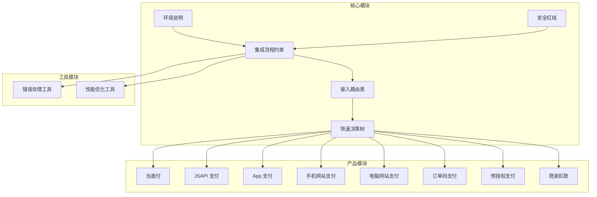
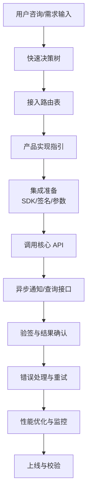
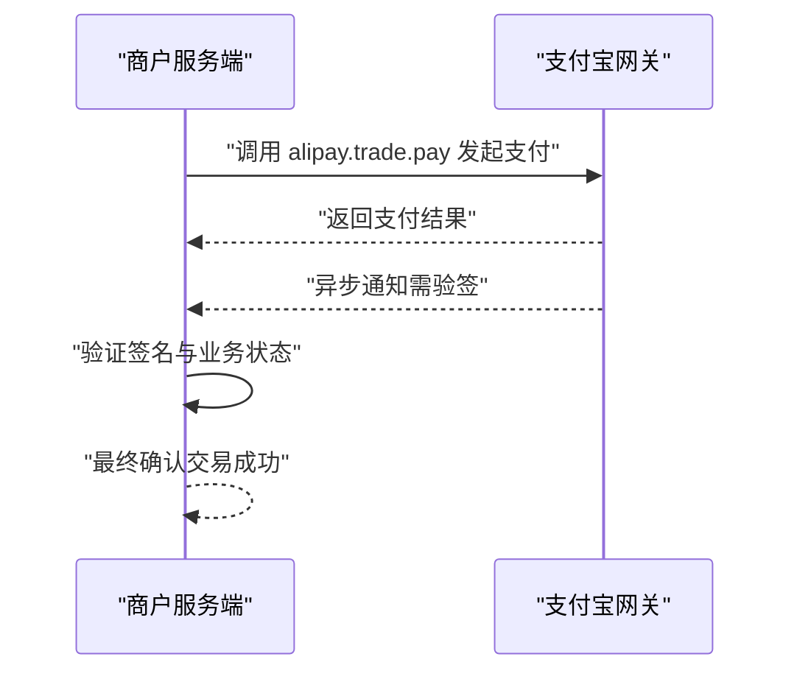
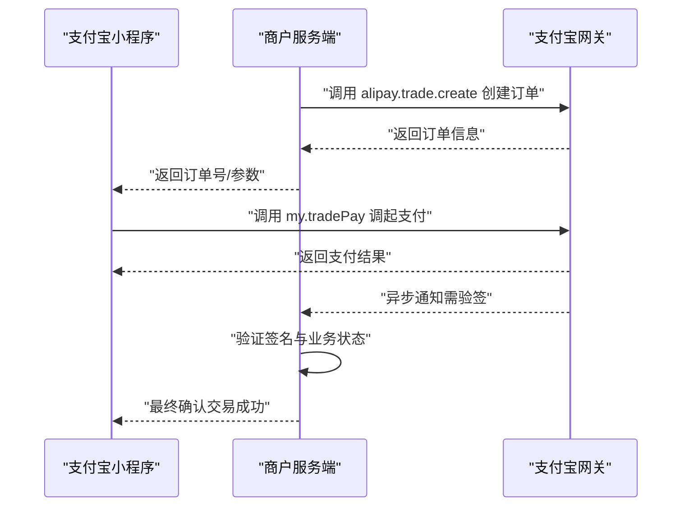
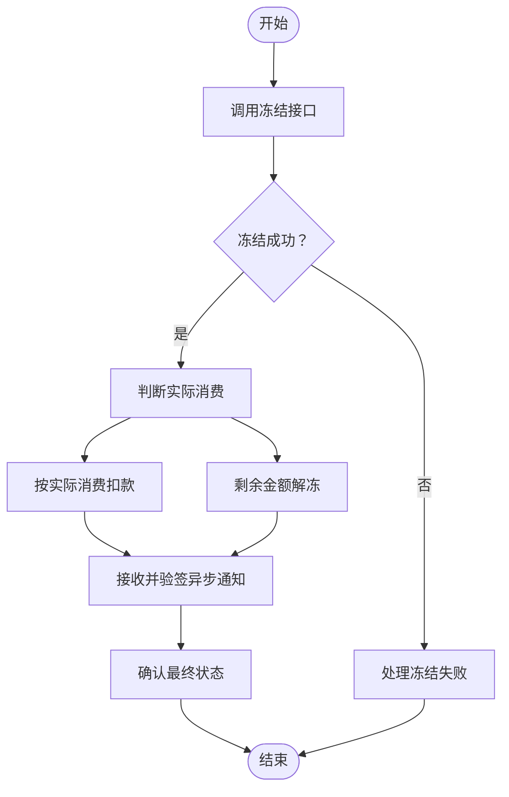
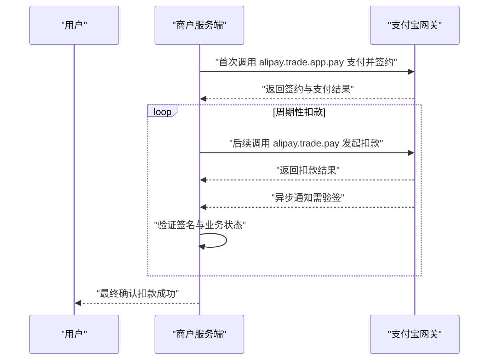
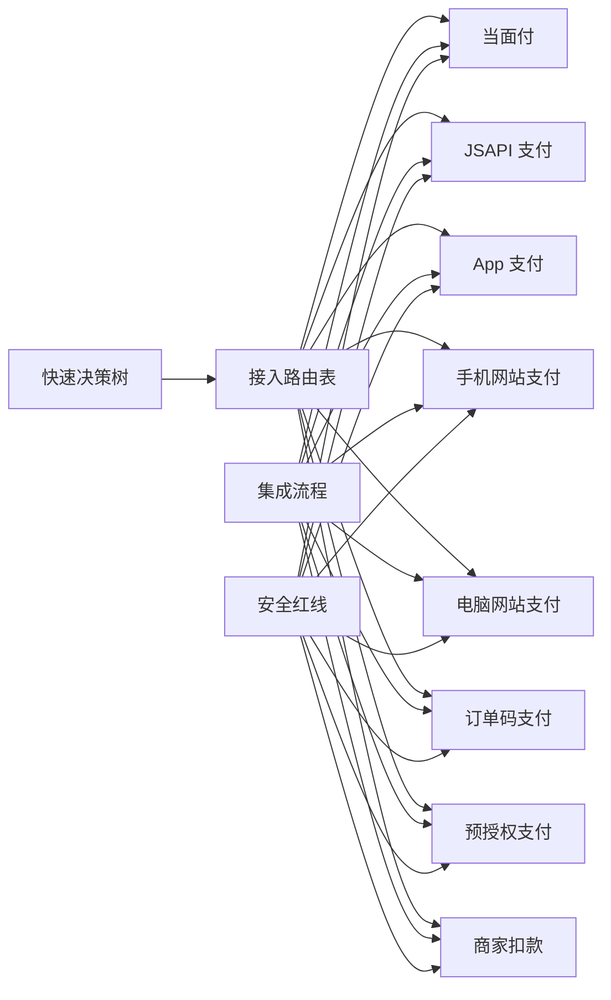

# 支付集成技能

<cite>
**本文引用的文件**
- [SKILL.md](file://skills/daoSkilLs/skills/alipay-payment-integration/SKILL.md)
- [environment.md](file://skills/daoSkilLs/skills/alipay-payment-integration/modules/core/environment.md)
- [security-guidelines.md](file://skills/daoSkilLs/skills/alipay-payment-integration/modules/core/security-guidelines.md)
- [integration-process.md](file://skills/daoSkilLs/skills/alipay-payment-integration/modules/core/integration-process.md)
- [routing-table.md](file://skills/daoSkilLs/skills/alipay-payment-integration/modules/core/routing-table.md)
- [decision-tree.md](file://skills/daoSkilLs/skills/alipay-payment-integration/modules/core/decision-tree.md)
- [face-to-face-payment.md](file://skills/daoSkilLs/skills/alipay-payment-integration/modules/products/face-to-face-payment.md)
- [jsapi-payment.md](file://skills/daoSkilLs/skills/alipay-payment-integration/modules/products/jsapi-payment.md)
- [pre-authorization.md](file://skills/daoSkilLs/skills/alipay-payment-integration/modules/products/pre-authorization.md)
- [merchant-debit.md](file://skills/daoSkilLs/skills/alipay-payment-integration/modules/products/merchant-debit.md)
- [error-handling.md](file://skills/daoSkilLs/skills/alipay-payment-integration/modules/utils/error-handling.md)
- [performance-optimization.md](file://skills/daoSkilLs/skills/alipay-payment-integration/modules/utils/performance-optimization.md)
</cite>

## 目录
1. [简介](#简介)
2. [项目结构](#项目结构)
3. [核心组件](#核心组件)
4. [架构总览](#架构总览)
5. [详细组件分析](#详细组件分析)
6. [依赖分析](#依赖分析)
7. [性能考虑](#性能考虑)
8. [故障排除指南](#故障排除指南)
9. [结论](#结论)
10. [附录](#附录)

## 简介
本技能面向“支付宝开放平台支付产品接入”的完整实现方案，覆盖线下当面付、订单码支付，线上 App 支付、JSAPI 支付、手机网站支付、电脑网站支付，以及预授权支付、商家扣款等特殊场景。文档提供产品选型策略、集成步骤、安全规范、签名验证、回调处理、错误处理与性能优化等关键技术实现，并给出流程图、决策树与常见问题解决方案，帮助开发者在不同业务场景下高效、安全地完成支付集成。

## 项目结构
该技能采用模块化组织方式，分为“核心模块”“产品模块”“工具模块”“文档模块”，便于按场景检索与复用：
- 核心模块：环境说明、安全红线、集成流程、接入路由表、快速决策树
- 产品模块：线下/线上支付与特殊场景的具体实现指引
- 工具模块：错误处理、性能优化、文档访问等支撑能力
- 文档模块：架构设计、使用指南、维护手册

图表来源
- [SKILL.md:19-64](file://skills/daoSkilLs/skills/alipay-payment-integration/SKILL.md#L19-L64)
- [environment.md:1-5](file://skills/daoSkilLs/skills/alipay-payment-integration/modules/core/environment.md#L1-L5)
- [security-guidelines.md:1-11](file://skills/daoSkilLs/skills/alipay-payment-integration/modules/core/security-guidelines.md#L1-L11)
- [integration-process.md:1-20](file://skills/daoSkilLs/skills/alipay-payment-integration/modules/core/integration-process.md#L1-L20)
- [routing-table.md:1-17](file://skills/daoSkilLs/skills/alipay-payment-integration/modules/core/routing-table.md#L1-L17)
- [decision-tree.md:1-22](file://skills/daoSkilLs/skills/alipay-payment-integration/modules/core/decision-tree.md#L1-L22)

章节来源
- [SKILL.md:13-64](file://skills/daoSkilLs/skills/alipay-payment-integration/SKILL.md#L13-L64)

## 核心组件
- 环境说明：明确沙箱与正式环境网关地址，指导测试与生产切换。
- 安全红线：定义支付接入不可触碰的安全边界，如私钥管理、前台结果可信度、异步通知验签等。
- 集成流程：三步法——信息收集、获取产品文档、集成校验；强调 SDK 选择、签名方式、错误码与校验清单。
- 接入路由表：按业务场景映射到具体产品与核心 API，作为选型依据。
- 快速决策树：以流程图形式帮助快速定位产品类型。

章节来源
- [environment.md:1-5](file://skills/daoSkilLs/skills/alipay-payment-integration/modules/core/environment.md#L1-L5)
- [security-guidelines.md:1-11](file://skills/daoSkilLs/skills/alipay-payment-integration/modules/core/security-guidelines.md#L1-L11)
- [integration-process.md:1-20](file://skills/daoSkilLs/skills/alipay-payment-integration/modules/core/integration-process.md#L1-L20)
- [routing-table.md:1-17](file://skills/daoSkilLs/skills/alipay-payment-integration/modules/core/routing-table.md#L1-L17)
- [decision-tree.md:1-22](file://skills/daoSkilLs/skills/alipay-payment-integration/modules/core/decision-tree.md#L1-L22)

## 架构总览
整体架构围绕“产品选型—集成准备—接口调用—异步通知—结果确认—安全校验—错误处理—性能优化”闭环展开。系统通过路由表与决策树驱动产品选择，结合安全规范与集成流程，确保签名、验签、回调处理与异常恢复的稳定性与安全性。

图表来源
- [decision-tree.md:1-22](file://skills/daoSkilLs/skills/alipay-payment-integration/modules/core/decision-tree.md#L1-L22)
- [routing-table.md:1-17](file://skills/daoSkilLs/skills/alipay-payment-integration/modules/core/routing-table.md#L1-L17)
- [integration-process.md:1-20](file://skills/daoSkilLs/skills/alipay-payment-integration/modules/core/integration-process.md#L1-L20)
- [security-guidelines.md:1-11](file://skills/daoSkilLs/skills/alipay-payment-integration/modules/core/security-guidelines.md#L1-L11)
- [error-handling.md:1-50](file://skills/daoSkilLs/skills/alipay-payment-integration/modules/utils/error-handling.md#L1-L50)
- [performance-optimization.md:1-50](file://skills/daoSkilLs/skills/alipay-payment-integration/modules/utils/performance-optimization.md#L1-L50)

## 详细组件分析

### 当面付（线下门店收款）
- 适用场景：实体门店用户出示付款码，商家扫码枪扫码收款。
- 核心 API：alipay.trade.pay。
- 关键步骤：获取 SDK → 配置参数 → 调用接口 → 处理结果 → 异步通知。
- 安全要点：服务端签名、异步通知验签、以异步通知或查询为准。

图表来源
- [face-to-face-payment.md:11-34](file://skills/daoSkilLs/skills/alipay-payment-integration/modules/products/face-to-face-payment.md#L11-L34)

章节来源
- [face-to-face-payment.md:1-34](file://skills/daoSkilLs/skills/alipay-payment-integration/modules/products/face-to-face-payment.md#L1-L34)

### JSAPI 支付（小程序内支付）
- 适用场景：支付宝小程序内调起支付。
- 核心 API：alipay.trade.create 创建订单 + my.tradePay 调起支付。
- 关键步骤：获取 SDK → 配置参数 → 创建订单 → 调起支付 → 处理结果 → 异步通知。
- 安全要点：服务端签名、异步通知验签、以异步通知或查询为准。

图表来源
- [jsapi-payment.md:11-34](file://skills/daoSkilLs/skills/alipay-payment-integration/modules/products/jsapi-payment.md#L11-L34)

章节来源
- [jsapi-payment.md:1-34](file://skills/daoSkilLs/skills/alipay-payment-integration/modules/products/jsapi-payment.md#L1-L34)

### App 支付（原生 App）
- 适用场景：iOS/Android/鸿蒙 App 内调起支付宝付款。
- 核心 API：alipay.trade.app.pay。
- 关键步骤：获取 SDK → 配置参数 → 调用接口 → 处理结果 → 异步通知。
- 安全要点：服务端签名、异步通知验签、以异步通知或查询为准。

章节来源
- [routing-table.md:11-12](file://skills/daoSkilLs/skills/alipay-payment-integration/modules/core/routing-table.md#L11-L12)

### 手机网站支付（H5）
- 适用场景：手机浏览器 H5 页面内唤起支付宝付款。
- 核心 API：alipay.trade.wap.pay。
- 关键步骤：获取 SDK → 配置参数 → 调用接口 → 处理结果 → 异步通知。
- 安全要点：服务端签名、异步通知验签、以异步通知或查询为准。

章节来源
- [routing-table.md:9-10](file://skills/daoSkilLs/skills/alipay-payment-integration/modules/core/routing-table.md#L9-L10)

### 电脑网站支付（PC）
- 适用场景：电脑浏览器网页内跳转支付宝收银台。
- 核心 API：alipay.trade.page.pay。
- 关键步骤：获取 SDK → 配置参数 → 调用接口 → 处理结果 → 异步通知。
- 安全要点：服务端签名、异步通知验签、以异步通知或查询为准。

章节来源
- [routing-table.md:9-12](file://skills/daoSkilLs/skills/alipay-payment-integration/modules/core/routing-table.md#L9-L12)

### 订单码支付（商家展示二维码）
- 适用场景：商家生成二维码，用户打开支付宝扫码付款。
- 核心 API：alipay.trade.precreate。
- 关键步骤：获取 SDK → 配置参数 → 调用接口 → 处理结果 → 异步通知。
- 安全要点：服务端签名、异步通知验签、以异步通知或查询为准。

章节来源
- [routing-table.md:7-8](file://skills/daoSkilLs/skills/alipay-payment-integration/modules/core/routing-table.md#L7-L8)

### 预授权支付（冻结资金/信用额度）
- 适用场景：酒店民宿、租车、分时租赁等需要先冻结再扣款的场景。
- 核心 API：alipay.fund.auth.order.app.freeze。
- 关键步骤：获取 SDK → 配置参数 → 调用冻结接口 → 处理结果 → 扣款或解冻 → 异步通知。
- 安全要点：服务端签名、异步通知验签、冻结后按实际消费处理。

图表来源
- [pre-authorization.md:11-33](file://skills/daoSkilLs/skills/alipay-payment-integration/modules/products/pre-authorization.md#L11-L33)

章节来源
- [pre-authorization.md:1-33](file://skills/daoSkilLs/skills/alipay-payment-integration/modules/products/pre-authorization.md#L1-L33)

### 商家扣款（周期性自动扣款）
- 适用场景：会员包月、自动续费、定期还款等周期性扣款。
- 核心 API：首次支付并签约 alipay.trade.app.pay + 后续扣款 alipay.trade.pay。
- 关键步骤：获取 SDK → 配置参数 → 首次支付并签约 → 后续周期性扣款 → 处理结果 → 异步通知。
- 安全要点：服务端签名、异步通知验签、仅支持周期性模式。

图表来源
- [merchant-debit.md:11-35](file://skills/daoSkilLs/skills/alipay-payment-integration/modules/products/merchant-debit.md#L11-L35)

章节来源
- [merchant-debit.md:1-35](file://skills/daoSkilLs/skills/alipay-payment-integration/modules/products/merchant-debit.md#L1-L35)

### 产品选择策略与路由
- 依据业务场景选择产品：线下门店收款（当面付/订单码）、线上 App/小程序/H5/PC（App/JSAPI/手机网站/电脑网站）、需要冻结资金（预授权）、周期性扣款（商家扣款）。
- 路由表提供核心 API 与在线文档链接，集成前需先阅读对应文档。

章节来源
- [routing-table.md:1-17](file://skills/daoSkilLs/skills/alipay-payment-integration/modules/core/routing-table.md#L1-L17)

### 集成步骤与安全指南
- 集成步骤：信息收集（SDK/签名方式）→ 获取产品文档 → 集成校验（签名验签/异步通知/异常处理）。
- 安全红线：私钥严禁存放客户端/日志/公共仓库；前台结果不可信；未确认不重付；异步通知必须先验签。

章节来源
- [integration-process.md:1-20](file://skills/daoSkilLs/skills/alipay-payment-integration/modules/core/integration-process.md#L1-L20)
- [security-guidelines.md:1-11](file://skills/daoSkilLs/skills/alipay-payment-integration/modules/core/security-guidelines.md#L1-L11)

## 依赖分析
- 组件耦合关系：路由表与决策树共同决定产品选择；产品实现指引依赖集成流程与安全规范；错误处理与性能优化贯穿各产品实现。
- 外部依赖：支付宝开放平台网关（沙箱/正式）、SDK、签名算法（RSA/RSA2）。
- 潜在风险：私钥泄露、前台结果信任、未验签异步通知、重复支付等。

图表来源
- [decision-tree.md:1-22](file://skills/daoSkilLs/skills/alipay-payment-integration/modules/core/decision-tree.md#L1-L22)
- [routing-table.md:1-17](file://skills/daoSkilLs/skills/alipay-payment-integration/modules/core/routing-table.md#L1-L17)
- [integration-process.md:1-20](file://skills/daoSkilLs/skills/alipay-payment-integration/modules/core/integration-process.md#L1-L20)
- [security-guidelines.md:1-11](file://skills/daoSkilLs/skills/alipay-payment-integration/modules/core/security-guidelines.md#L1-L11)

## 性能考虑
- 缓存机制：内存缓存、磁盘缓存、基于时间/内容变化的失效策略，减少重复文档访问与数据处理。
- 网络优化：并发请求、请求合并、合理超时、智能重试，提升文档访问与接口调用效率。
- 数据处理：惰性加载、数据压缩、异步处理、批量处理，降低内存占用与 CPU 开销。
- 性能指标：响应时间、内存占用、CPU 使用率、请求成功率，作为监控与优化目标。

章节来源
- [performance-optimization.md:1-50](file://skills/daoSkilLs/skills/alipay-payment-integration/modules/utils/performance-optimization.md#L1-L50)

## 故障排除指南
- 错误码管理：统一错误码体系，便于识别与处理；常见错误包括网络连接、文档访问、解析、参数、签名验证失败等。
- 错误信息格式化：标准化 JSON 结构，包含 code、message、detail、timestamp，便于日志与告警。
- 异常场景处理：网络异常（超时与重试）、文档访问失败（URL 校验与备选）、解析错误（默认值与回退）、参数错误（校验与提示）、签名失败（配置检查与工具）。
- 最佳实践：捕获并记录异常、提供友好提示、实现重试与监控、持续优化。

章节来源
- [error-handling.md:1-50](file://skills/daoSkilLs/skills/alipay-payment-integration/modules/utils/error-handling.md#L1-L50)

## 结论
本技能通过“产品选型—集成准备—接口调用—异步通知—结果确认—安全校验—错误处理—性能优化”的闭环，为支付宝支付集成提供系统化、可落地的实施路径。开发者可依据路由表与决策树快速定位产品，遵循安全红线与集成流程，结合错误处理与性能优化工具，确保在不同业务场景下的稳定与安全。

## 附录
- 环境配置：沙箱环境与正式环境网关地址，用于测试与生产切换。
- SDK 与签名：根据开发语言选择 SDK，优先使用 RSA2（SHA256WithRSA）签名方式。
- 文档访问：集成前先阅读对应产品在线文档，获取最新参数、示例与注意事项。

章节来源
- [environment.md:1-5](file://skills/daoSkilLs/skills/alipay-payment-integration/modules/core/environment.md#L1-L5)
- [integration-process.md:6-15](file://skills/daoSkilLs/skills/alipay-payment-integration/modules/core/integration-process.md#L6-L15)
- [routing-table.md:16-17](file://skills/daoSkilLs/skills/alipay-payment-integration/modules/core/routing-table.md#L16-L17)