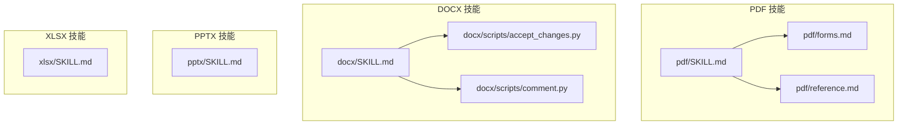
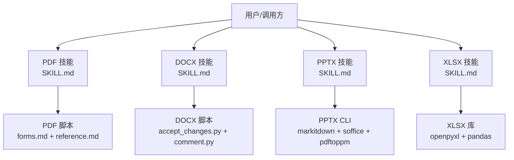
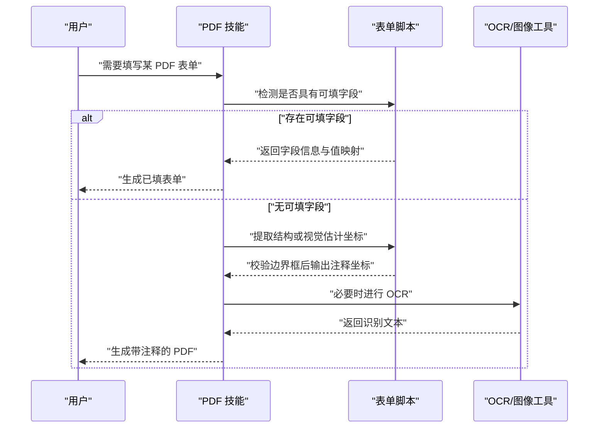
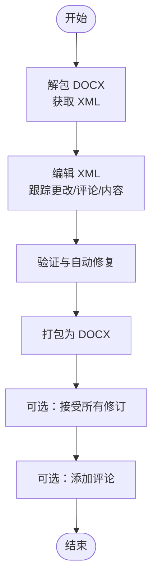
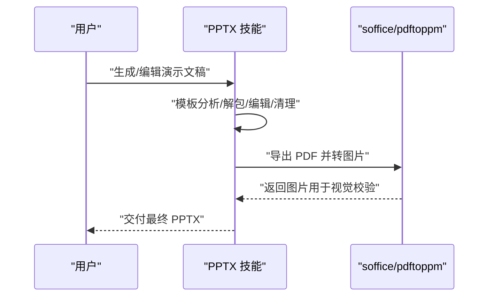
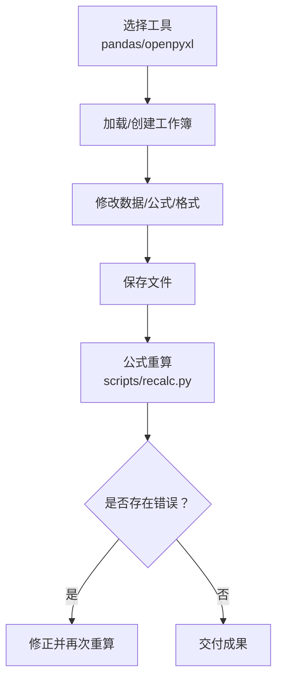
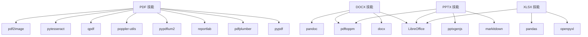

# 文档处理技能

<cite>
**本文引用的文件**
- [pdf/SKILL.md](file://skills/daoSkilLs/skills/anthropics-skills/skills/pdf/SKILL.md)
- [pdf/forms.md](file://skills/daoSkilLs/skills/anthropics-skills/skills/pdf/forms.md)
- [pdf/reference.md](file://skills/daoSkilLs/skills/anthropics-skills/skills/pdf/reference.md)
- [docx/SKILL.md](file://skills/daoSkilLs/skills/anthropics-skills/skills/docx/SKILL.md)
- [docx/scripts/accept_changes.py](file://skills/daoSkilLs/skills/anthropics-skills/skills/docx/scripts/accept_changes.py)
- [docx/scripts/comment.py](file://skills/daoSkilLs/skills/anthropics-skills/skills/docx/scripts/comment.py)
- [pptx/SKILL.md](file://skills/daoSkilLs/skills/anthropics-skills/skills/pptx/SKILL.md)
- [xlsx/SKILL.md](file://skills/daoSkilLs/skills/anthropics-skills/skills/xlsx/SKILL.md)
</cite>

## 目录
1. [简介](#简介)
2. [项目结构](#项目结构)
3. [核心组件](#核心组件)
4. [架构总览](#架构总览)
5. [详细组件分析](#详细组件分析)
6. [依赖关系分析](#依赖关系分析)
7. [性能考虑](#性能考虑)
8. [故障排查指南](#故障排查指南)
9. [结论](#结论)
10. [附录](#附录)

## 简介
本技术文档系统性阐述 DAO Skills 中“文档处理技能”的实现与使用方法，覆盖以下能力：
- PDF 处理：文本与表格提取、文件合并/拆分、旋转、水印、表单填写、加密/解密、图片提取、扫描版 OCR 可检索化等。
- Word 文档（docx）处理：创建、编辑、表格处理、图片插入、页眉页脚管理、跟踪更改与批注、评论生成等。
- PowerPoint 演示文稿（pptx）处理：幻灯片创建、内容编辑、模板分析、可视化校验、转图片校验等。
- Excel 电子表格（xlsx/xlsm/csv/tsv）处理：数据读取/写入、格式化、公式计算、财务模型规范、公式重算与验证等。

文档提供各类型 API 使用路径、性能优化建议与错误处理策略，帮助在不同场景下高效、稳定地完成文档自动化任务。

## 项目结构
该技能以“按技能类型划分”的方式组织，每个技能包含：
- 技能说明文档（SKILL.md）：概述能力、最佳实践与参考链接
- 高级参考（如 reference.md）：高级库与命令行工具用法
- 表单处理（如 forms.md）：可填字段与不可填字段的处理流程
- 脚本集合（scripts/）：Python 工具链，用于打包/解包、评论、接受修订等

图表来源
- [pdf/SKILL.md:1-315](file://skills/daoSkilLs/skills/anthropics-skills/skills/pdf/SKILL.md#L1-L315)
- [pdf/forms.md:1-295](file://skills/daoSkilLs/skills/anthropics-skills/skills/pdf/forms.md#L1-L295)
- [pdf/reference.md:1-612](file://skills/daoSkilLs/skills/anthropics-skills/skills/pdf/reference.md#L1-L612)
- [docx/SKILL.md:1-591](file://skills/daoSkilLs/skills/anthropics-skills/skills/docx/SKILL.md#L1-L591)
- [docx/scripts/accept_changes.py:1-136](file://skills/daoSkilLs/skills/anthropics-skills/skills/docx/scripts/accept_changes.py#L1-L136)
- [docx/scripts/comment.py:1-319](file://skills/daoSkilLs/skills/anthropics-skills/skills/docx/scripts/comment.py#L1-L319)
- [pptx/SKILL.md:1-233](file://skills/daoSkilLs/skills/anthropics-skills/skills/pptx/SKILL.md#L1-L233)
- [xlsx/SKILL.md:1-292](file://skills/daoSkilLs/skills/anthropics-skills/skills/xlsx/SKILL.md#L1-L292)

章节来源
- [pdf/SKILL.md:1-315](file://skills/daoSkilLs/skills/anthropics-skills/skills/pdf/SKILL.md#L1-L315)
- [docx/SKILL.md:1-591](file://skills/daoSkilLs/skills/anthropics-skills/skills/docx/SKILL.md#L1-L591)
- [pptx/SKILL.md:1-233](file://skills/daoSkilLs/skills/anthropics-skills/skills/pptx/SKILL.md#L1-L233)
- [xlsx/SKILL.md:1-292](file://skills/daoSkilLs/skills/anthropics-skills/skills/xlsx/SKILL.md#L1-L292)

## 核心组件
- PDF 技能：提供文本/表格提取、合并/拆分、旋转、水印、创建 PDF、命令行工具、OCR、表单填写等能力。
- DOCX 技能：支持 docx-js 创建、XML 解包/编辑、跟踪更改接受、评论生成、样式与布局规范。
- PPTX 技能：基于 markitdown 提取文本、缩略图概览、模板分析、从零创建、QA 流程与转图片校验。
- XLSX 技能：pandas 数据分析、openpyxl 格式与公式、财务模型颜色与格式规范、公式重算与验证。

章节来源
- [pdf/SKILL.md:28-315](file://skills/daoSkilLs/skills/anthropics-skills/skills/pdf/SKILL.md#L28-L315)
- [docx/SKILL.md:56-591](file://skills/daoSkilLs/skills/anthropics-skills/skills/docx/SKILL.md#L56-L591)
- [pptx/SKILL.md:19-233](file://skills/daoSkilLs/skills/anthropics-skills/skills/pptx/SKILL.md#L19-L233)
- [xlsx/SKILL.md:66-292](file://skills/daoSkilLs/skills/anthropics-skills/skills/xlsx/SKILL.md#L66-L292)

## 架构总览
整体采用“技能模块 + 工具链脚本”的分层架构：
- 技能层：以 SKILL.md 为核心，定义任务边界与最佳实践
- 工具层：Python 脚本负责解包/打包、评论、接受修订、表单坐标校验等
- 命令行层：pdftotext、pdfimages、qpdf、pdftoppm 等工具用于高性能处理
- 库层：pypdf、pdfplumber、reportlab、pdf-lib、pdfjs-dist、openpyxl、pandas 等

图表来源
- [pdf/SKILL.md:1-315](file://skills/daoSkilLs/skills/anthropics-skills/skills/pdf/SKILL.md#L1-L315)
- [pdf/forms.md:1-295](file://skills/daoSkilLs/skills/anthropics-skills/skills/pdf/forms.md#L1-L295)
- [pdf/reference.md:1-612](file://skills/daoSkilLs/skills/anthropics-skills/skills/pdf/reference.md#L1-L612)
- [docx/SKILL.md:1-591](file://skills/daoSkilLs/skills/anthropics-skills/skills/docx/SKILL.md#L1-L591)
- [docx/scripts/accept_changes.py:1-136](file://skills/daoSkilLs/skills/anthropics-skills/skills/docx/scripts/accept_changes.py#L1-L136)
- [docx/scripts/comment.py:1-319](file://skills/daoSkilLs/skills/anthropics-skills/skills/docx/scripts/comment.py#L1-L319)
- [pptx/SKILL.md:1-233](file://skills/daoSkilLs/skills/anthropics-skills/skills/pptx/SKILL.md#L1-L233)
- [xlsx/SKILL.md:1-292](file://skills/daoSkilLs/skills/anthropics-skills/skills/xlsx/SKILL.md#L1-L292)

## 详细组件分析

### PDF 处理组件
- 文本与表格提取：pdfplumber 的页面级文本与表格提取；reportlab 用于创建 PDF。
- 文件操作：pypdf 的合并/拆分/旋转/元数据读取；qpdf、pdftk 作为命令行替代方案。
- 图像与 OCR：pdfimages 提取嵌入图像；对扫描版 PDF 使用 pytesseract + pdf2image 进行 OCR。
- 表单处理：可填字段与不可填字段的两套流程，含坐标校验与注释填充。
- 高级特性：pypdfium2 渲染与文本提取；pdf-lib、pdfjs-dist 的 JavaScript 方案；命令行优化与修复。

图表来源
- [pdf/SKILL.md:233-294](file://skills/daoSkilLs/skills/anthropics-skills/skills/pdf/SKILL.md#L233-L294)
- [pdf/forms.md:1-295](file://skills/daoSkilLs/skills/anthropics-skills/skills/pdf/forms.md#L1-L295)
- [pdf/reference.md:1-612](file://skills/daoSkilLs/skills/anthropics-skills/skills/pdf/reference.md#L1-L612)

章节来源
- [pdf/SKILL.md:28-315](file://skills/daoSkilLs/skills/anthropics-skills/skills/pdf/SKILL.md#L28-L315)
- [pdf/forms.md:1-295](file://skills/daoSkilLs/skills/anthropics-skills/skills/pdf/forms.md#L1-L295)
- [pdf/reference.md:1-612](file://skills/daoSkilLs/skills/anthropics-skills/skills/pdf/reference.md#L1-L612)

### DOCX 处理组件
- 创建：docx-js 语法与样式规范，明确页面尺寸、编号列表、表格宽度与单元格宽度必须一致等关键规则。
- 编辑：通过解包（unpack）获取 XML，再由脚本（accept_changes.py、comment.py）处理跟踪更改与评论，最后打包回 docx。
- 规范：字体、编号、页眉页脚、表格渲染、页码、超链接、脚注、制表符定位、多栏布局、目录等。

图表来源
- [docx/SKILL.md:398-441](file://skills/daoSkilLs/skills/anthropics-skills/skills/docx/SKILL.md#L398-L441)
- [docx/scripts/accept_changes.py:36-88](file://skills/daoSkilLs/skills/anthropics-skills/skills/docx/scripts/accept_changes.py#L36-L88)
- [docx/scripts/comment.py:218-291](file://skills/daoSkilLs/skills/anthropics-skills/skills/docx/scripts/comment.py#L218-L291)

章节来源
- [docx/SKILL.md:56-591](file://skills/daoSkilLs/skills/anthropics-skills/skills/docx/SKILL.md#L56-L591)
- [docx/scripts/accept_changes.py:1-136](file://skills/daoSkilLs/skills/anthropics-skills/skills/docx/scripts/accept_changes.py#L1-L136)
- [docx/scripts/comment.py:1-319](file://skills/daoSkilLs/skills/anthropics-skills/skills/docx/scripts/comment.py#L1-L319)

### PPTX 处理组件
- 内容读取：使用 markitdown 提取文本；缩略图概览辅助设计审查。
- 编辑工作流：模板分析（thumbnail.py）、解包/修改/清理/打包。
- 从零创建：参考 pptxgenjs 文档，结合设计建议（配色、排版、字体、间距）。
- 质量保证：文本与视觉双重 QA，必要时转 PDF 并转图片逐帧检查。

图表来源
- [pptx/SKILL.md:19-233](file://skills/daoSkilLs/skills/anthropics-skills/skills/pptx/SKILL.md#L19-L233)

章节来源
- [pptx/SKILL.md:1-233](file://skills/daoSkilLs/skills/anthropics-skills/skills/pptx/SKILL.md#L1-L233)

### XLSX 处理组件
- 数据分析：pandas 读取/统计/导出。
- 动态模型：openpyxl 添加数据、公式、格式；recalc.py 重算并报告错误。
- 财务模型规范：颜色编码、数字格式、假设放置、错误预防清单。
- 最佳实践：库选择、大文件读写策略、公式测试策略与错误解读。

图表来源
- [xlsx/SKILL.md:132-292](file://skills/daoSkilLs/skills/anthropics-skills/skills/xlsx/SKILL.md#L132-L292)

章节来源
- [xlsx/SKILL.md:66-292](file://skills/daoSkilLs/skills/anthropics-skills/skills/xlsx/SKILL.md#L66-L292)

## 依赖关系分析
- PDF：pypdf、pdfplumber、reportlab、pypdfium2、pdf-lib、pdfjs-dist、poppler-utils、qpdf、pytesseract、pdf2image。
- DOCX：docx、LibreOffice（soffice）、pandoc、Poppler（pdftoppm）。
- PPTX：markitdown、Pillow、pptxgenjs、LibreOffice、Poppler。
- XLSX：openpyxl、pandas、LibreOffice（recalc）。

图表来源
- [pdf/SKILL.md:585-591](file://skills/daoSkilLs/skills/anthropics-skills/skills/pdf/SKILL.md#L585-L591)
- [docx/SKILL.md:585-591](file://skills/daoSkilLs/skills/anthropics-skills/skills/docx/SKILL.md#L585-L591)
- [pptx/SKILL.md:226-233](file://skills/daoSkilLs/skills/anthropics-skills/skills/pptx/SKILL.md#L226-L233)
- [xlsx/SKILL.md:267-292](file://skills/daoSkilLs/skills/anthropics-skills/skills/xlsx/SKILL.md#L267-L292)

章节来源
- [pdf/SKILL.md:585-591](file://skills/daoSkilLs/skills/anthropics-skills/skills/pdf/SKILL.md#L585-L591)
- [docx/SKILL.md:585-591](file://skills/daoSkilLs/skills/anthropics-skills/skills/docx/SKILL.md#L585-L591)
- [pptx/SKILL.md:226-233](file://skills/daoSkilLs/skills/anthropics-skills/skills/pptx/SKILL.md#L226-L233)
- [xlsx/SKILL.md:267-292](file://skills/daoSkilLs/skills/anthropics-skills/skills/xlsx/SKILL.md#L267-L292)

## 性能考虑
- 大型 PDF：优先使用命令行工具（pdfimages、pdftoppm、qpdf）与 pypdfium2 流式渲染；避免一次性加载整页到内存。
- 文本提取：纯文本优先 pdftotext -bbox-layout；结构化表格使用 pdfplumber；避免 pypdf.extract_text 对超大文档的高开销。
- 图像提取：pdfimages 明显快于渲染整页；预览用低分辨率，最终输出用高分辨率。
- 表单填写：pdf-lib 更好维护表单结构；提前校验字段与边界框，减少失败重试。
- XLSX：大文件使用 read_only/write_only；公式重算统一走 recalc.py 并设置合理超时。

## 故障排查指南
- 加密 PDF：先尝试 pypdf 解密；若失败，使用 qpdf --check/--fix-qdf 修复结构后再处理。
- 扫描版 PDF：OCR 前先转换为图像，再用 pytesseract；注意 DPI 与语言包配置。
- 文档损坏：qpdf --repair 或 --replace-input；必要时用 --show-all-pages 定位问题页。
- 公式错误：使用 scripts/recalc.py 输出 JSON，按错误类型（#REF!/#DIV/0! 等）定位并修正。
- DOCX 无效：确认解包后 XML 合法、关系与内容类型声明完整；使用自动修复与最小化编辑。

章节来源
- [pdf/reference.md:567-601](file://skills/daoSkilLs/skills/anthropics-skills/skills/pdf/reference.md#L567-L601)
- [xlsx/SKILL.md:207-263](file://skills/daoSkilLs/skills/anthropics-skills/skills/xlsx/SKILL.md#L207-L263)

## 结论
该技能体系以“技能文档 + 脚本工具 + 命令行 + 第三方库”协同的方式，覆盖了从 PDF 到 Office 生态的全栈文档处理需求。遵循各技能的规范与最佳实践，可在保证质量的同时显著提升自动化效率。建议在生产环境中结合性能优化与完善的错误处理策略，确保稳定性与可维护性。

## 附录
- API 使用路径（以路径代替具体代码）
  - PDF 合并/拆分/旋转/水印/加密：[pdf/SKILL.md:32-294](file://skills/daoSkilLs/skills/anthropics-skills/skills/pdf/SKILL.md#L32-L294)
  - PDF 表单填写（可填/不可填字段）：[pdf/forms.md:1-295](file://skills/daoSkilLs/skills/anthropics-skills/skills/pdf/forms.md#L1-L295)
  - PDF 高级特性（pypdfium2/pdf-lib/pdfjs-dist）：[pdf/reference.md:5-612](file://skills/daoSkilLs/skills/anthropics-skills/skills/pdf/reference.md#L5-L612)
  - DOCX 创建/编辑/跟踪更改/评论：[docx/SKILL.md:56-591](file://skills/daoSkilLs/skills/anthropics-skills/skills/docx/SKILL.md#L56-L591)，[docx/scripts/accept_changes.py:36-88](file://skills/daoSkilLs/skills/anthropics-skills/skills/docx/scripts/accept_changes.py#L36-L88)，[docx/scripts/comment.py:218-291](file://skills/daoSkilLs/skills/anthropics-skills/skills/docx/scripts/comment.py#L218-L291)
  - PPTX 读取/编辑/创建/校验：[pptx/SKILL.md:19-233](file://skills/daoSkilLs/skills/anthropics-skills/skills/pptx/SKILL.md#L19-L233)
  - XLSX 分析/建模/重算/验证：[xlsx/SKILL.md:66-292](file://skills/daoSkilLs/skills/anthropics-skills/skills/xlsx/SKILL.md#L66-L292)