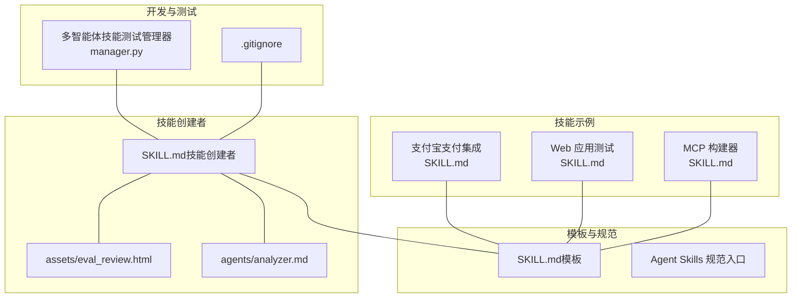
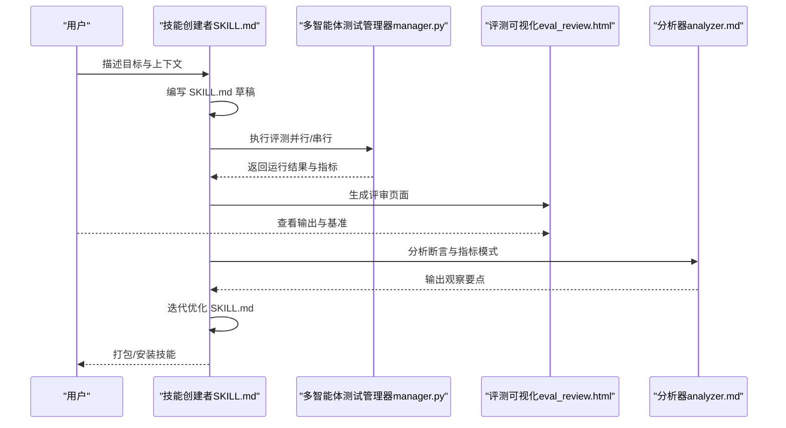
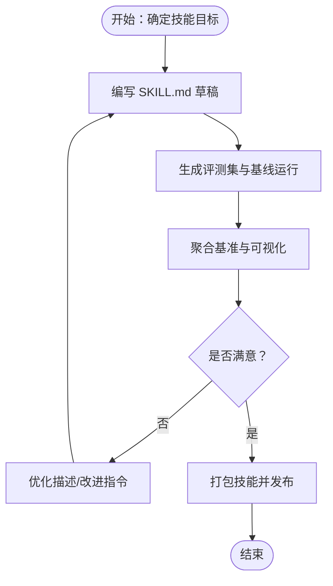
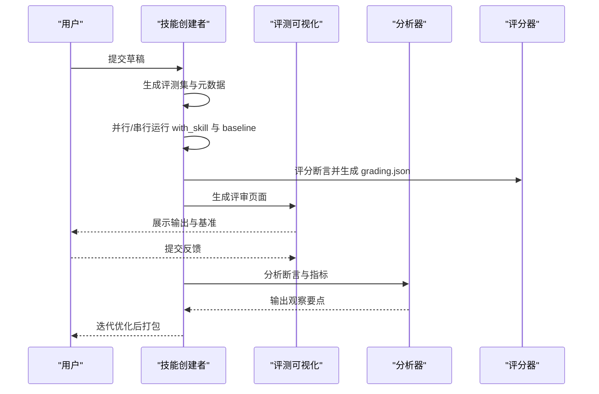
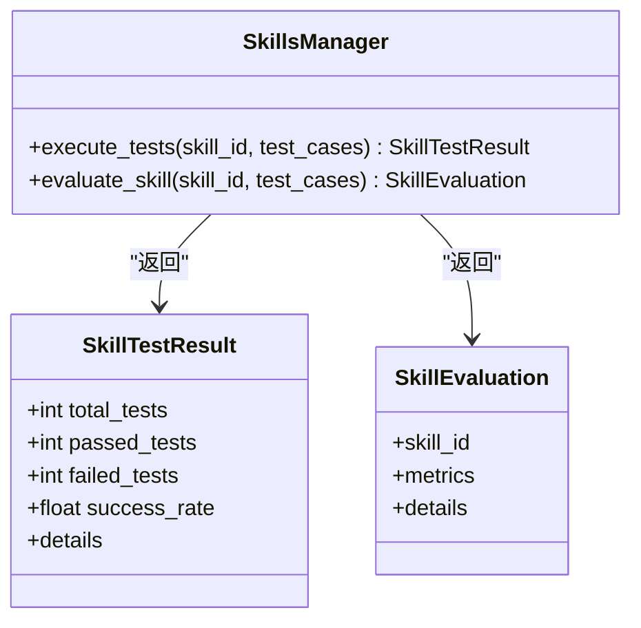
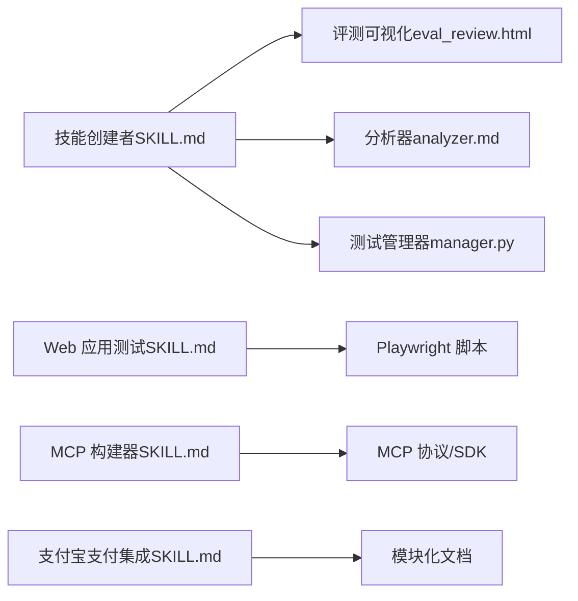

# 自定义技能开发

<cite>
**本文引用的文件**
- [README.md](file://skills/daoSkilLs/skills/anthropics-skills/README.md)
- [SKILL.md（模板）](file://skills/daoSkilLs/skills/anthropics-skills/template/SKILL.md)
- [Agent Skills 规范入口](file://skills/daoSkilLs/skills/anthropics-skills/spec/agent-skills-spec.md)
- [SKILL.md（支付宝支付集成）](file://skills/daoSkilLs/skills/alipay-payment-integration/SKILL.md)
- [SKILL.md（Web 应用测试）](file://skills/daoSkilLs/skills/anthropics-skills/skills/webapp-testing/SKILL.md)
- [SKILL.md（MCP 构建器）](file://skills/daoSkilLs/skills/anthropics-skills/skills/mcp-builder/SKILL.md)
- [SKILL.md（技能创建者）](file://skills/daoSkilLs/skills/anthropics-skills/skills/skill-creator/SKILL.md)
- [.gitignore](file://skills/daoSkilLs/.gitignore)
- [eval_review.html（触发评估模板）](file://skills/daoSkilLs/skills/anthropics-skills/skills/skill-creator/assets/eval_review.html)
- [analyzer.md（基准分析）](file://skills/daoSkilLs/skills/anthropics-skills/skills/skill-creator/agents/analyzer.md)
- [manager.py（多智能体技能测试管理器）](file://tools/flexloop/src/taolib/testing/multi_agent/skills/manager.py)
</cite>

## 目录
1. [引言](#引言)
2. [项目结构](#项目结构)
3. [核心组件](#核心组件)
4. [架构总览](#架构总览)
5. [详细组件分析](#详细组件分析)
6. [依赖分析](#依赖分析)
7. [性能考虑](#性能考虑)
8. [故障排查指南](#故障排查指南)
9. [结论](#结论)
10. [附录](#附录)

## 引言
本指南面向希望在 DAO Apps 生态中开发“自定义技能”的工程师与产品人员。技能是可动态加载、用于提升特定任务执行能力的指令与资源集合，广泛应用于文档创作、测试自动化、MCP 服务集成等场景。本指南基于仓库中的“Anthropic 技能示例”“技能创建者”“MCP 构建器”“Web 应用测试”等真实技能与工具，系统阐述技能模板使用、开发环境配置、代码结构规范、测试策略、发布流程、评估与优化方法，并提供端到端开发案例与常见问题解决方案。

## 项目结构
DAO Apps 的技能体系主要位于 skills/daoSkilLs 目录，包含：
- 示例技能：如“支付宝支付集成”“Web 应用测试”“MCP 构建器”
- 技能创建者：提供从草稿到评测再到迭代优化的完整工作流
- 模板与规范：SKILL.md 模板、Agent Skills 规范入口
- 开发与测试工具：多智能体技能测试管理器、触发评估模板等

图示来源
- [SKILL.md（支付宝支付集成）:1-64](file://skills/daoSkilLs/skills/alipay-payment-integration/SKILL.md#L1-L64)
- [SKILL.md（Web 应用测试）:1-96](file://skills/daoSkilLs/skills/anthropics-skills/skills/webapp-testing/SKILL.md#L1-L96)
- [SKILL.md（MCP 构建器）:1-237](file://skills/daoSkilLs/skills/anthropics-skills/skills/mcp-builder/SKILL.md#L1-L237)
- [SKILL.md（技能创建者）:1-486](file://skills/daoSkilLs/skills/anthropics-skills/skills/skill-creator/SKILL.md#L1-L486)
- [SKILL.md（模板）:1-7](file://skills/daoSkilLs/skills/anthropics-skills/template/SKILL.md#L1-L7)
- [Agent Skills 规范入口:1-4](file://skills/daoSkilLs/skills/anthropics-skills/spec/agent-skills-spec.md#L1-L4)
- [manager.py（多智能体技能测试管理器）:213-257](file://tools/flexloop/src/taolib/testing/multi_agent/skills/manager.py#L213-L257)
- [.gitignore:1-208](file://skills/daoSkilLs/.gitignore#L1-L208)

章节来源
- [README.md:1-95](file://skills/daoSkilLs/skills/anthropics-skills/README.md#L1-L95)
- [SKILL.md（模板）:1-7](file://skills/daoSkilLs/skills/anthropics-skills/template/SKILL.md#L1-L7)
- [Agent Skills 规范入口:1-4](file://skills/daoSkilLs/skills/anthropics-skills/spec/agent-skills-spec.md#L1-L4)

## 核心组件
- 技能模板（SKILL.md）
  - 必需字段：name、description；正文包含指令、示例与规范
  - 结构建议：三段式加载（元数据、主体、按需资源）
- 技能创建者（Skill Creator）
  - 提供从意图捕获、草稿编写、评测、迭代到打包的闭环
  - 包含评测集生成、基准聚合、可视化评审、描述优化等工具链
- 示例技能
  - 支付宝支付集成：模块化文档组织、产品与工具分层
  - Web 应用测试：Playwright 辅助脚本、侦察-行动模式
  - MCP 构建器：MCP 协议实现、工具设计、评估与测试
- 多智能体技能测试管理器
  - 提供统一的测试执行、统计与结果封装接口

章节来源
- [SKILL.md（模板）:1-7](file://skills/daoSkilLs/skills/anthropics-skills/template/SKILL.md#L1-L7)
- [SKILL.md（技能创建者）:45-162](file://skills/daoSkilLs/skills/anthropics-skills/skills/skill-creator/SKILL.md#L45-L162)
- [SKILL.md（支付宝支付集成）:19-64](file://skills/daoSkilLs/skills/alipay-payment-integration/SKILL.md#L19-L64)
- [SKILL.md（Web 应用测试）:16-96](file://skills/daoSkilLs/skills/anthropics-skills/skills/webapp-testing/SKILL.md#L16-L96)
- [SKILL.md（MCP 构建器）:15-148](file://skills/daoSkilLs/skills/anthropics-skills/skills/mcp-builder/SKILL.md#L15-L148)
- [manager.py（多智能体技能测试管理器）:213-257](file://tools/flexloop/src/taolib/testing/multi_agent/skills/manager.py#L213-L257)

## 架构总览
技能开发的总体流程由“意图捕获—草稿编写—评测对比—迭代优化—打包发布”构成，贯穿技能创建者工具链与多智能体测试管理器。

图示来源
- [SKILL.md（技能创建者）:163-252](file://skills/daoSkilLs/skills/anthropics-skills/skills/skill-creator/SKILL.md#L163-L252)
- [eval_review.html（触发评估模板）:1-21](file://skills/daoSkilLs/skills/anthropics-skills/skills/skill-creator/assets/eval_review.html#L1-L21)
- [analyzer.md（基准分析）:195-239](file://skills/daoSkilLs/skills/anthropics-skills/skills/skill-creator/agents/analyzer.md#L195-L239)
- [manager.py（多智能体技能测试管理器）:213-257](file://tools/flexloop/src/taolib/testing/multi_agent/skills/manager.py#L213-L257)

## 详细组件分析

### 组件一：技能模板与结构规范
- 字段要求
  - name：唯一标识（小写、连字符）
  - description：触发时机与能力说明（主触发机制）
- 内容组织
  - 主体建议控制在 500 行以内，必要时增加层级与指路
  - 资源按需加载：scripts/、references/、assets/
- 最佳实践
  - 使用祈使句；明确输出格式；提供示例与指导
  - 对大文档提供目录；对多变体采用按域分层

图示来源
- [SKILL.md（模板）:1-7](file://skills/daoSkilLs/skills/anthropics-skills/template/SKILL.md#L1-L7)
- [SKILL.md（技能创建者）:71-110](file://skills/daoSkilLs/skills/anthropics-skills/skills/skill-creator/SKILL.md#L71-L110)

章节来源
- [SKILL.md（模板）:1-7](file://skills/daoSkilLs/skills/anthropics-skills/template/SKILL.md#L1-L7)
- [SKILL.md（技能创建者）:71-110](file://skills/daoSkilLs/skills/anthropics-skills/skills/skill-creator/SKILL.md#L71-L110)

### 组件二：技能创建者工作流
- 关键步骤
  - 意图捕获：目标、触发条件、输出格式、测试用例
  - 草稿编写：遵循模板与写作模式
  - 评测运行：并行/串行执行，记录耗时与 token
  - 基准聚合：生成 benchmark.json 与报告
  - 可视化评审：输出对比与定量指标
  - 分析观察：断言模式、跨评测模式、资源使用模式
  - 描述优化：生成触发查询集，自动优化描述
- 适用环境差异
  - Claude.ai：无子代理时以人工方式执行与评审
  - Cowork：无浏览器时生成静态 HTML 评审
  - 云端/远程：使用静态评审与反馈收集

图示来源
- [SKILL.md（技能创建者）:163-252](file://skills/daoSkilLs/skills/anthropics-skills/skills/skill-creator/SKILL.md#L163-L252)
- [analyzer.md（基准分析）:195-239](file://skills/daoSkilLs/skills/anthropics-skills/skills/skill-creator/agents/analyzer.md#L195-L239)
- [eval_review.html（触发评估模板）:1-21](file://skills/daoSkilLs/skills/anthropics-skills/skills/skill-creator/assets/eval_review.html#L1-L21)

章节来源
- [SKILL.md（技能创建者）:163-252](file://skills/daoSkilLs/skills/anthropics-skills/skills/skill-creator/SKILL.md#L163-L252)
- [analyzer.md（基准分析）:195-239](file://skills/daoSkilLs/skills/anthropics-skills/skills/skill-creator/agents/analyzer.md#L195-L239)
- [eval_review.html（触发评估模板）:1-21](file://skills/daoSkilLs/skills/anthropics-skills/skills/skill-creator/assets/eval_review.html#L1-L21)

### 组件三：示例技能解析

#### 支付宝支付集成（模块化文档）
- 结构特征
  - 核心模块：基础信息、集成流程、安全规范
  - 产品模块：线下/线上/特殊场景支付
  - 工具模块：文档访问、错误处理、性能优化
  - 文档模块：架构设计、使用指南、维护手册
- 设计要点
  - 清晰的导航与模块划分，便于按需加载
  - 场景关键词匹配与澄清话术，提升触发准确性

章节来源
- [SKILL.md（支付宝支付集成）:19-64](file://skills/daoSkilLs/skills/alipay-payment-integration/SKILL.md#L19-L64)

#### Web 应用测试（Playwright 辅助）
- 决策树
  - 是否静态 HTML → 直接读取并识别选择器
  - 动态应用 → 是否已有服务运行
    - 否：使用 with_server.py 启动并自动化
    - 是：侦察-行动（截图/检查 DOM → 识别选择器 → 执行动作）
- 最佳实践
  - 先等待 networkidle 再检查 DOM
  - 使用同步 Playwright，显式关闭浏览器
  - 使用描述性选择器与适当等待

章节来源
- [SKILL.md（Web 应用测试）:16-96](file://skills/daoSkilLs/skills/anthropics-skills/skills/webapp-testing/SKILL.md#L16-L96)

#### MCP 构建器（协议与实现）
- 四阶段流程
  - 深入研究与规划：理解现代 MCP 设计、协议与框架
  - 实现：项目结构、基础设施、工具实现与注解
  - 审查与测试：代码质量、构建与 MCP Inspector 测试
  - 创建评估：10 个真实复杂问题，XML 格式输出
- 设计原则
  - API 覆盖与工作流工具平衡
  - 工具命名与上下文管理
  - 可操作的错误消息与只读/幂等提示

章节来源
- [SKILL.md（MCP 构建器）:15-148](file://skills/daoSkilLs/skills/anthropics-skills/skills/mcp-builder/SKILL.md#L15-L148)
- [SKILL.md（MCP 构建器）:151-237](file://skills/daoSkilLs/skills/anthropics-skills/skills/mcp-builder/SKILL.md#L151-L237)

### 组件四：多智能体技能测试管理器
- 能力概览
  - 执行技能测试用例，统计成功/失败与成功率
  - 评估技能，支持从文档或外部输入获取测试用例
  - 记录详细结果，便于后续分析与报告
- 关键接口
  - 执行测试：返回总数、通过数、失败数与成功率
  - 评估技能：根据测试用例生成评估结果

图示来源
- [manager.py（多智能体技能测试管理器）:213-257](file://tools/flexloop/src/taolib/testing/multi_agent/skills/manager.py#L213-L257)

章节来源
- [manager.py（多智能体技能测试管理器）:213-257](file://tools/flexloop/src/taolib/testing/multi_agent/skills/manager.py#L213-L257)

## 依赖分析
- 技能创建者依赖于
  - 触发评估模板（HTML）用于生成与导出评测集
  - 基准分析器（analyzer.md）用于模式识别与观察输出
  - 多智能体测试管理器（manager.py）用于执行与统计
- 示例技能之间的依赖
  - 支付宝支付集成：强调模块化与导航
  - Web 应用测试：依赖 Playwright 与辅助脚本
  - MCP 构建器：依赖 MCP 协议与 SDK 文档

图示来源
- [SKILL.md（技能创建者）:163-252](file://skills/daoSkilLs/skills/anthropics-skills/skills/skill-creator/SKILL.md#L163-L252)
- [eval_review.html（触发评估模板）:1-21](file://skills/daoSkilLs/skills/anthropics-skills/skills/skill-creator/assets/eval_review.html#L1-L21)
- [analyzer.md（基准分析）:195-239](file://skills/daoSkilLs/skills/anthropics-skills/skills/skill-creator/agents/analyzer.md#L195-L239)
- [manager.py（多智能体技能测试管理器）:213-257](file://tools/flexloop/src/taolib/testing/multi_agent/skills/manager.py#L213-L257)
- [SKILL.md（Web 应用测试）:1-96](file://skills/daoSkilLs/skills/anthropics-skills/skills/webapp-testing/SKILL.md#L1-L96)
- [SKILL.md（MCP 构建器）:1-237](file://skills/daoSkilLs/skills/anthropics-skills/skills/mcp-builder/SKILL.md#L1-L237)
- [SKILL.md（支付宝支付集成）:1-64](file://skills/daoSkilLs/skills/alipay-payment-integration/SKILL.md#L1-L64)

章节来源
- [SKILL.md（技能创建者）:163-252](file://skills/daoSkilLs/skills/anthropics-skills/skills/skill-creator/SKILL.md#L163-L252)
- [manager.py（多智能体技能测试管理器）:213-257](file://tools/flexloop/src/taolib/testing/multi_agent/skills/manager.py#L213-L257)

## 性能考虑
- 触发与评测
  - 触发质量：描述应足够复杂且具备多步/专业化特征，避免简单单步查询
  - 评测并发：在具备子代理的环境中并行执行 with_skill 与 baseline，缩短总耗时
- 资源使用
  - 时间与 token：关注均值±标准差与增量变化，识别异常波动
  - 工具调用：评估工具组合与调用稳定性
- 代码与文档
  - 控制 SKILL.md 主体长度，使用模块化与导航减少上下文污染
  - 大文档提供目录，按需加载资源

章节来源
- [SKILL.md（技能创建者）:396-401](file://skills/daoSkilLs/skills/anthropics-skills/skills/skill-creator/SKILL.md#L396-L401)
- [analyzer.md（基准分析）:227-233](file://skills/daoSkilLs/skills/anthropics-skills/skills/skill-creator/agents/analyzer.md#L227-L233)

## 故障排查指南
- 触发不生效
  - 检查描述是否过于简单；尝试更复杂的多步/专业化表述
  - 使用触发评估模板生成应触发/不应触发查询集进行验证
- 评测结果不稳定
  - 排查断言是否过于宽松或非判别性；检查是否存在高方差评测
  - 使用分析器识别跨评测与断言模式，定位异常
- 运行超时或资源异常
  - 在 Web 应用测试中确保先等待 networkidle 再检查 DOM
  - 使用 with_server.py 管理服务器生命周期，避免端口冲突
- 环境限制
  - Claude.ai/Cowork 等无浏览器环境：使用静态评审 HTML 或直接在会话中展示结果

章节来源
- [SKILL.md（技能创建者）:337-405](file://skills/daoSkilLs/skills/anthropics-skills/skills/skill-creator/SKILL.md#L337-L405)
- [SKILL.md（Web 应用测试）:78-82](file://skills/daoSkilLs/skills/anthropics-skills/skills/webapp-testing/SKILL.md#L78-L82)
- [analyzer.md（基准分析）:211-233](file://skills/daoSkilLs/skills/anthropics-skills/skills/skill-creator/agents/analyzer.md#L211-L233)

## 结论
通过“技能模板—技能创建者—示例技能—测试管理器”的协同，DAO Apps 为自定义技能开发提供了从草稿到发布的完整路径。遵循三段式加载、模块化文档与严谨评测，结合描述优化与分析器洞察，可显著提升技能的触发准确率、执行稳定性与用户体验。建议在团队内建立标准化的评测集与评审流程，持续迭代与优化。

## 附录

### A. 技能开发框架与规范
- 模板字段与结构
  - 必填：name、description
  - 建议：主体控制在 500 行内；提供目录与模块化导航
- 资源组织
  - scripts/：可执行脚本
  - references/：按需加载的参考文档
  - assets/：输出模板与图标等资源

章节来源
- [SKILL.md（模板）:1-7](file://skills/daoSkilLs/skills/anthropics-skills/template/SKILL.md#L1-L7)
- [SKILL.md（技能创建者）:71-110](file://skills/daoSkilLs/skills/anthropics-skills/skills/skill-creator/SKILL.md#L71-L110)

### B. 测试策略与实施
- 单元测试
  - 针对 scripts/ 中的可执行脚本，编写最小化输入输出断言
- 集成测试
  - 使用多智能体测试管理器执行完整流程，统计成功率与指标
- 性能测试
  - 采集耗时与 token 数据，生成基准报告并进行方差分析

章节来源
- [manager.py（多智能体技能测试管理器）:213-257](file://tools/flexloop/src/taolib/testing/multi_agent/skills/manager.py#L213-L257)
- [analyzer.md（基准分析）:227-233](file://skills/daoSkilLs/skills/anthropics-skills/skills/skill-creator/agents/analyzer.md#L227-L233)

### C. 发布流程与质量保证
- 版本管理
  - 使用语义化版本；变更记录于 SKILL.md 或独立变更日志
- 文档更新
  - 更新 SKILL.md 与 references/ 中的使用指南与维护手册
- 质量保证
  - 通过评测集与基准报告验证；分析器输出作为质量依据
- 部署策略
  - 打包为 .skill 文件；在 Claude Code/Claude.ai/API 中安装与验证

章节来源
- [SKILL.md（技能创建者）:408-418](file://skills/daoSkilLs/skills/anthropics-skills/skills/skill-creator/SKILL.md#L408-L418)

### D. 评估与优化指南
- 基准测试
  - 生成 benchmark.json 与 benchmark.md；对比 with_skill 与 baseline
- 用户体验评估
  - 使用评测可视化页面收集用户反馈；聚焦具体问题与改进建议
- 持续改进
  - 基于分析器观察与用户反馈迭代指令与资源；定期重跑评测集

章节来源
- [SKILL.md（技能创建者）:221-252](file://skills/daoSkilLs/skills/anthropics-skills/skills/skill-creator/SKILL.md#L221-L252)
- [analyzer.md（基准分析）:195-239](file://skills/daoSkilLs/skills/anthropics-skills/skills/skill-creator/agents/analyzer.md#L195-L239)

### E. 实际开发案例（端到端）
- 需求分析
  - 明确技能目标、触发条件、输出格式与测试用例
- 草稿编写
  - 基于模板与写作模式完成 SKILL.md
- 评测与评审
  - 并行运行 with_skill 与 baseline；生成评审页面
- 分析与优化
  - 使用分析器识别断言与指标模式；优化描述与指令
- 打包与发布
  - 生成 .skill 文件并在目标平台安装验证

章节来源
- [SKILL.md（技能创建者）:10-31](file://skills/daoSkilLs/skills/anthropics-skills/skills/skill-creator/SKILL.md#L10-L31)
- [SKILL.md（技能创建者）:472-486](file://skills/daoSkilLs/skills/anthropics-skills/skills/skill-creator/SKILL.md#L472-L486)

### F. 常见问题与调试技巧
- 触发不触发
  - 使用触发评估模板生成查询集；调整描述以增强触发
- 评测不稳定
  - 重新审视断言与评测设计；排除高方差评测
- 运行异常
  - 确认网络状态与等待策略；使用 with_server.py 管理服务

章节来源
- [SKILL.md（技能创建者）:337-405](file://skills/daoSkilLs/skills/anthropics-skills/skills/skill-creator/SKILL.md#L337-L405)
- [SKILL.md（Web 应用测试）:78-82](file://skills/daoSkilLs/skills/anthropics-skills/skills/webapp-testing/SKILL.md#L78-L82)