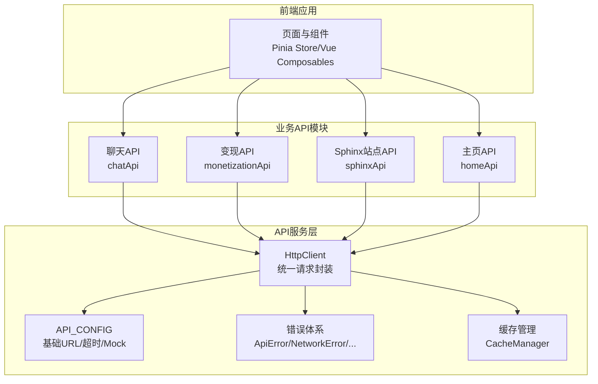
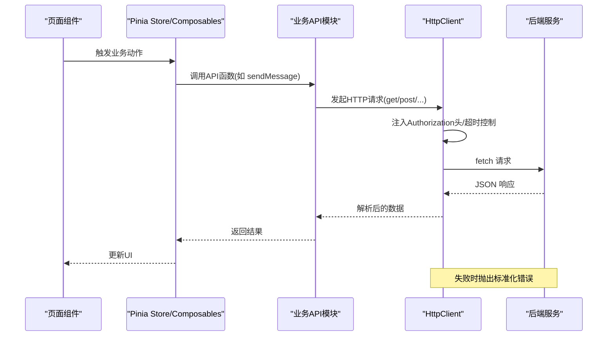
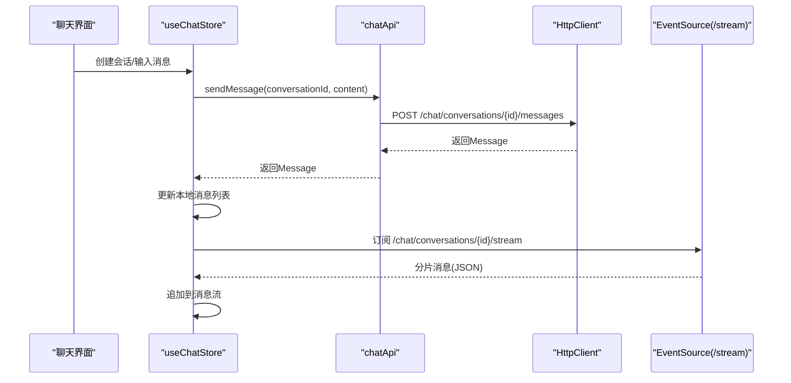
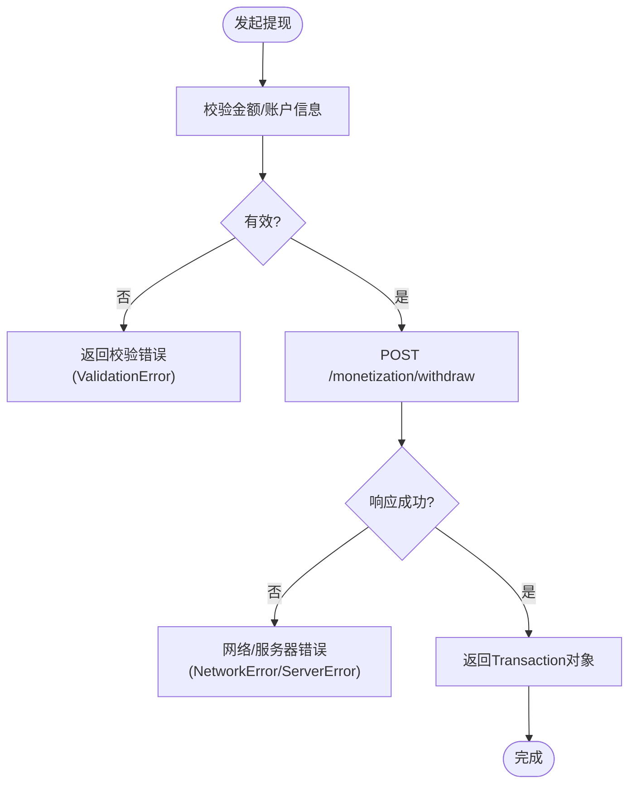
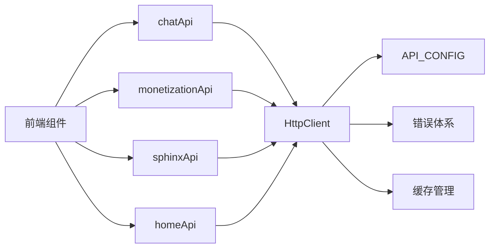

# API服务设计

<cite>
**本文档引用的文件**
- [src/services/api/client.ts](file://src/services/api/client.ts)
- [src/services/config.ts](file://src/services/config.ts)
- [src/services/errors.ts](file://src/services/errors.ts)
- [src/services/cache.ts](file://src/services/cache.ts)
- [src/services/api/chat.ts](file://src/services/api/chat.ts)
- [src/services/api/monetization.ts](file://src/services/api/monetization.ts)
- [src/services/api/sphinx.ts](file://src/services/api/sphinx.ts)
- [src/services/api/home.ts](file://src/services/api/home.ts)
- [apps/AgentPit/src/stores/useChatStore.ts](file://apps/AgentPit/src/stores/useChatStore.ts)
- [apps/AgentPit/src/composables/useSSE.ts](file://apps/AgentPit/src/composables/useSSE.ts)
- [apps/AgentPit/src/types/chat.ts](file://apps/AgentPit/src/types/chat.ts)
</cite>

## 目录
1. [简介](#简介)
2. [项目结构](#项目结构)
3. [核心组件](#核心组件)
4. [架构总览](#架构总览)
5. [详细组件分析](#详细组件分析)
6. [依赖关系分析](#依赖关系分析)
7. [性能考虑](#性能考虑)
8. [故障排查指南](#故障排查指南)
9. [结论](#结论)
10. [附录](#附录)

## 简介
本文件面向DAOApps的API服务设计，系统化阐述RESTful API设计规范与WebSocket实时通信实现，覆盖HTTP方法、URL模式、请求/响应格式、认证机制、版本管理策略、错误处理与扩展方法，并给出聊天服务、变现服务、Sphinx站点构建服务与主页服务的完整接口说明、调用示例路径、参数说明、响应格式与客户端实现指南。

## 项目结构
DAOApps采用前后端分离与多应用协作的组织方式：前端应用位于apps目录，核心API服务封装在src/services下；各业务模块通过独立API模块进行调用，统一由HttpClient发起请求，配置中心控制基础URL、超时与Mock开关，错误体系提供标准化异常类型，缓存层提升性能与离线体验。

图表来源
- [src/services/api/client.ts:19-102](file://src/services/api/client.ts#L19-L102)
- [src/services/config.ts:2-10](file://src/services/config.ts#L2-L10)
- [src/services/errors.ts:1-45](file://src/services/errors.ts#L1-L45)
- [src/services/cache.ts:8-47](file://src/services/cache.ts#L8-L47)
- [src/services/api/chat.ts:26-86](file://src/services/api/chat.ts#L26-L86)
- [src/services/api/monetization.ts:40-76](file://src/services/api/monetization.ts#L40-L76)
- [src/services/api/sphinx.ts:32-68](file://src/services/api/sphinx.ts#L32-L68)
- [src/services/api/home.ts:20-29](file://src/services/api/home.ts#L20-L29)

章节来源
- [src/services/api/client.ts:1-105](file://src/services/api/client.ts#L1-L105)
- [src/services/config.ts:1-11](file://src/services/config.ts#L1-L11)
- [src/services/errors.ts:1-45](file://src/services/errors.ts#L1-L45)
- [src/services/cache.ts:1-50](file://src/services/cache.ts#L1-L50)

## 核心组件
- 统一HTTP客户端：封装GET/POST/PUT/PATCH/DELETE方法，自动注入Authorization头，支持超时控制与AbortController取消，统一解析JSON响应并抛出标准化错误。
- 配置中心：集中管理baseURL、timeout、useMock、重试策略等。
- 错误体系：ApiError基类及NetworkError、ServerError、ValidationError、UnauthorizedError等派生类型，便于前端捕获与UI反馈。
- 缓存管理：基于Map的内存缓存，支持TTL过期、按正则清理、键值增删查清操作。
- 业务API模块：聊天、变现、Sphinx站点、主页四大模块，每个模块暴露清晰的函数式API，内部可选择Mock或真实后端。

章节来源
- [src/services/api/client.ts:19-102](file://src/services/api/client.ts#L19-L102)
- [src/services/config.ts:2-10](file://src/services/config.ts#L2-L10)
- [src/services/errors.ts:1-45](file://src/services/errors.ts#L1-L45)
- [src/services/cache.ts:8-47](file://src/services/cache.ts#L8-L47)

## 架构总览
API调用链路自上而下：页面组件通过Pinia Store或Composables触发业务API；业务API调用HttpClient；HttpClient根据API_CONFIG拼接URL、注入认证头并执行fetch；后端返回JSON，HttpClient解析并返回；错误通过错误体系抛出；可选地使用缓存提升性能。

图表来源
- [apps/AgentPit/src/stores/useChatStore.ts:176-215](file://apps/AgentPit/src/stores/useChatStore.ts#L176-L215)
- [src/services/api/chat.ts:46-55](file://src/services/api/chat.ts#L46-L55)
- [src/services/api/client.ts:33-69](file://src/services/api/client.ts#L33-L69)

## 详细组件分析

### 统一HTTP客户端（HttpClient）
- 功能要点
  - 自动注入Authorization头（若存在localStorage中的auth_token）
  - 支持GET/POST/PUT/PATCH/DELETE
  - 超时控制与AbortController取消
  - 统一响应解析与错误分类
- 错误处理
  - 网络超时：NetworkError
  - fetch非ok：ServerError(status)
  - 其他异常：NetworkError
  - 已知ApiError直接透传
- 使用建议
  - 在业务API模块中复用httpClient，避免重复逻辑
  - 对需要鉴权的接口无需手动传头，自动注入

章节来源
- [src/services/api/client.ts:19-102](file://src/services/api/client.ts#L19-L102)
- [src/services/errors.ts:12-44](file://src/services/errors.ts#L12-L44)

### 配置中心（API_CONFIG）
- 关键项
  - baseURL：后端API基础地址，默认开发环境本地地址
  - timeout：默认请求超时时间
  - useMock：是否启用Mock模式
  - retry：重试次数与延迟（当前用于配置，具体重试逻辑需在业务层实现）
- 使用建议
  - 通过VITE_*环境变量切换不同环境
  - 生产环境务必确保baseURL正确指向后端

章节来源
- [src/services/config.ts:2-10](file://src/services/config.ts#L2-L10)

### 错误体系
- ApiError：通用API错误基类
- NetworkError：网络异常（超时/断网）
- ServerError：HTTP状态错误（带status）
- ValidationError：字段校验错误（含fields）
- UnauthorizedError：未授权访问
- 建议
  - 前端按错误类型做差异化提示与重试
  - 后端配合返回标准错误码与message

章节来源
- [src/services/errors.ts:1-45](file://src/services/errors.ts#L1-L45)

### 缓存管理（CacheManager）
- 能力
  - get/set/delete/clear/clearPattern
  - TTL过期控制
- 使用建议
  - 对高频读取且不频繁变化的数据启用缓存
  - 清理策略结合路由/模块维度

章节来源
- [src/services/cache.ts:8-47](file://src/services/cache.ts#L8-L47)

### 聊天服务（chatApi）
- 接口清单
  - GET /chat/conversations → 获取对话列表
  - GET /chat/conversations/{conversationId} → 获取消息历史
  - POST /chat/conversations/{conversationId}/messages → 发送消息
  - GET /chat/conversations/{conversationId}/stream → SSE流式消息（浏览器端EventSource）
- 数据模型
  - Conversation：id/title/lastMessage/lastMessageTime/unreadCount
  - Message：id/content/sender('user'/'agent')/timestamp/status('sending'/'sent'/'failed')
- 实时通信
  - 浏览器端通过EventSource订阅/stream
  - Mock模式下模拟流式片段推送
- 客户端集成
  - Pinia Store维护会话与消息列表
  - 发送消息后更新本地状态并等待流式返回

图表来源
- [src/services/api/chat.ts:46-85](file://src/services/api/chat.ts#L46-L85)
- [apps/AgentPit/src/stores/useChatStore.ts:199-215](file://apps/AgentPit/src/stores/useChatStore.ts#L199-L215)
- [apps/AgentPit/src/composables/useSSE.ts:18-39](file://apps/AgentPit/src/composables/useSSE.ts#L18-L39)

章节来源
- [src/services/api/chat.ts:26-86](file://src/services/api/chat.ts#L26-L86)
- [apps/AgentPit/src/stores/useChatStore.ts:176-215](file://apps/AgentPit/src/stores/useChatStore.ts#L176-L215)
- [apps/AgentPit/src/composables/useSSE.ts:1-129](file://apps/AgentPit/src/composables/useSSE.ts#L1-L129)
- [apps/AgentPit/src/types/chat.ts:38-76](file://apps/AgentPit/src/types/chat.ts#L38-L76)

### 变现服务（monetizationApi）
- 接口清单
  - GET /monetization/wallet → 获取钱包余额
  - GET /monetization/revenue → 获取收益数据
  - GET /monetization/transactions → 获取交易历史
  - POST /monetization/withdraw → 发起提现
- 数据模型
  - Wallet：balance/currency/lastUpdate
  - RevenueData：total/daily/monthly/trends
  - Transaction：id/type('income'/'expense')/amount/currency/description/timestamp/status('pending'/'completed'/'failed')
  - WithdrawRequest：amount/currency/method/account

图表来源
- [src/services/api/monetization.ts:68-75](file://src/services/api/monetization.ts#L68-L75)
- [src/services/errors.ts:29-37](file://src/services/errors.ts#L29-L37)

章节来源
- [src/services/api/monetization.ts:40-76](file://src/services/api/monetization.ts#L40-L76)

### Sphinx站点构建服务（sphinxApi）
- 接口清单
  - GET /sphinx/templates → 获取模板列表
  - GET /sphinx/preview/{siteId} → 获取站点预览
  - POST /sphinx/generate → 生成站点
  - POST /sphinx/publish/{siteId} → 发布站点
- 数据模型
  - Template：id/name/description/preview/category/popularity
  - SitePreview：id/url/status('draft'/'published')/lastUpdated
  - SiteGenerateRequest：templateId/content/settings

章节来源
- [src/services/api/sphinx.ts:32-68](file://src/services/api/sphinx.ts#L32-L68)

### 主页服务（homeApi）
- 接口清单
  - GET /home/modules → 获取模块列表
- 数据模型
  - Module：id/title/description/icon/route/status('active'/'inactive')/badge?

章节来源
- [src/services/api/home.ts:20-29](file://src/services/api/home.ts#L20-L29)

## 依赖关系分析
- 低耦合高内聚
  - 业务API模块仅依赖HttpClient与配置中心，彼此独立
  - 错误体系与缓存作为横切关注点被复用
- 关键依赖链
  - 前端组件 → 业务API模块 → HttpClient → fetch
  - 错误体系贯穿整个调用链
  - 缓存可选地介入业务API模块以提升性能

图表来源
- [src/services/api/chat.ts:26-86](file://src/services/api/chat.ts#L26-L86)
- [src/services/api/monetization.ts:40-76](file://src/services/api/monetization.ts#L40-L76)
- [src/services/api/sphinx.ts:32-68](file://src/services/api/sphinx.ts#L32-L68)
- [src/services/api/home.ts:20-29](file://src/services/api/home.ts#L20-L29)
- [src/services/api/client.ts:19-102](file://src/services/api/client.ts#L19-L102)
- [src/services/config.ts:2-10](file://src/services/config.ts#L2-L10)
- [src/services/errors.ts:1-45](file://src/services/errors.ts#L1-L45)
- [src/services/cache.ts:8-47](file://src/services/cache.ts#L8-L47)

## 性能考虑
- 请求缓存
  - 对高频读取接口（如模板列表、模块列表、钱包余额）启用缓存，合理设置TTL
- 超时与取消
  - 合理设置timeout，避免长时间阻塞UI
  - 使用AbortController在组件卸载时取消请求
- Mock与离线
  - 开发阶段使用useMock快速迭代，生产环境关闭
- 流式传输
  - SSE分片推送降低首屏延迟，前端按片段渲染
- 并发控制
  - 对同一会话的消息发送进行串行化，避免乱序与竞态

## 故障排查指南
- 常见问题定位
  - 网络超时：检查timeout与网络状况，必要时增加重试
  - 未授权：确认Authorization头是否注入，token是否过期
  - 服务器错误：查看状态码与后端日志
  - 校验错误：根据fields定位具体字段问题
- 建议流程
  - 捕获NetworkError/ServerError/ValidationError
  - 对可恢复错误进行指数退避重试
  - 对不可恢复错误引导用户检查配置或联系支持

章节来源
- [src/services/api/client.ts:56-68](file://src/services/api/client.ts#L56-L68)
- [src/services/errors.ts:12-44](file://src/services/errors.ts#L12-L44)

## 结论
DAOApps的API设计遵循“统一客户端、模块化业务、标准化错误、可插拔Mock”的原则，既保证了开发效率，也为后续扩展与演进提供了清晰边界。通过SSE实现实时交互，结合缓存与合理的错误处理，可在复杂场景下保持良好的用户体验与系统稳定性。

## 附录

### RESTful API规范与示例路径
- 统一约定
  - 方法：GET/POST/PUT/PATCH/DELETE
  - 成功响应：包含data字段与success标志
  - 认证：Authorization: Bearer <token>
  - 超时：默认30秒，可通过配置调整
- 示例路径
  - 获取对话列表：GET [src/services/api/chat.ts:28-34](file://src/services/api/chat.ts#L28-L34)
  - 获取消息历史：GET [src/services/api/chat.ts:37-43](file://src/services/api/chat.ts#L37-L43)
  - 发送消息：POST [src/services/api/chat.ts:46-55](file://src/services/api/chat.ts#L46-L55)
  - SSE流式消息：GET [src/services/api/chat.ts:58-85](file://src/services/api/chat.ts#L58-L85)
  - 获取钱包余额：GET [src/services/api/monetization.ts:42-48](file://src/services/api/monetization.ts#L42-L48)
  - 获取收益数据：GET [src/services/api/monetization.ts:51-57](file://src/services/api/monetization.ts#L51-L57)
  - 获取交易历史：GET [src/services/api/monetization.ts:60-66](file://src/services/api/monetization.ts#L60-L66)
  - 发起提现：POST [src/services/api/monetization.ts:69-75](file://src/services/api/monetization.ts#L69-L75)
  - 获取模板列表：GET [src/services/api/sphinx.ts:34-40](file://src/services/api/sphinx.ts#L34-L40)
  - 获取站点预览：GET [src/services/api/sphinx.ts:43-49](file://src/services/api/sphinx.ts#L43-L49)
  - 生成站点：POST [src/services/api/sphinx.ts:52-58](file://src/services/api/sphinx.ts#L52-L58)
  - 发布站点：POST [src/services/api/sphinx.ts:61-67](file://src/services/api/sphinx.ts#L61-L67)
  - 获取模块列表：GET [src/services/api/home.ts:22-28](file://src/services/api/home.ts#L22-L28)

### WebSocket与SSE实现要点
- 连接处理
  - 浏览器端使用EventSource订阅/stream
  - Mock模式下模拟分片推送，便于前端调试
- 消息格式
  - SSE事件：data字段承载JSON字符串
  - 前端解析后逐段追加到消息流
- 事件类型与交互模式
  - 事件类型：message（消息到达）、streaming（流式开始/结束）
  - 交互模式：单向流式推送，客户端负责渲染与滚动

章节来源
- [src/services/api/chat.ts:58-85](file://src/services/api/chat.ts#L58-L85)
- [apps/AgentPit/src/composables/useSSE.ts:18-95](file://apps/AgentPit/src/composables/useSSE.ts#L18-L95)
- [apps/AgentPit/src/types/chat.ts:125-133](file://apps/AgentPit/src/types/chat.ts#L125-L133)

### API版本管理策略
- 建议
  - 在baseURL中加入版本号（如/api/v1），避免破坏性变更
  - 旧版本通过兼容层过渡，逐步淘汰
  - 重大变更发布新版本并提供迁移指南

### 错误处理机制
- 前端
  - 捕获NetworkError/ServerError/ValidationError/UnauthorizedError
  - 提供用户友好的提示与重试按钮
- 后端
  - 返回明确的错误码与message
  - 区分业务错误与系统错误

章节来源
- [src/services/errors.ts:1-45](file://src/services/errors.ts#L1-L45)
- [src/services/api/client.ts:50-68](file://src/services/api/client.ts#L50-L68)

### API扩展方法
- 新增模块
  - 在src/services/api下新增模块文件，导出API函数
  - 在src/services/index.ts中统一导出
  - 在前端组件中按需引入并使用
- Mock与真实后端切换
  - 通过VITE_USE_MOCK_API控制useMock
  - Mock数据位于apps/AgentPit/src/data/mock*.ts

### 客户端实现指南
- 聊天
  - 使用useChatStore维护会话与消息
  - 通过chatApi调用后端接口
  - 使用SSE监听流式消息
- 变现
  - 使用monetizationApi获取余额/收益/交易
  - 发起提现时进行表单校验与二次确认
- Sphinx
  - 选择模板后提交生成请求
  - 预览完成后发布上线
- 主页
  - 加载模块列表并渲染导航卡片

章节来源
- [apps/AgentPit/src/stores/useChatStore.ts:176-215](file://apps/AgentPit/src/stores/useChatStore.ts#L176-L215)
- [apps/AgentPit/src/composables/useSSE.ts:1-129](file://apps/AgentPit/src/composables/useSSE.ts#L1-L129)
- [src/services/api/monetization.ts:40-76](file://src/services/api/monetization.ts#L40-L76)
- [src/services/api/sphinx.ts:32-68](file://src/services/api/sphinx.ts#L32-L68)
- [src/services/api/home.ts:20-29](file://src/services/api/home.ts#L20-L29)