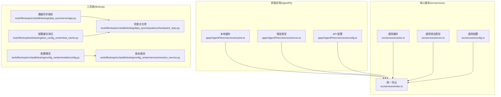
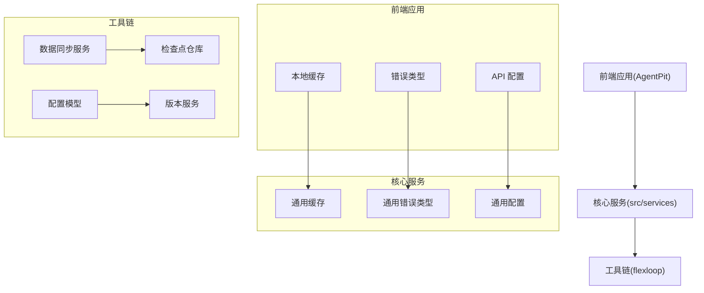
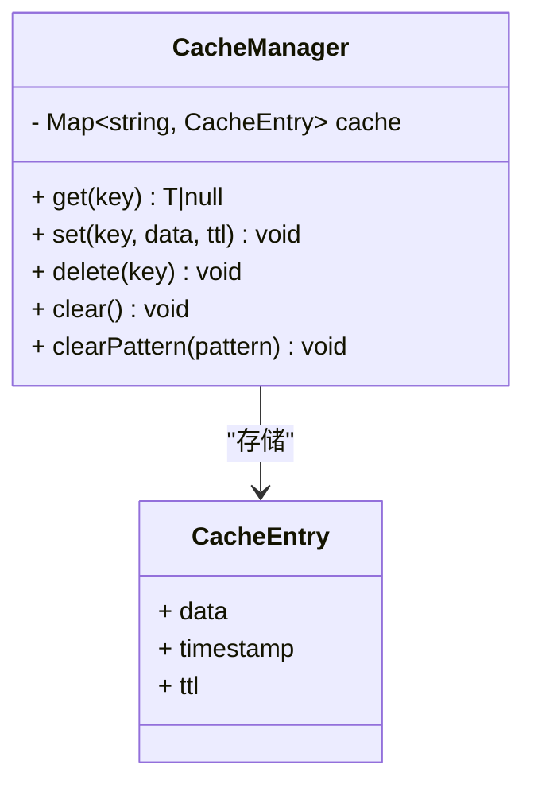
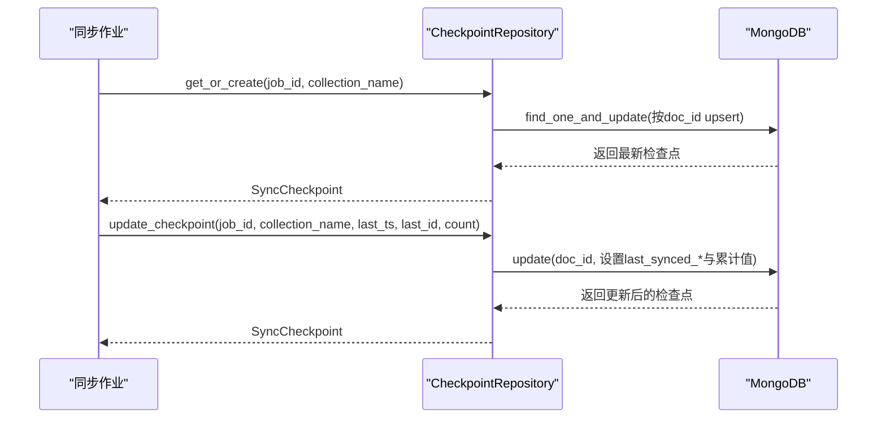
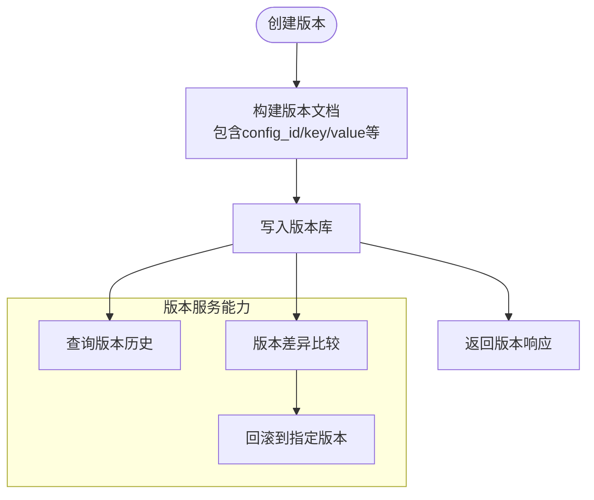
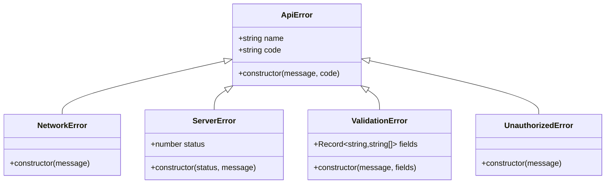
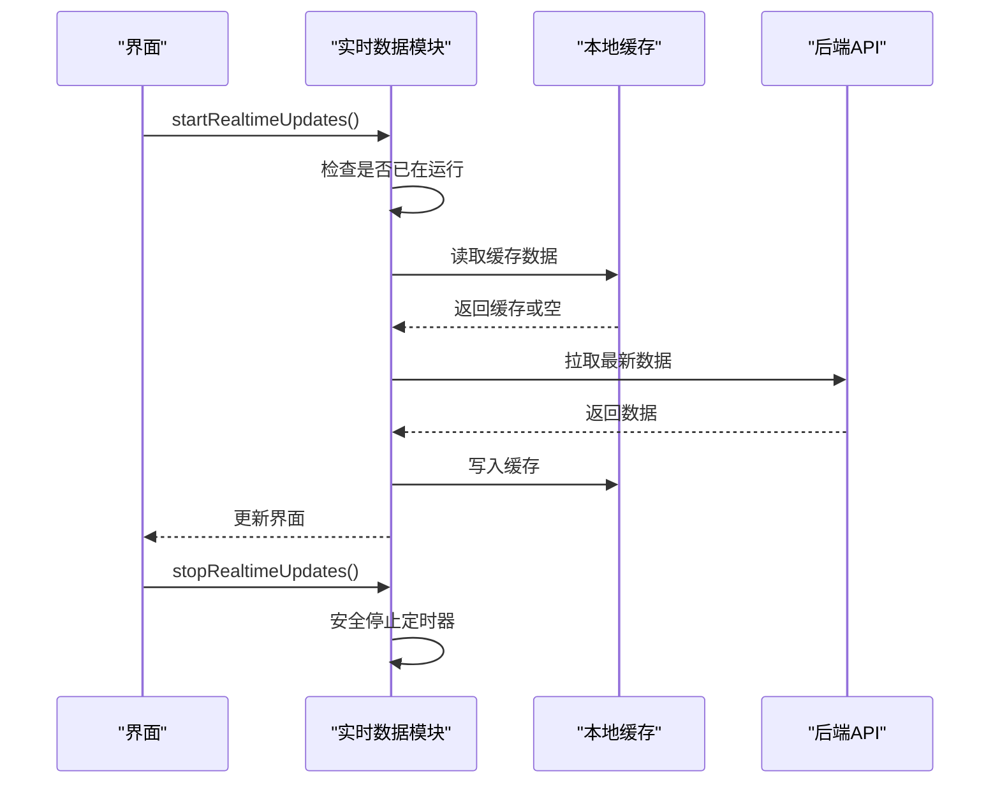
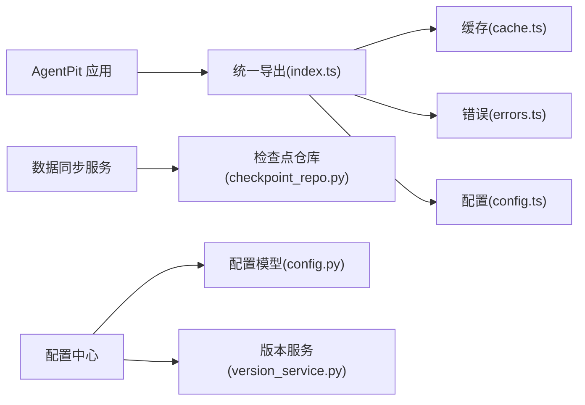

# 数据服务

<cite>
**本文引用的文件**
- [src/services/cache.ts](file://src/services/cache.ts)
- [apps/AgentPit/src/services/cache.ts](file://apps/AgentPit/src/services/cache.ts)
- [src/services/errors.ts](file://src/services/errors.ts)
- [apps/AgentPit/src/services/errors.ts](file://apps/AgentPit/src/services/errors.ts)
- [src/services/config.ts](file://src/services/config.ts)
- [apps/AgentPit/src/services/config.ts](file://apps/AgentPit/src/services/config.ts)
- [src/services/index.ts](file://src/services/index.ts)
- [tools/flexloop/src/taolib/testing/data_sync/repository/checkpoint_repo.py](file://tools/flexloop/src/taolib/testing/data_sync/repository/checkpoint_repo.py)
- [tools/flexloop/src/taolib/testing/data_sync/server/app.py](file://tools/flexloop/src/taolib/testing/data_sync/server/app.py)
- [tools/flexloop/tests/testing/test_config_center/test_cache.py](file://tools/flexloop/tests/testing/test_config_center/test_cache.py)
- [tools/flexloop/tests/testing/test_config_center/verify_tests.py](file://tools/flexloop/tests/testing/test_config_center/verify_tests.py)
- [tools/flexloop/src/taolib/testing/config_center/models/config.py](file://tools/flexloop/src/taolib/testing/config_center/models/config.py)
- [tools/flexloop/src/taolib/testing/config_center/services/version_service.py](file://tools/flexloop/src/taolib/testing/config_center/services/version_service.py)
- [tools/flexloop/tests/testing/test_config_center/test_api_integration.py](file://tools/flexloop/tests/testing/test_config_center/test_api_integration.py)
- [apps/AgentPit/src/__tests__/composables/useRealtimeData.spec.ts](file://apps/AgentPit/src/__tests__/composables/useRealtimeData.spec.ts)
- [tools/DeepResearch/src/deepresearch/llms/llm.py](file://tools/DeepResearch/src/deepresearch/llms/llm.py)
- [skills/daoSkilLs/skills/alipay-payment-integration/modules/utils/error-handling-implementation.md](file://skills/daoSkilLs/skills/alipay-payment-integration/modules/utils/error-handling-implementation.md)
</cite>

## 目录
1. [简介](#简介)
2. [项目结构](#项目结构)
3. [核心组件](#核心组件)
4. [架构总览](#架构总览)
5. [详细组件分析](#详细组件分析)
6. [依赖分析](#依赖分析)
7. [性能考虑](#性能考虑)
8. [故障排查指南](#故障排查指南)
9. [结论](#结论)
10. [附录](#附录)

## 简介
本文件面向 DAOApps 的数据服务，围绕以下目标展开：缓存策略实现、数据同步机制与离线数据处理、配置中心的动态配置管理与版本控制、统一错误处理与恢复策略，并给出性能优化与一致性保障建议。文档同时提供可视化图示与最佳实践指引，帮助开发者快速理解与落地。

## 项目结构
DAOApps 的数据服务涉及三层：
- 前端应用层（AgentPit）：提供本地缓存、错误类型与 API 配置。
- 核心服务层（src/services）：统一导出配置、错误与缓存工具。
- 工具链与基础设施（flexloop）：提供数据同步服务、配置中心模型与版本服务，以及配套测试与基准脚本。

图表来源
- [apps/AgentPit/src/services/cache.ts:1-50](file://apps/AgentPit/src/services/cache.ts#L1-L50)
- [apps/AgentPit/src/services/errors.ts:1-45](file://apps/AgentPit/src/services/errors.ts#L1-L45)
- [apps/AgentPit/src/services/config.ts:1-11](file://apps/AgentPit/src/services/config.ts#L1-L11)
- [src/services/index.ts:1-10](file://src/services/index.ts#L1-L10)
- [src/services/cache.ts:1-50](file://src/services/cache.ts#L1-L50)
- [src/services/errors.ts:1-45](file://src/services/errors.ts#L1-L45)
- [src/services/config.ts:1-11](file://src/services/config.ts#L1-L11)
- [tools/flexloop/src/taolib/testing/data_sync/server/app.py:57-84](file://tools/flexloop/src/taolib/testing/data_sync/server/app.py#L57-L84)
- [tools/flexloop/src/taolib/testing/data_sync/repository/checkpoint_repo.py:15-111](file://tools/flexloop/src/taolib/testing/data_sync/repository/checkpoint_repo.py#L15-L111)
- [tools/flexloop/src/taolib/testing/config_center/models/config.py:14-106](file://tools/flexloop/src/taolib/testing/config_center/models/config.py#L14-L106)
- [tools/flexloop/src/taolib/testing/config_center/services/version_service.py:47-192](file://tools/flexloop/src/taolib/testing/config_center/services/version_service.py#L47-L192)
- [tools/flexloop/tests/testing/test_config_center/test_cache.py:128-158](file://tools/flexloop/tests/testing/test_config_center/test_cache.py#L128-L158)

章节来源
- [src/services/index.ts:1-10](file://src/services/index.ts#L1-L10)
- [src/services/cache.ts:1-50](file://src/services/cache.ts#L1-L50)
- [src/services/errors.ts:1-45](file://src/services/errors.ts#L1-L45)
- [src/services/config.ts:1-11](file://src/services/config.ts#L1-L11)
- [apps/AgentPit/src/services/cache.ts:1-50](file://apps/AgentPit/src/services/cache.ts#L1-L50)
- [apps/AgentPit/src/services/errors.ts:1-45](file://apps/AgentPit/src/services/errors.ts#L1-L45)
- [apps/AgentPit/src/services/config.ts:1-11](file://apps/AgentPit/src/services/config.ts#L1-L11)
- [tools/flexloop/src/taolib/testing/data_sync/server/app.py:57-84](file://tools/flexloop/src/taolib/testing/data_sync/server/app.py#L57-L84)
- [tools/flexloop/src/taolib/testing/data_sync/repository/checkpoint_repo.py:15-111](file://tools/flexloop/src/taolib/testing/data_sync/repository/checkpoint_repo.py#L15-L111)
- [tools/flexloop/src/taolib/testing/config_center/models/config.py:14-106](file://tools/flexloop/src/taolib/testing/config_center/models/config.py#L14-L106)
- [tools/flexloop/src/taolib/testing/config_center/services/version_service.py:47-192](file://tools/flexloop/src/taolib/testing/config_center/services/version_service.py#L47-L192)
- [tools/flexloop/tests/testing/test_config_center/test_cache.py:128-158](file://tools/flexloop/tests/testing/test_config_center/test_cache.py#L128-L158)

## 核心组件
- 本地缓存管理器：提供基于 Map 的内存缓存，支持 TTL 过期、按正则清理、批量清理与删除。
- 统一错误类型体系：覆盖网络、服务端、参数校验、未授权等场景，便于前端统一处理与上报。
- API 配置：集中管理基础地址、超时、Mock 开关与重试策略。
- 数据同步检查点：以 MongoDB 为中心的检查点持久化，支持获取/创建、更新与索引。
- 配置中心模型与版本服务：定义配置文档结构、版本记录与差异比较、回滚等能力。
- 实时数据与离线处理：通过定时轮询与通知机制实现数据刷新与状态提示；结合缓存提升离线可用性。

章节来源
- [src/services/cache.ts:1-50](file://src/services/cache.ts#L1-L50)
- [apps/AgentPit/src/services/cache.ts:1-50](file://apps/AgentPit/src/services/cache.ts#L1-L50)
- [src/services/errors.ts:1-45](file://src/services/errors.ts#L1-L45)
- [apps/AgentPit/src/services/errors.ts:1-45](file://apps/AgentPit/src/services/errors.ts#L1-L45)
- [src/services/config.ts:1-11](file://src/services/config.ts#L1-L11)
- [apps/AgentPit/src/services/config.ts:1-11](file://apps/AgentPit/src/services/config.ts#L1-L11)
- [tools/flexloop/src/taolib/testing/data_sync/repository/checkpoint_repo.py:15-111](file://tools/flexloop/src/taolib/testing/data_sync/repository/checkpoint_repo.py#L15-L111)
- [tools/flexloop/src/taolib/testing/config_center/models/config.py:14-106](file://tools/flexloop/src/taolib/testing/config_center/models/config.py#L14-L106)
- [tools/flexloop/src/taolib/testing/config_center/services/version_service.py:47-192](file://tools/flexloop/src/taolib/testing/config_center/services/version_service.py#L47-L192)
- [apps/AgentPit/src/__tests__/composables/useRealtimeData.spec.ts:205-248](file://apps/AgentPit/src/__tests__/composables/useRealtimeData.spec.ts#L205-L248)

## 架构总览
下图展示数据服务在不同层级的交互：前端应用通过统一导出模块使用缓存与错误类型；核心服务提供通用能力；工具链提供数据同步与配置中心能力。

图表来源
- [src/services/index.ts:1-10](file://src/services/index.ts#L1-L10)
- [src/services/cache.ts:1-50](file://src/services/cache.ts#L1-L50)
- [src/services/errors.ts:1-45](file://src/services/errors.ts#L1-L45)
- [src/services/config.ts:1-11](file://src/services/config.ts#L1-L11)
- [tools/flexloop/src/taolib/testing/data_sync/server/app.py:57-84](file://tools/flexloop/src/taolib/testing/data_sync/server/app.py#L57-L84)
- [tools/flexloop/src/taolib/testing/data_sync/repository/checkpoint_repo.py:15-111](file://tools/flexloop/src/taolib/testing/data_sync/repository/checkpoint_repo.py#L15-L111)
- [tools/flexloop/src/taolib/testing/config_center/models/config.py:14-106](file://tools/flexloop/src/taolib/testing/config_center/models/config.py#L14-L106)
- [tools/flexloop/src/taolib/testing/config_center/services/version_service.py:47-192](file://tools/flexloop/src/taolib/testing/config_center/services/version_service.py#L47-L192)

## 详细组件分析

### 缓存系统
- 设计要点
  - 使用 Map 存储缓存条目，每个条目包含数据、时间戳与 TTL。
  - 读取时判断是否过期，过期则删除并返回空。
  - 支持按正则清理匹配的键，便于按服务或模块维度批量失效。
- 缓存键设计
  - 建议采用“环境:服务:路径”的层级结构，例如“development:auth-service:db.host”，便于按服务维度清理。
  - 在配置中心测试中可见标准键生成方式，可作为统一规范。
- 失效策略
  - TTL 过期自动清理。
  - 按正则批量清理，适合灰度发布或服务迁移时的全局失效。
  - 单个删除与全量清空满足调试与重置场景。

图表来源
- [src/services/cache.ts:1-50](file://src/services/cache.ts#L1-L50)
- [apps/AgentPit/src/services/cache.ts:1-50](file://apps/AgentPit/src/services/cache.ts#L1-L50)

章节来源
- [src/services/cache.ts:1-50](file://src/services/cache.ts#L1-L50)
- [apps/AgentPit/src/services/cache.ts:1-50](file://apps/AgentPit/src/services/cache.ts#L1-L50)
- [tools/flexloop/tests/testing/test_config_center/test_cache.py:128-158](file://tools/flexloop/tests/testing/test_config_center/test_cache.py#L128-L158)
- [tools/flexloop/tests/testing/test_config_center/verify_tests.py:101-115](file://tools/flexloop/tests/testing/test_config_center/verify_tests.py#L101-L115)

### 数据同步与检查点
- 检查点仓库提供：
  - 获取或创建检查点：以“作业ID:集合名”作为唯一键，首次插入默认字段。
  - 更新检查点：记录最后同步时间戳、最后文档ID、累计同步数与更新时间。
  - 删除作业相关检查点与索引创建。
- 数据同步服务：
  - 基于 FastAPI 提供生命周期钩子、CORS 中间件与监控仪表盘路由。
  - 为失败记录集合设置 TTL，便于自动清理短期异常数据。

图表来源
- [tools/flexloop/src/taolib/testing/data_sync/repository/checkpoint_repo.py:26-89](file://tools/flexloop/src/taolib/testing/data_sync/repository/checkpoint_repo.py#L26-L89)
- [tools/flexloop/src/taolib/testing/data_sync/server/app.py:57-84](file://tools/flexloop/src/taolib/testing/data_sync/server/app.py#L57-L84)

章节来源
- [tools/flexloop/src/taolib/testing/data_sync/repository/checkpoint_repo.py:15-111](file://tools/flexloop/src/taolib/testing/data_sync/repository/checkpoint_repo.py#L15-L111)
- [tools/flexloop/src/taolib/testing/data_sync/server/app.py:40-84](file://tools/flexloop/src/taolib/testing/data_sync/server/app.py#L40-L84)

### 配置中心与版本控制
- 配置模型
  - 定义配置键、环境、服务、值、值类型、描述、Schema、标签、状态等字段。
  - 提供创建、更新、响应与文档模型，并支持转换为响应对象。
- 版本服务
  - 创建版本记录：记录变更人、变更原因、变更类型、差异摘要与创建时间。
  - 查询版本历史：支持分页查询。
  - 版本差异比较与回滚：支持两版本值比较、回滚创建新版本记录。
- 测试验证
  - 键生成与缓存基本功能验证。
  - 回滚后版本数增加且变更类型标记为回滚。
  - 版本差异比较接口可用。

图表来源
- [tools/flexloop/src/taolib/testing/config_center/models/config.py:14-106](file://tools/flexloop/src/taolib/testing/config_center/models/config.py#L14-L106)
- [tools/flexloop/src/taolib/testing/config_center/services/version_service.py:47-192](file://tools/flexloop/src/taolib/testing/config_center/services/version_service.py#L47-L192)
- [tools/flexloop/tests/testing/test_config_center/verify_tests.py:101-115](file://tools/flexloop/tests/testing/test_config_center/verify_tests.py#L101-L115)
- [tools/flexloop/tests/testing/test_config_center/test_api_integration.py:296-331](file://tools/flexloop/tests/testing/test_config_center/test_api_integration.py#L296-L331)

章节来源
- [tools/flexloop/src/taolib/testing/config_center/models/config.py:14-106](file://tools/flexloop/src/taolib/testing/config_center/models/config.py#L14-L106)
- [tools/flexloop/src/taolib/testing/config_center/services/version_service.py:47-192](file://tools/flexloop/src/taolib/testing/config_center/services/version_service.py#L47-L192)
- [tools/flexloop/tests/testing/test_config_center/verify_tests.py:101-115](file://tools/flexloop/tests/testing/test_config_center/verify_tests.py#L101-L115)
- [tools/flexloop/tests/testing/test_config_center/test_api_integration.py:296-331](file://tools/flexloop/tests/testing/test_config_center/test_api_integration.py#L296-L331)

### 错误处理与恢复
- 统一错误类型
  - ApiError 基类，扩展出 NetworkError、ServerError、ValidationError、UnauthorizedError。
  - ServerError 携带状态码，便于前端区分错误类型。
- 错误分类与恢复策略
  - 网络错误：指数退避重试、降级显示、提示用户稍后重试。
  - 服务端错误：根据状态码与业务语义决定是否重试或引导用户修正。
  - 参数校验错误：返回具体字段与错误信息，前端聚焦修复。
  - 未授权：引导重新登录或刷新令牌。
- 最佳实践
  - 在调用层捕获并格式化错误，保留上下文与追踪标识。
  - 对可恢复错误进行有限次重试，避免雪崩。
  - 记录结构化日志，便于审计与定位。

图表来源
- [src/services/errors.ts:1-45](file://src/services/errors.ts#L1-L45)
- [apps/AgentPit/src/services/errors.ts:1-45](file://apps/AgentPit/src/services/errors.ts#L1-L45)

章节来源
- [src/services/errors.ts:1-45](file://src/services/errors.ts#L1-L45)
- [apps/AgentPit/src/services/errors.ts:1-45](file://apps/AgentPit/src/services/errors.ts#L1-L45)
- [skills/daoSkilLs/skills/alipay-payment-integration/modules/utils/error-handling-implementation.md:36-288](file://skills/daoSkilLs/skills/alipay-payment-integration/modules/utils/error-handling-implementation.md#L36-L288)

### 实时数据与离线处理
- 实时更新机制
  - 通过定时器周期拉取数据，避免重复启动与多次停止的安全处理。
  - 通过通知队列向用户反馈状态变化。
- 离线可用性
  - 结合本地缓存与检查点，优先返回缓存数据，后台异步刷新。
  - 对失败的同步作业记录失败日志并设置 TTL，便于后续重试与观察。

图表来源
- [apps/AgentPit/src/__tests__/composables/useRealtimeData.spec.ts:205-248](file://apps/AgentPit/src/__tests__/composables/useRealtimeData.spec.ts#L205-L248)

章节来源
- [apps/AgentPit/src/__tests__/composables/useRealtimeData.spec.ts:205-248](file://apps/AgentPit/src/__tests__/composables/useRealtimeData.spec.ts#L205-L248)

## 依赖分析
- 组件内聚与耦合
  - 前端应用与核心服务通过统一导出模块解耦，便于替换与扩展。
  - 工具链与前端应用通过 API 与缓存间接耦合，检查点与配置中心提供稳定的数据契约。
- 外部依赖
  - 数据同步服务依赖 MongoDB 与 Motor 异步驱动。
  - 配置中心依赖 Pydantic 模型与 MongoDB 文档映射。
- 循环依赖
  - 当前结构未见循环导入，各模块职责清晰。

图表来源
- [src/services/index.ts:1-10](file://src/services/index.ts#L1-L10)
- [src/services/cache.ts:1-50](file://src/services/cache.ts#L1-L50)
- [src/services/errors.ts:1-45](file://src/services/errors.ts#L1-L45)
- [src/services/config.ts:1-11](file://src/services/config.ts#L1-L11)
- [tools/flexloop/src/taolib/testing/data_sync/repository/checkpoint_repo.py:15-111](file://tools/flexloop/src/taolib/testing/data_sync/repository/checkpoint_repo.py#L15-L111)
- [tools/flexloop/src/taolib/testing/config_center/models/config.py:14-106](file://tools/flexloop/src/taolib/testing/config_center/models/config.py#L14-L106)
- [tools/flexloop/src/taolib/testing/config_center/services/version_service.py:47-192](file://tools/flexloop/src/taolib/testing/config_center/services/version_service.py#L47-L192)

章节来源
- [src/services/index.ts:1-10](file://src/services/index.ts#L1-L10)
- [src/services/cache.ts:1-50](file://src/services/cache.ts#L1-L50)
- [src/services/errors.ts:1-45](file://src/services/errors.ts#L1-L45)
- [src/services/config.ts:1-11](file://src/services/config.ts#L1-L11)
- [tools/flexloop/src/taolib/testing/data_sync/repository/checkpoint_repo.py:15-111](file://tools/flexloop/src/taolib/testing/data_sync/repository/checkpoint_repo.py#L15-L111)
- [tools/flexloop/src/taolib/testing/config_center/models/config.py:14-106](file://tools/flexloop/src/taolib/testing/config_center/models/config.py#L14-L106)
- [tools/flexloop/src/taolib/testing/config_center/services/version_service.py:47-192](file://tools/flexloop/src/taolib/testing/config_center/services/version_service.py#L47-L192)

## 性能考虑
- 缓存命中率优化
  - 使用稳定的键前缀与层级结构，避免频繁失效。
  - 对热点数据设置较长 TTL，对变更频繁的配置设置较短 TTL。
  - 利用正则批量清理实现精准失效，减少全量重建成本。
- 数据一致性
  - 检查点记录最后同步时间戳与ID，确保断点续传与幂等。
  - 版本服务记录变更类型与差异摘要，便于回滚与审计。
- 线程安全与并发
  - 工具链中的 LRU 缓存在锁保护下进行访问与淘汰，避免竞态。
  - 配置缓存测试覆盖并发场景，建议在生产中同样进行压力验证。
- 超时与重试
  - API 配置集中管理超时与重试策略，避免分散配置带来的不一致。

章节来源
- [tools/DeepResearch/src/deepresearch/llms/llm.py:81-118](file://tools/DeepResearch/src/deepresearch/llms/llm.py#L81-L118)
- [tools/flexloop/tests/testing/perf_remote_bench.py:662-699](file://tools/flexloop/tests/testing/perf_remote_bench.py#L662-L699)
- [src/services/config.ts:1-11](file://src/services/config.ts#L1-L11)
- [apps/AgentPit/src/services/config.ts:1-11](file://apps/AgentPit/src/services/config.ts#L1-L11)

## 故障排查指南
- 缓存问题
  - 现象：读取不到数据或读到过期数据。
  - 排查：确认 TTL 是否过短；检查键是否符合“环境:服务:路径”规范；使用正则清理相关键。
  - 参考：配置中心测试中对键生成与缓存读写的验证。
- 同步异常
  - 现象：同步中断或重复同步。
  - 排查：检查检查点 last_synced_timestamp 与 last_synced_id 是否更新；查看失败记录集合的 TTL 是否导致数据过早消失。
- 配置回滚
  - 现象：回滚后版本数增加且变更类型为回滚。
  - 排查：确认版本服务的回滚逻辑与差异比较接口是否正常工作。
- 错误分类
  - 现象：前端无法区分错误类型。
  - 排查：确认错误类型是否继承自统一基类；检查状态码与字段信息是否正确传递。

章节来源
- [tools/flexloop/tests/testing/test_config_center/test_cache.py:128-158](file://tools/flexloop/tests/testing/test_config_center/test_cache.py#L128-L158)
- [tools/flexloop/tests/testing/test_config_center/test_api_integration.py:296-331](file://tools/flexloop/tests/testing/test_config_center/test_api_integration.py#L296-L331)
- [tools/flexloop/src/taolib/testing/data_sync/server/app.py:40-46](file://tools/flexloop/src/taolib/testing/data_sync/server/app.py#L40-L46)
- [src/services/errors.ts:1-45](file://src/services/errors.ts#L1-L45)

## 结论
DAOApps 的数据服务通过“前端本地缓存 + 核心服务抽象 + 工具链配置中心与同步服务”的分层设计，实现了可维护、可扩展与可观测的数据能力。建议在生产环境中：
- 统一键命名规范与 TTL 策略；
- 使用检查点与版本服务保障一致性与可追溯；
- 建立完善的错误分类与恢复策略；
- 结合并发与性能测试持续优化。

## 附录
- 最佳实践清单
  - 缓存：键前缀稳定、TTL 合理、按需批量失效。
  - 同步：断点续传、幂等更新、失败记录 TTL。
  - 配置：版本记录、差异比较、回滚审计。
  - 错误：统一分类、结构化日志、有限重试。
- 示例参考路径
  - 缓存键生成与缓存读写验证：[verify_tests.py:101-115](file://tools/flexloop/tests/testing/test_config_center/verify_tests.py#L101-L115)
  - 配置回滚与版本记录：[test_api_integration.py:296-331](file://tools/flexloop/tests/testing/test_config_center/test_api_integration.py#L296-L331)
  - 检查点更新流程：[checkpoint_repo.py:60-89](file://tools/flexloop/src/taolib/testing/data_sync/repository/checkpoint_repo.py#L60-L89)
  - 错误类型继承关系：[errors.ts:1-45](file://src/services/errors.ts#L1-L45)