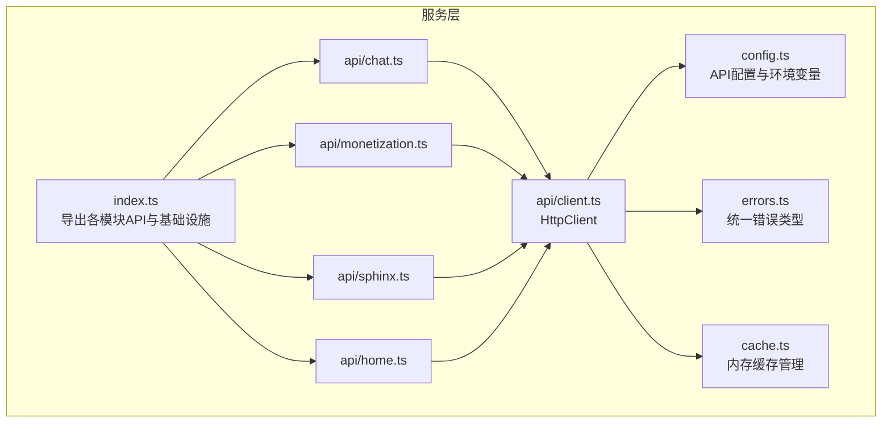
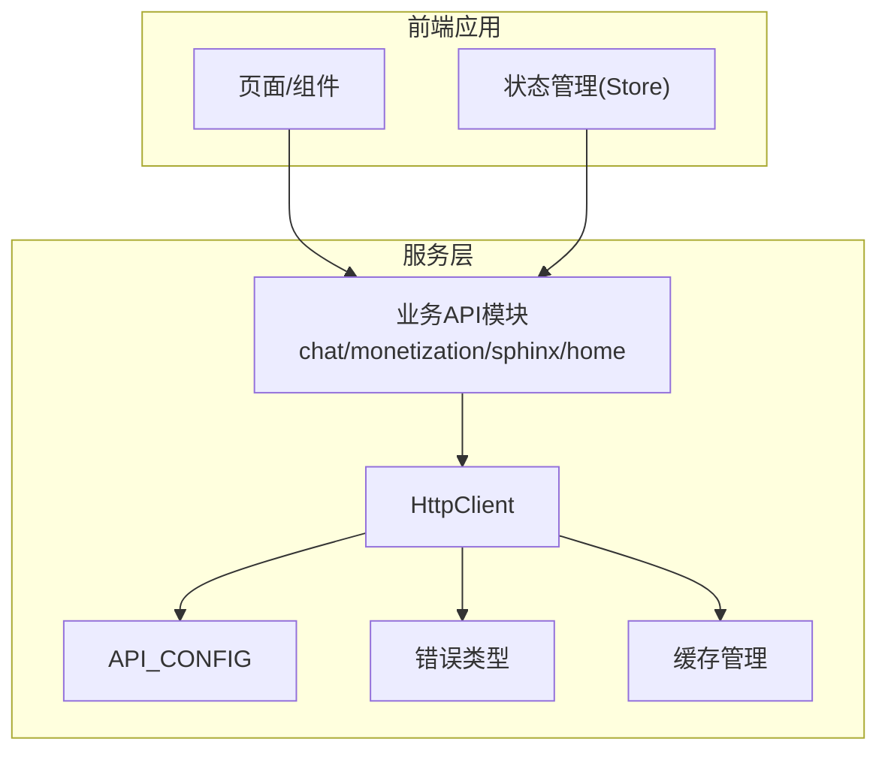
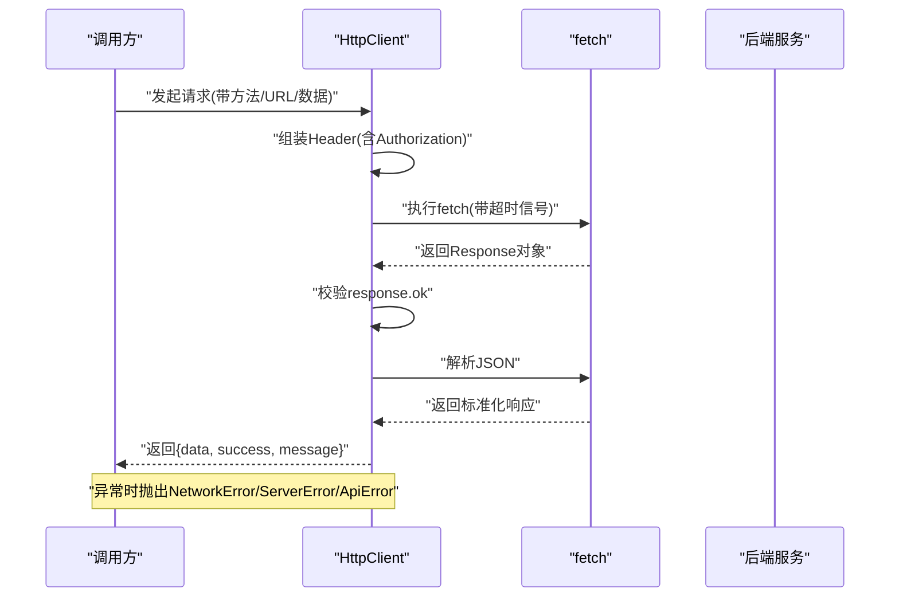
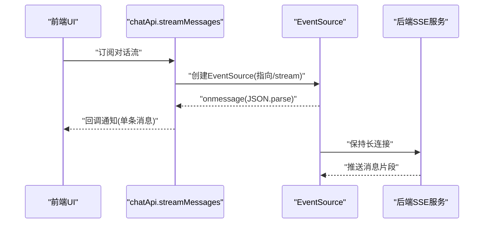
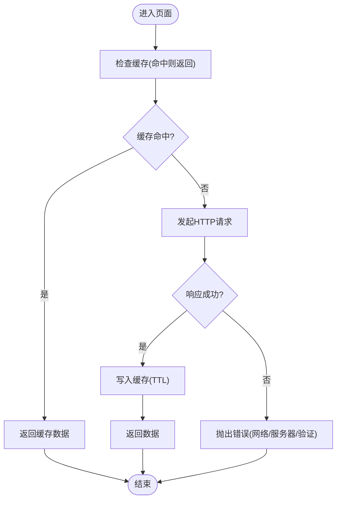
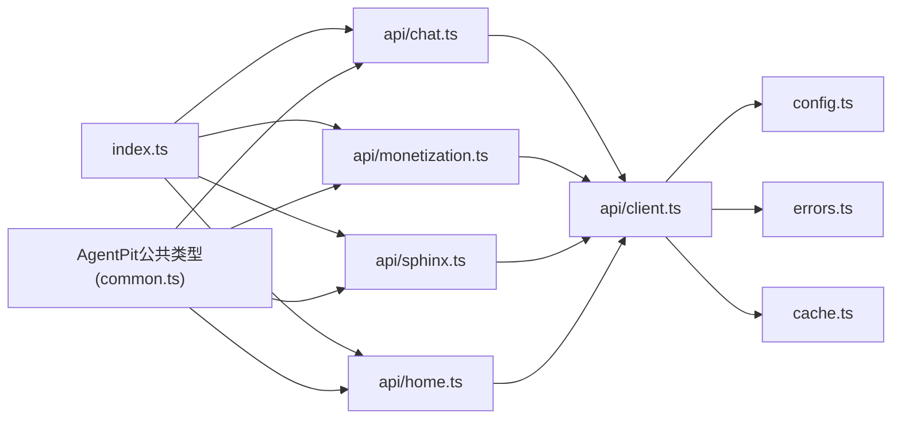

# 服务层架构

<cite>
**本文引用的文件**
- [src/services/index.ts](file://src/services/index.ts)
- [src/services/config.ts](file://src/services/config.ts)
- [src/services/errors.ts](file://src/services/errors.ts)
- [src/services/cache.ts](file://src/services/cache.ts)
- [src/services/api/client.ts](file://src/services/api/client.ts)
- [src/services/api/chat.ts](file://src/services/api/chat.ts)
- [src/services/api/monetization.ts](file://src/services/api/monetization.ts)
- [src/services/api/sphinx.ts](file://src/services/api/sphinx.ts)
- [src/services/api/home.ts](file://src/services/api/home.ts)
- [apps/AgentPit/src/types/common.ts](file://apps/AgentPit/src/types/common.ts)
- [apps/AgentPit/src/composables/useRealtimeData.ts](file://apps/AgentPit/src/composables/useRealtimeData.ts)
- [apps/AgentPit/src/composables/useSSE.ts](file://apps/AgentPit/src/composables/useSSE.ts)
</cite>

## 目录
1. [引言](#引言)
2. [项目结构](#项目结构)
3. [核心组件](#核心组件)
4. [架构总览](#架构总览)
5. [详细组件分析](#详细组件分析)
6. [依赖关系分析](#依赖关系分析)
7. [性能考虑](#性能考虑)
8. [故障排查指南](#故障排查指南)
9. [结论](#结论)
10. [附录](#附录)

## 引言
本文件系统性梳理 DAOApps 的服务层架构，聚焦于 API 服务、数据服务与认证授权等核心能力。内容涵盖 RESTful API 设计规范、WebSocket/Server-Sent Events 实时通信、API 版本管理与错误处理机制；阐述数据服务的缓存策略、数据同步与离线处理思路；并给出认证授权的 JWT 令牌管理、OAuth2.0 集成、权限控制与会话管理的实现建议。最后提供扩展方法、集成最佳实践与性能优化策略，帮助在现有基础上进行稳定演进。

## 项目结构
服务层位于前端工程的 src/services 目录，采用“按功能域分包”的组织方式：API 层以模块化服务封装（chat、monetization、sphinx、home），统一通过 HTTP 客户端发起请求；配置、错误类型与缓存管理作为基础设施被各模块复用。

图示来源
- [src/services/index.ts:1-10](file://src/services/index.ts#L1-L10)
- [src/services/config.ts:1-11](file://src/services/config.ts#L1-L11)
- [src/services/errors.ts:1-45](file://src/services/errors.ts#L1-L45)
- [src/services/cache.ts:1-50](file://src/services/cache.ts#L1-L50)
- [src/services/api/client.ts:1-105](file://src/services/api/client.ts#L1-L105)
- [src/services/api/chat.ts:1-87](file://src/services/api/chat.ts#L1-L87)
- [src/services/api/monetization.ts:1-77](file://src/services/api/monetization.ts#L1-L77)
- [src/services/api/sphinx.ts:1-69](file://src/services/api/sphinx.ts#L1-L69)
- [src/services/api/home.ts:1-30](file://src/services/api/home.ts#L1-L30)

章节来源
- [src/services/index.ts:1-10](file://src/services/index.ts#L1-L10)
- [src/services/config.ts:1-11](file://src/services/config.ts#L1-L11)

## 核心组件
- 统一配置中心：集中管理 API 基地址、超时、是否启用 Mock、重试策略等。
- HTTP 客户端：封装 fetch 请求，自动注入 Authorization 头，统一处理超时、网络与服务器错误，并返回标准化响应结构。
- 错误体系：定义 ApiError 及其子类（NetworkError、ServerError、ValidationError、UnauthorizedError），便于上层统一捕获与提示。
- 缓存管理：基于内存 Map 的 TTL 缓存，支持键匹配清理，适合作为轻量级本地缓存。
- API 模块：按业务域拆分（聊天、变现、站点生成、首页模块），每个模块暴露清晰的接口与类型定义，支持 Mock 切换。

章节来源
- [src/services/config.ts:1-11](file://src/services/config.ts#L1-L11)
- [src/services/api/client.ts:19-105](file://src/services/api/client.ts#L19-L105)
- [src/services/errors.ts:1-45](file://src/services/errors.ts#L1-L45)
- [src/services/cache.ts:8-50](file://src/services/cache.ts#L8-L50)
- [src/services/api/chat.ts:26-87](file://src/services/api/chat.ts#L26-L87)
- [src/services/api/monetization.ts:40-77](file://src/services/api/monetization.ts#L40-L77)
- [src/services/api/sphinx.ts:32-69](file://src/services/api/sphinx.ts#L32-L69)
- [src/services/api/home.ts:20-30](file://src/services/api/home.ts#L20-L30)

## 架构总览
服务层整体采用“模块化 API + 统一客户端 + 基础设施”的分层设计。各业务模块仅关注自身领域模型与接口契约，通过 HttpClient 统一处理网络细节；配置、错误与缓存作为横切关注点贯穿所有模块。

图示来源
- [src/services/api/client.ts:19-105](file://src/services/api/client.ts#L19-L105)
- [src/services/config.ts:1-11](file://src/services/config.ts#L1-L11)
- [src/services/errors.ts:1-45](file://src/services/errors.ts#L1-L45)
- [src/services/cache.ts:8-50](file://src/services/cache.ts#L8-L50)
- [src/services/api/chat.ts:26-87](file://src/services/api/chat.ts#L26-L87)
- [src/services/api/monetization.ts:40-77](file://src/services/api/monetization.ts#L40-L77)
- [src/services/api/sphinx.ts:32-69](file://src/services/api/sphinx.ts#L32-L69)
- [src/services/api/home.ts:20-30](file://src/services/api/home.ts#L20-L30)

## 详细组件分析

### HTTP 客户端与统一错误处理
- 请求头管理：自动从本地存储读取令牌并注入 Authorization: Bearer。
- 超时控制：AbortController + setTimeout 组合实现可配置超时。
- 错误分类：区分网络超时、网络失败、服务器错误、已知业务错误，抛出对应错误类型。
- 响应格式：要求后端返回统一结构 { data, success, message?, code? }，便于前端一致处理。

图示来源
- [src/services/api/client.ts:33-69](file://src/services/api/client.ts#L33-L69)

章节来源
- [src/services/api/client.ts:19-105](file://src/services/api/client.ts#L19-L105)
- [src/services/errors.ts:1-45](file://src/services/errors.ts#L1-L45)

### RESTful API 设计规范
- 资源命名：采用名词复数形式，如 /chat/conversations、/monetization/wallet。
- 动作映射：GET/POST/PUT/PATCH/DELETE 对应读取/创建/更新/增量更新/删除。
- 统一响应：后端返回 { success, data, message?, code? }，前端直接消费。
- 参数传递：查询参数用于过滤/分页；请求体用于创建/更新。
- 状态码：遵循 HTTP 语义，结合业务错误码（如 VALIDATION_ERROR、UNAUTHORIZED）。

章节来源
- [src/services/api/chat.ts:26-55](file://src/services/api/chat.ts#L26-L55)
- [src/services/api/monetization.ts:40-75](file://src/services/api/monetization.ts#L40-L75)
- [src/services/api/sphinx.ts:32-67](file://src/services/api/sphinx.ts#L32-L67)
- [src/services/api/home.ts:20-28](file://src/services/api/home.ts#L20-L28)

### WebSocket 与 Server-Sent Events 实时通信
- SSE 支持：聊天模块提供 streamMessages(conversationId, callback)，通过 EventSource 订阅 /chat/conversations/{id}/stream，逐条推送消息。
- Mock 流：在 useSSE 中提供模拟连接与分片推送，便于前端联调与演示。
- WebSocket 集成：可在需要双向低延迟场景引入 WebSocket，建议复用 HttpClient 的鉴权与超时策略，统一错误处理。

图示来源
- [src/services/api/chat.ts:58-85](file://src/services/api/chat.ts#L58-L85)
- [apps/AgentPit/src/composables/useSSE.ts:18-95](file://apps/AgentPit/src/composables/useSSE.ts#L18-L95)

章节来源
- [src/services/api/chat.ts:58-85](file://src/services/api/chat.ts#L58-L85)
- [apps/AgentPit/src/composables/useSSE.ts:11-129](file://apps/AgentPit/src/composables/useSSE.ts#L11-L129)

### API 版本管理
- 基础路径版本化：在 API_CONFIG.baseURL 中体现版本前缀，如 /api/v1。
- 渐进式迁移：通过开关（如 useMock）与后端配合，逐步替换旧接口。
- 兼容策略：新增接口采用新路径，旧接口保留过渡期，避免破坏性变更。

章节来源
- [src/services/config.ts:2-10](file://src/services/config.ts#L2-L10)

### 错误处理机制
- 分层错误：ApiError 为基类，NetworkError/ServerError/ValidationError/UnauthorizedError 各司其职。
- 前端展示：结合统一错误类型，UI 可按错误类别做差异化提示与引导。
- 日志上报：建议在 HttpClient 捕获异常后统一打点，便于问题追踪。

章节来源
- [src/services/errors.ts:1-45](file://src/services/errors.ts#L1-L45)
- [src/services/api/client.ts:56-68](file://src/services/api/client.ts#L56-L68)

### 数据服务：缓存策略、同步与离线
- 内存缓存：CacheManager 提供 TTL 缓存，适合短期热点数据与防抖刷新。
- 清理策略：支持按模式批量清理，避免内存泄漏。
- 同步与离线：建议在 Store 层引入“乐观更新 + 回滚”策略，结合本地持久化（如 IndexedDB 或浏览器存储）实现离线写入与重放。

图示来源
- [src/services/cache.ts:11-29](file://src/services/cache.ts#L11-L29)
- [src/services/api/client.ts:50-68](file://src/services/api/client.ts#L50-L68)

章节来源
- [src/services/cache.ts:8-50](file://src/services/cache.ts#L8-L50)

### 认证授权：JWT 令牌管理、OAuth2.0、权限控制与会话
- JWT 令牌：HttpClient 自动从本地存储读取 auth_token 并注入 Authorization 头，确保每次请求具备身份上下文。
- OAuth2.0 集成：建议在登录流程中接入 OAuth2.0 授权码/隐式流程，成功后换取并持久化访问令牌；同时提供刷新令牌机制。
- 权限控制：后端基于角色/资源进行 RBAC 控制，前端根据用户角色与路由守卫限制访问；对敏感操作增加二次确认。
- 会话管理：结合 HttpOnly Cookie（服务端）与前端本地存储（客户端）双轨策略，提升安全性；注意 XSS 与 CSRF 防护。

章节来源
- [src/services/api/client.ts:20-31](file://src/services/api/client.ts#L20-L31)
- [src/services/errors.ts:39-44](file://src/services/errors.ts#L39-L44)

### 实时数据与可视化（变现模块）
- 实时监控：useRealtimeData 模拟周期性余额变化，触发阈值告警与通知队列。
- 通知系统：支持自动消失与手动移除，保证用户体验与信息密度平衡。
- 扩展建议：将模拟逻辑替换为真实 SSE/WebSocket 推送，结合 Store 实现全局状态联动。

章节来源
- [apps/AgentPit/src/composables/useRealtimeData.ts:13-117](file://apps/AgentPit/src/composables/useRealtimeData.ts#L13-L117)

## 依赖关系分析
- 模块聚合：index.ts 统一导出各业务 API 与基础设施，降低上层导入复杂度。
- 横切依赖：各 API 模块依赖 HttpClient；HttpClient 依赖配置、错误与缓存。
- 类型共享：通用类型（ID、Timestamp、Status、ApiResponse 等）由 AgentPit 的公共类型文件提供，跨模块复用。

图示来源
- [src/services/index.ts:1-10](file://src/services/index.ts#L1-L10)
- [src/services/api/chat.ts:1-87](file://src/services/api/chat.ts#L1-L87)
- [src/services/api/monetization.ts:1-77](file://src/services/api/monetization.ts#L1-L77)
- [src/services/api/sphinx.ts:1-69](file://src/services/api/sphinx.ts#L1-L69)
- [src/services/api/home.ts:1-30](file://src/services/api/home.ts#L1-L30)
- [src/services/api/client.ts:1-105](file://src/services/api/client.ts#L1-L105)
- [src/services/config.ts:1-11](file://src/services/config.ts#L1-L11)
- [src/services/errors.ts:1-45](file://src/services/errors.ts#L1-L45)
- [src/services/cache.ts:1-50](file://src/services/cache.ts#L1-L50)
- [apps/AgentPit/src/types/common.ts:1-157](file://apps/AgentPit/src/types/common.ts#L1-L157)

章节来源
- [src/services/index.ts:1-10](file://src/services/index.ts#L1-L10)
- [apps/AgentPit/src/types/common.ts:62-72](file://apps/AgentPit/src/types/common.ts#L62-L72)

## 性能考虑
- 请求去抖与合并：对高频查询（如搜索、筛选）使用防抖与结果合并，减少重复请求。
- 缓存策略：合理设置 TTL，对只读数据优先走缓存；对写后读场景采用“写后失效”策略。
- 超时与重试：结合 API_CONFIG.retry，在弱网环境下提升成功率；对幂等请求允许自动重试。
- 分页与懒加载：大列表采用分页或虚拟滚动，降低首屏压力。
- 资源压缩与预加载：开启 Gzip/Brotli，对关键资源进行预加载与缓存。

## 故障排查指南
- 网络超时：检查 API_CONFIG.timeout 与后端响应时间，必要时增大超时或优化接口。
- 未授权访问：确认本地存储中的 auth_token 是否存在且未过期，检查后端鉴权中间件。
- 服务器错误：根据 ServerError 的状态码定位具体问题，查看后端日志与限流策略。
- 数据不一致：检查缓存 TTL 与失效策略，确保关键路径绕过缓存或强制刷新。
- SSE 连接失败：确认后端 SSE 服务可用性与跨域配置，前端 useSSE 提供了模拟链路便于定位。

章节来源
- [src/services/api/client.ts:33-69](file://src/services/api/client.ts#L33-L69)
- [src/services/errors.ts:12-44](file://src/services/errors.ts#L12-L44)
- [apps/AgentPit/src/composables/useSSE.ts:18-39](file://apps/AgentPit/src/composables/useSSE.ts#L18-L39)

## 结论
DAOApps 的服务层以“模块化 API + 统一客户端 + 基础设施”为核心，实现了清晰的职责分离与良好的可维护性。通过标准化的错误类型、可配置的 HTTP 客户端与内存缓存，以及对 SSE 的原生支持，为实时交互与数据一致性提供了坚实基础。后续可在版本化路径、OAuth2.0 集成、权限细化与离线能力方面持续增强，以支撑更复杂的业务场景。

## 附录
- 扩展方法：新增模块时遵循现有命名与目录约定，复用 HttpClient 与错误体系；对需要实时性的模块优先考虑 SSE/WebSocket。
- 集成最佳实践：前后端约定统一响应结构与错误码；前端对敏感操作增加二次确认与权限校验；对第三方登录采用 OAuth2.0 并妥善管理令牌生命周期。
- 性能优化：结合缓存、分页与懒加载策略；对关键接口进行并发控制与重试退避；在弱网环境下提供降级体验与离线数据兜底。