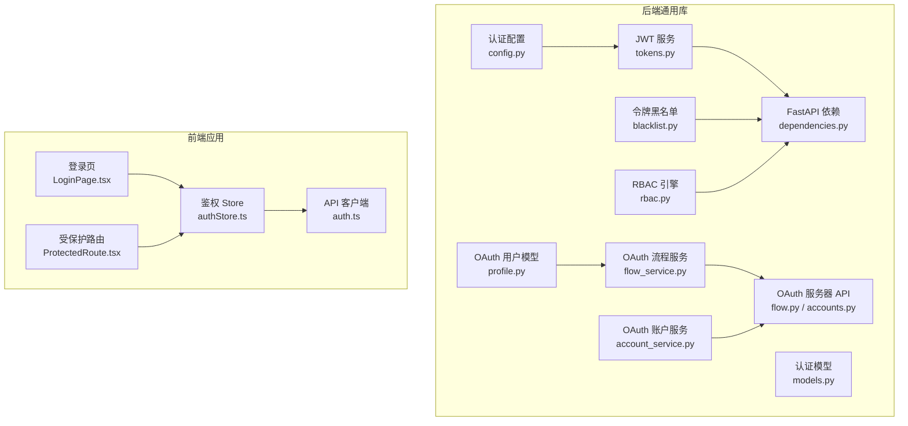
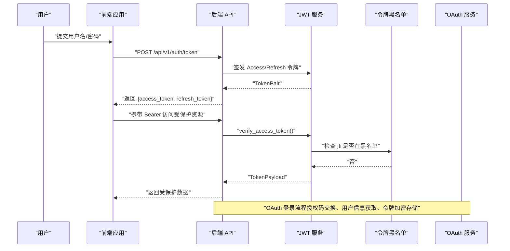
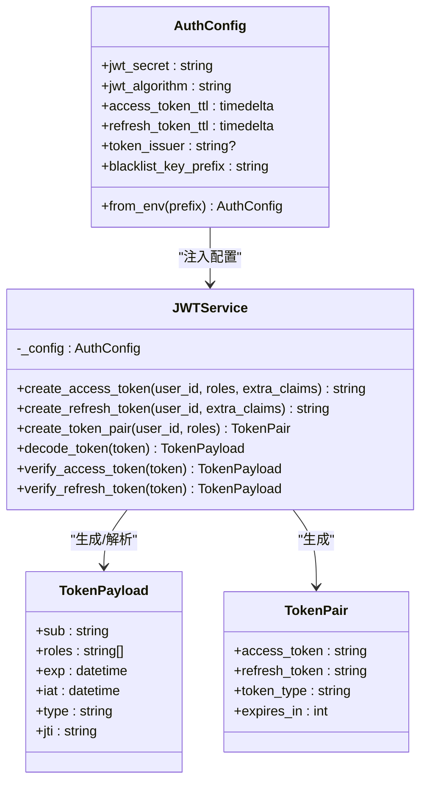
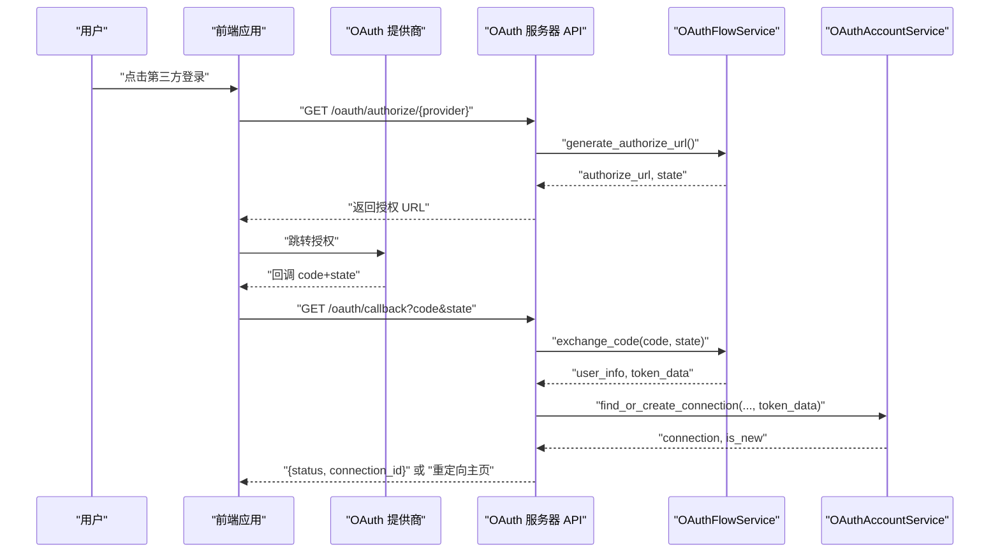
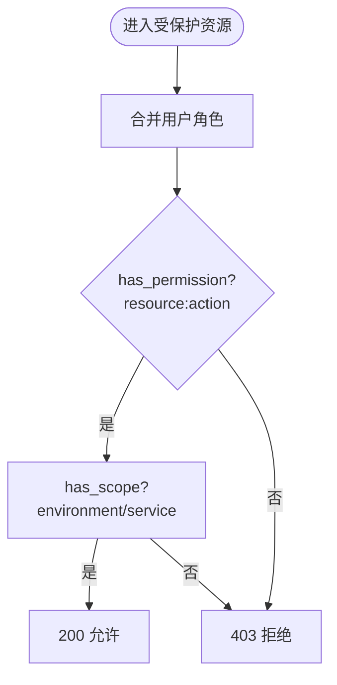
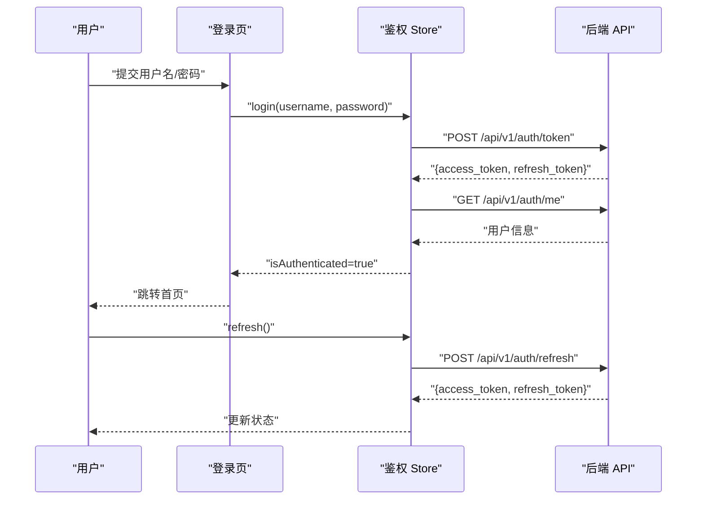
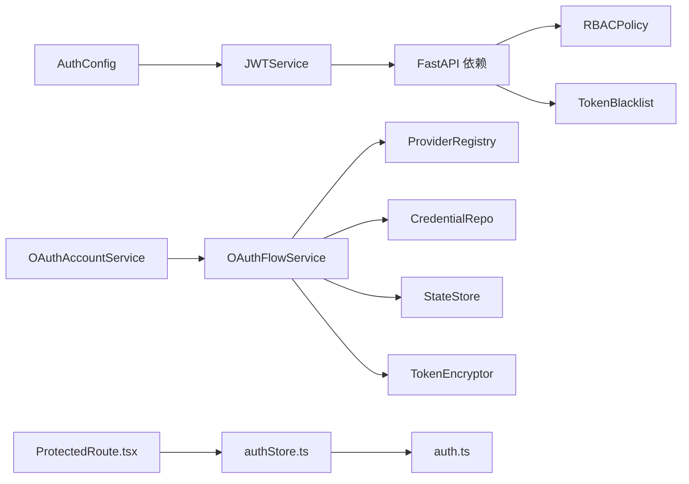

# 认证授权

<cite>
**本文引用的文件**
- [tools/flexloop/src/taolib/testing/auth/tokens.py](file://tools/flexloop/src/taolib/testing/auth/tokens.py)
- [tools/flexloop/src/taolib/testing/auth/models.py](file://tools/flexloop/src/taolib/testing/auth/models.py)
- [tools/flexloop/src/taolib/testing/auth/config.py](file://tools/flexloop/src/taolib/testing/auth/config.py)
- [tools/flexloop/src/taolib/testing/auth/blacklist.py](file://tools/flexloop/src/taolib/testing/auth/blacklist.py)
- [tools/flexloop/src/taolib/testing/auth/fastapi/dependencies.py](file://tools/flexloop/src/taolib/testing/auth/fastapi/dependencies.py)
- [tools/flexloop/src/taolib/testing/auth/rbac.py](file://tools/flexloop/src/taolib/testing/auth/rbac.py)
- [tools/flexloop/src/taolib/testing/oauth/services/flow_service.py](file://tools/flexloop/src/taolib/testing/oauth/services/flow_service.py)
- [tools/flexloop/src/taolib/testing/oauth/services/account_service.py](file://tools/flexloop/src/taolib/testing/oauth/services/account_service.py)
- [tools/flexloop/src/taolib/testing/oauth/server/api/flow.py](file://tools/flexloop/src/taolib/testing/oauth/server/api/flow.py)
- [tools/flexloop/src/taolib/testing/oauth/server/api/accounts.py](file://tools/flexloop/src/taolib/testing/oauth/server/api/accounts.py)
- [tools/flexloop/src/taolib/testing/oauth/models/profile.py](file://tools/flexloop/src/taolib/testing/oauth/models/profile.py)
- [apps/config-center/src/store/authStore.ts](file://apps/config-center/src/store/authStore.ts)
- [apps/config-center/src/api/auth.ts](file://apps/config-center/src/api/auth.ts)
- [apps/config-center/src/pages/LoginPage.tsx](file://apps/config-center/src/pages/LoginPage.tsx)
- [apps/config-center/src/components/ProtectedRoute.tsx](file://apps/config-center/src/components/ProtectedRoute.tsx)
- [tools/flexloop/src/taolib/testing/config_center/server/auth/rbac.py](file://tools/flexloop/src/taolib/testing/config_center/server/auth/rbac.py)
- [tools/flexloop/tests/testing/test_auth/test_fastapi/test_dependencies.py](file://tools/flexloop/tests/testing/test_auth/test_fastapi/test_dependencies.py)
- [tools/flexloop/tests/testing/test_auth/test_rbac.py](file://tools/flexloop/tests/testing/test_auth/test_rbac.py)
- [tools/flexloop/tests/testing/test_config_center/test_auth.py](file://tools/flexloop/tests/testing/test_config_center/test_auth.py)
</cite>

## 目录
1. [简介](#简介)
2. [项目结构](#项目结构)
3. [核心组件](#核心组件)
4. [架构总览](#架构总览)
5. [组件详解](#组件详解)
6. [依赖关系分析](#依赖关系分析)
7. [性能考量](#性能考量)
8. [故障排查指南](#故障排查指南)
9. [结论](#结论)
10. [附录](#附录)

## 简介
本文件面向 DAOApps 的认证授权体系，系统化阐述以下能力与实现：
- JWT 令牌管理：签发、校验、刷新与吊销
- OAuth2.0 集成：授权码流程、提供商对接、令牌加密与存储
- 权限控制机制：基于角色的访问控制（RBAC）与作用域控制
- 会话管理：前端状态持久化、令牌刷新与会话生命周期
- 安全最佳实践：密钥管理、防重放、令牌黑名单与 API Key 备选认证
- 完整流程示例：登录、刷新、受保护资源访问与错误处理

## 项目结构
认证授权相关代码主要分布在两处：
- 后端通用认证库（flexloop 工具包）：JWT、RBAC、OAuth、FastAPI 依赖注入与黑名单
- 前端配置中心应用（config-center）：登录页、鉴权状态管理、受保护路由

图表来源
- [tools/flexloop/src/taolib/testing/auth/tokens.py:1-237](file://tools/flexloop/src/taolib/testing/auth/tokens.py#L1-L237)
- [tools/flexloop/src/taolib/testing/auth/models.py:1-68](file://tools/flexloop/src/taolib/testing/auth/models.py#L1-L68)
- [tools/flexloop/src/taolib/testing/auth/config.py:1-82](file://tools/flexloop/src/taolib/testing/auth/config.py#L1-L82)
- [tools/flexloop/src/taolib/testing/auth/blacklist.py:1-113](file://tools/flexloop/src/taolib/testing/auth/blacklist.py#L1-L113)
- [tools/flexloop/src/taolib/testing/auth/rbac.py:1-99](file://tools/flexloop/src/taolib/testing/auth/rbac.py#L1-L99)
- [tools/flexloop/src/taolib/testing/auth/fastapi/dependencies.py:1-291](file://tools/flexloop/src/taolib/testing/auth/fastapi/dependencies.py#L1-L291)
- [tools/flexloop/src/taolib/testing/oauth/services/flow_service.py:1-123](file://tools/flexloop/src/taolib/testing/oauth/services/flow_service.py#L1-L123)
- [tools/flexloop/src/taolib/testing/oauth/services/account_service.py:106-145](file://tools/flexloop/src/taolib/testing/oauth/services/account_service.py#L106-L145)
- [tools/flexloop/src/taolib/testing/oauth/server/api/flow.py:231-267](file://tools/flexloop/src/taolib/testing/oauth/server/api/flow.py#L231-L267)
- [tools/flexloop/src/taolib/testing/oauth/server/api/accounts.py:41-82](file://tools/flexloop/src/taolib/testing/oauth/server/api/accounts.py#L41-L82)
- [tools/flexloop/src/taolib/testing/oauth/models/profile.py:1-41](file://tools/flexloop/src/taolib/testing/oauth/models/profile.py#L1-L41)
- [apps/config-center/src/pages/LoginPage.tsx:1-77](file://apps/config-center/src/pages/LoginPage.tsx#L1-L77)
- [apps/config-center/src/store/authStore.ts:1-108](file://apps/config-center/src/store/authStore.ts#L1-L108)
- [apps/config-center/src/api/auth.ts:1-15](file://apps/config-center/src/api/auth.ts#L1-L15)
- [apps/config-center/src/components/ProtectedRoute.tsx:1-14](file://apps/config-center/src/components/ProtectedRoute.tsx#L1-L14)

章节来源
- [tools/flexloop/src/taolib/testing/auth/tokens.py:1-237](file://tools/flexloop/src/taolib/testing/auth/tokens.py#L1-L237)
- [apps/config-center/src/store/authStore.ts:1-108](file://apps/config-center/src/store/authStore.ts#L1-L108)

## 核心组件
- JWT 服务：负责 Access/Refresh 令牌的生成、解析与验证，并支持额外声明与签发方信息
- 认证模型：TokenPayload、AuthenticatedUser、TokenPair 等核心数据结构
- 认证配置：集中式配置容器，支持从环境变量加载密钥与 TTL
- 令牌黑名单：支持 Redis/内存/空实现三种后端，用于吊销已登出或泄露的令牌
- RBAC 引擎：基于角色的权限与作用域检查，支持多角色合并权限
- FastAPI 依赖：统一的认证入口，支持 JWT Bearer 与 API Key 双通道，并提供角色/权限/作用域依赖工厂
- OAuth 服务：授权码流程编排、提供商凭证管理、CSRF state 校验、令牌加密存储
- 前端鉴权 Store：登录、刷新、登出、用户信息拉取与权限提示（客户端 UI 辅助）

章节来源
- [tools/flexloop/src/taolib/testing/auth/models.py:1-68](file://tools/flexloop/src/taolib/testing/auth/models.py#L1-L68)
- [tools/flexloop/src/taolib/testing/auth/config.py:1-82](file://tools/flexloop/src/taolib/testing/auth/config.py#L1-L82)
- [tools/flexloop/src/taolib/testing/auth/blacklist.py:1-113](file://tools/flexloop/src/taolib/testing/auth/blacklist.py#L1-L113)
- [tools/flexloop/src/taolib/testing/auth/rbac.py:1-99](file://tools/flexloop/src/taolib/testing/auth/rbac.py#L1-L99)
- [tools/flexloop/src/taolib/testing/auth/fastapi/dependencies.py:1-291](file://tools/flexloop/src/taolib/testing/auth/fastapi/dependencies.py#L1-L291)
- [tools/flexloop/src/taolib/testing/oauth/services/flow_service.py:1-123](file://tools/flexloop/src/taolib/testing/oauth/services/flow_service.py#L1-L123)
- [apps/config-center/src/store/authStore.ts:1-108](file://apps/config-center/src/store/authStore.ts#L1-L108)

## 架构总览
整体采用“后端通用库 + 前端应用”的分层设计：
- 后端通过 JWT 与 RBAC 提供无状态认证与细粒度授权；OAuth 作为外部身份提供商接入
- 前端通过 Store 统一管理认证状态与令牌刷新，受保护路由拦截未认证访问

图表来源
- [apps/config-center/src/api/auth.ts:1-15](file://apps/config-center/src/api/auth.ts#L1-L15)
- [tools/flexloop/src/taolib/testing/auth/tokens.py:129-199](file://tools/flexloop/src/taolib/testing/auth/tokens.py#L129-L199)
- [tools/flexloop/src/taolib/testing/auth/blacklist.py:54-67](file://tools/flexloop/src/taolib/testing/auth/blacklist.py#L54-L67)
- [tools/flexloop/src/taolib/testing/oauth/services/flow_service.py:76-121](file://tools/flexloop/src/taolib/testing/oauth/services/flow_service.py#L76-L121)

## 组件详解

### JWT 令牌管理
- 令牌类型与负载
  - Access Token：包含用户 ID、角色列表、签发/过期时间、类型标记与唯一 ID，用于短期访问
  - Refresh Token：不含角色，仅用于换取新的 Access Token，降低泄露风险
- 生成与验证
  - 支持自定义算法、签发方与额外声明
  - 验证时区分令牌类型，防止混用
- 刷新机制
  - 前端 Store 在刷新接口失败时自动登出，避免悬挂状态

图表来源
- [tools/flexloop/src/taolib/testing/auth/config.py:12-82](file://tools/flexloop/src/taolib/testing/auth/config.py#L12-L82)
- [tools/flexloop/src/taolib/testing/auth/tokens.py:17-237](file://tools/flexloop/src/taolib/testing/auth/tokens.py#L17-L237)
- [tools/flexloop/src/taolib/testing/auth/models.py:11-68](file://tools/flexloop/src/taolib/testing/auth/models.py#L11-L68)

章节来源
- [tools/flexloop/src/taolib/testing/auth/tokens.py:34-127](file://tools/flexloop/src/taolib/testing/auth/tokens.py#L34-L127)
- [apps/config-center/src/store/authStore.ts:57-73](file://apps/config-center/src/store/authStore.ts#L57-L73)

### OAuth2.0 集成
- 授权码流程
  - 生成授权 URL（含 CSRF state）、交换授权码、获取用户信息与令牌
  - state 校验失败时拒绝回调，防止 CSRF
- 令牌存储
  - Access/Refresh 令牌加密存储，记录提供商、邮箱、头像、作用域与过期时间
- 服务器端 API
  - 回调处理、首次引导返回、关联已有账户

图表来源
- [tools/flexloop/src/taolib/testing/oauth/services/flow_service.py:40-121](file://tools/flexloop/src/taolib/testing/oauth/services/flow_service.py#L40-L121)
- [tools/flexloop/src/taolib/testing/oauth/services/account_service.py:106-145](file://tools/flexloop/src/taolib/testing/oauth/services/account_service.py#L106-L145)
- [tools/flexloop/src/taolib/testing/oauth/server/api/flow.py:231-267](file://tools/flexloop/src/taolib/testing/oauth/server/api/flow.py#L231-L267)
- [tools/flexloop/src/taolib/testing/oauth/server/api/accounts.py:41-82](file://tools/flexloop/src/taolib/testing/oauth/server/api/accounts.py#L41-L82)
- [tools/flexloop/src/taolib/testing/oauth/models/profile.py:13-41](file://tools/flexloop/src/taolib/testing/oauth/models/profile.py#L13-L41)

章节来源
- [tools/flexloop/src/taolib/testing/oauth/services/flow_service.py:76-121](file://tools/flexloop/src/taolib/testing/oauth/services/flow_service.py#L76-L121)
- [tools/flexloop/src/taolib/testing/oauth/services/account_service.py:106-145](file://tools/flexloop/src/taolib/testing/oauth/services/account_service.py#L106-L145)

### 权限控制与 RBAC
- 角色与权限
  - 角色定义包含权限集合与作用域映射；支持多角色合并权限
- 服务端 RBAC
  - 配置中心示例角色：超级管理员、配置管理员、编辑、查看者、审计员
  - 支持按环境与服务维度的作用域控制
- 客户端 RBAC
  - 前端 Store 提供 hasPermission 客户端提示，超级管理员默认放行，其他角色由服务端强制

图表来源
- [tools/flexloop/src/taolib/testing/auth/rbac.py:41-99](file://tools/flexloop/src/taolib/testing/auth/rbac.py#L41-L99)
- [tools/flexloop/src/taolib/testing/config_center/server/auth/rbac.py:11-162](file://tools/flexloop/src/taolib/testing/config_center/server/auth/rbac.py#L11-L162)
- [apps/config-center/src/store/authStore.ts:84-95](file://apps/config-center/src/store/authStore.ts#L84-L95)

章节来源
- [tools/flexloop/src/taolib/testing/auth/rbac.py:64-99](file://tools/flexloop/src/taolib/testing/auth/rbac.py#L64-L99)
- [tools/flexloop/src/taolib/testing/config_center/server/auth/rbac.py:91-160](file://tools/flexloop/src/taolib/testing/config_center/server/auth/rbac.py#L91-L160)
- [apps/config-center/src/store/authStore.ts:84-95](file://apps/config-center/src/store/authStore.ts#L84-L95)

### 会话管理（前端）
- 登录流程
  - 前端调用登录接口获取令牌对，随后拉取用户信息并写入 Store
- 刷新流程
  - Store 在存在刷新令牌时定期或在 401 时调用刷新接口，成功则更新令牌，失败则登出
- 受保护路由
  - 未认证用户被重定向至登录页

图表来源
- [apps/config-center/src/pages/LoginPage.tsx:15-29](file://apps/config-center/src/pages/LoginPage.tsx#L15-L29)
- [apps/config-center/src/store/authStore.ts:29-82](file://apps/config-center/src/store/authStore.ts#L29-L82)
- [apps/config-center/src/api/auth.ts:4-14](file://apps/config-center/src/api/auth.ts#L4-L14)
- [apps/config-center/src/components/ProtectedRoute.tsx:4-13](file://apps/config-center/src/components/ProtectedRoute.tsx#L4-L13)

章节来源
- [apps/config-center/src/store/authStore.ts:29-82](file://apps/config-center/src/store/authStore.ts#L29-L82)
- [apps/config-center/src/pages/LoginPage.tsx:15-29](file://apps/config-center/src/pages/LoginPage.tsx#L15-L29)
- [apps/config-center/src/components/ProtectedRoute.tsx:4-13](file://apps/config-center/src/components/ProtectedRoute.tsx#L4-L13)

### 安全最佳实践
- 密钥与算法
  - 从环境变量加载密钥，长度满足算法要求；支持自定义算法与签发方
- 防重放与吊销
  - 令牌包含唯一 ID（jti），支持黑名单；Access/Refresh 类型严格区分
- API Key 备选认证
  - FastAPI 依赖支持 API Key 与 JWT 双通道，便于内部服务间调用
- OAuth 安全
  - state 校验、CSRF 防护、令牌加密存储、首次引导与关联流程

章节来源
- [tools/flexloop/src/taolib/testing/auth/config.py:34-82](file://tools/flexloop/src/taolib/testing/auth/config.py#L34-L82)
- [tools/flexloop/src/taolib/testing/auth/tokens.py:129-199](file://tools/flexloop/src/taolib/testing/auth/tokens.py#L129-L199)
- [tools/flexloop/src/taolib/testing/auth/blacklist.py:54-67](file://tools/flexloop/src/taolib/testing/auth/blacklist.py#L54-L67)
- [tools/flexloop/src/taolib/testing/auth/fastapi/dependencies.py:27-142](file://tools/flexloop/src/taolib/testing/auth/fastapi/dependencies.py#L27-L142)
- [tools/flexloop/src/taolib/testing/oauth/services/flow_service.py:97-121](file://tools/flexloop/src/taolib/testing/oauth/services/flow_service.py#L97-L121)
- [tools/flexloop/src/taolib/testing/oauth/services/account_service.py:113-127](file://tools/flexloop/src/taolib/testing/oauth/services/account_service.py#L113-L127)

## 依赖关系分析
- 后端依赖
  - JWT 服务依赖认证配置与密钥；FastAPI 依赖注入组合 JWT、RBAC 与黑名单
  - OAuth 服务依赖提供商注册表、凭证仓库、state 存储与令牌加密器
- 前端依赖
  - Store 依赖 API 客户端；受保护路由依赖 Store 状态

图表来源
- [tools/flexloop/src/taolib/testing/auth/config.py:12-82](file://tools/flexloop/src/taolib/testing/auth/config.py#L12-L82)
- [tools/flexloop/src/taolib/testing/auth/tokens.py:17-33](file://tools/flexloop/src/taolib/testing/auth/tokens.py#L17-L33)
- [tools/flexloop/src/taolib/testing/auth/fastapi/dependencies.py:27-142](file://tools/flexloop/src/taolib/testing/auth/fastapi/dependencies.py#L27-L142)
- [tools/flexloop/src/taolib/testing/oauth/services/flow_service.py:16-39](file://tools/flexloop/src/taolib/testing/oauth/services/flow_service.py#L16-L39)
- [apps/config-center/src/store/authStore.ts:1-18](file://apps/config-center/src/store/authStore.ts#L1-L18)
- [apps/config-center/src/components/ProtectedRoute.tsx:1-14](file://apps/config-center/src/components/ProtectedRoute.tsx#L1-L14)

章节来源
- [tools/flexloop/src/taolib/testing/auth/fastapi/dependencies.py:27-142](file://tools/flexloop/src/taolib/testing/auth/fastapi/dependencies.py#L27-L142)
- [tools/flexloop/src/taolib/testing/oauth/services/flow_service.py:16-39](file://tools/flexloop/src/taolib/testing/oauth/services/flow_service.py#L16-L39)
- [apps/config-center/src/store/authStore.ts:1-18](file://apps/config-center/src/store/authStore.ts#L1-L18)

## 性能考量
- 令牌 TTL 设计
  - Access Token 短 TTL 降低泄露影响面；Refresh Token 长 TTL 但仅用于换取新令牌
- 黑名单后端
  - Redis 黑名单具备自动过期与高并发特性；内存黑名单适合开发测试
- RBAC 查询
  - 角色与权限线性遍历，建议在服务端缓存常用角色定义；复杂权限场景可引入索引或预计算
- OAuth 流程
  - 凭证查询与提供商网络调用需考虑超时与重试；state 存储建议低延迟 KV

## 故障排查指南
- 常见错误与定位
  - 令牌过期：前端收到 401 时触发刷新；若刷新失败则登出
  - 令牌类型错误：Access/Refresh 混用导致校验失败
  - 黑名单命中：已吊销令牌无法通过校验
  - OAuth state 校验失败：回调中的 state 无效或已过期
  - API Key 无效：API Key 认证失败
- 建议排查步骤
  - 检查环境变量密钥长度与算法配置
  - 核对 Access/Refresh TTL 设置
  - 确认黑名单后端可用且键前缀一致
  - 核对 OAuth 凭证、回调地址与 state 存储
  - 查看服务端日志与异常堆栈，结合单元测试用例定位问题

章节来源
- [apps/config-center/src/store/authStore.ts:57-82](file://apps/config-center/src/store/authStore.ts#L57-L82)
- [tools/flexloop/src/taolib/testing/auth/tokens.py:155-199](file://tools/flexloop/src/taolib/testing/auth/tokens.py#L155-L199)
- [tools/flexloop/src/taolib/testing/auth/blacklist.py:61-67](file://tools/flexloop/src/taolib/testing/auth/blacklist.py#L61-L67)
- [tools/flexloop/src/taolib/testing/oauth/services/flow_service.py:97-100](file://tools/flexloop/src/taolib/testing/oauth/services/flow_service.py#L97-L100)
- [tools/flexloop/src/taolib/testing/auth/fastapi/dependencies.py:86-105](file://tools/flexloop/src/taolib/testing/auth/fastapi/dependencies.py#L86-L105)

## 结论
DAOApps 的认证授权体系以“后端通用库 + 前端应用”协同实现：
- 后端提供健壮的 JWT、RBAC、OAuth 与 FastAPI 依赖注入，支持多场景认证与细粒度授权
- 前端通过 Store 统一管理令牌与用户态，配合受保护路由保障访问安全
- 通过黑名单、CSRF state、令牌加密与 API Key 备选认证等手段强化安全
- 建议在生产环境中启用 Redis 黑名单、严格的密钥管理与完善的监控告警

## 附录

### API 调用规范（前端）
- 登录
  - 方法与路径：POST /api/v1/auth/token
  - 请求体：用户名与密码
  - 响应：令牌对（Access/Refresh）
- 刷新
  - 方法与路径：POST /api/v1/auth/refresh
  - 请求体：刷新令牌
  - 响应：新的令牌对
- 获取当前用户
  - 方法与路径：GET /api/v1/auth/me
  - 响应：用户信息

章节来源
- [apps/config-center/src/api/auth.ts:4-14](file://apps/config-center/src/api/auth.ts#L4-L14)

### 完整认证流程示例
- 用户登录
  - 前端提交凭据 → 后端签发令牌对 → 前端保存并携带 Bearer 访问受保护资源
- 令牌刷新
  - Access 过期 → 前端使用 Refresh 换取新令牌 → 更新本地状态
- 受保护资源访问
  - FastAPI 依赖校验 Access 令牌类型与黑名单 → RBAC 校验角色/权限/作用域 → 返回资源

章节来源
- [apps/config-center/src/pages/LoginPage.tsx:15-29](file://apps/config-center/src/pages/LoginPage.tsx#L15-L29)
- [apps/config-center/src/store/authStore.ts:57-82](file://apps/config-center/src/store/authStore.ts#L57-L82)
- [tools/flexloop/src/taolib/testing/auth/fastapi/dependencies.py:83-141](file://tools/flexloop/src/taolib/testing/auth/fastapi/dependencies.py#L83-L141)

### 测试参考
- FastAPI 认证依赖测试：验证 JWT 与 API Key 认证、角色/权限/作用域依赖
- RBAC 测试：覆盖管理员/编辑/查看者等角色权限与作用域
- 配置中心 RBAC 测试：系统角色结构与多角色合并权限

章节来源
- [tools/flexloop/tests/testing/test_auth/test_fastapi/test_dependencies.py:86-132](file://tools/flexloop/tests/testing/test_auth/test_fastapi/test_dependencies.py#L86-L132)
- [tools/flexloop/tests/testing/test_auth/test_rbac.py:34-184](file://tools/flexloop/tests/testing/test_auth/test_rbac.py#L34-L184)
- [tools/flexloop/tests/testing/test_config_center/test_auth.py:177-283](file://tools/flexloop/tests/testing/test_config_center/test_auth.py#L177-L283)