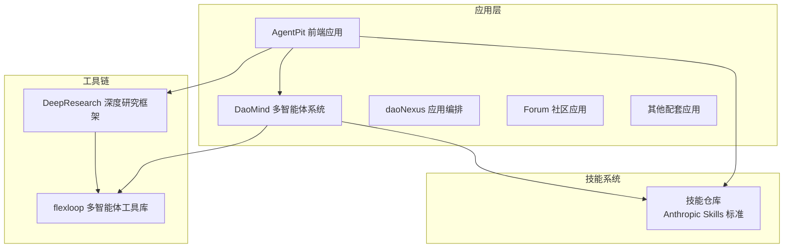
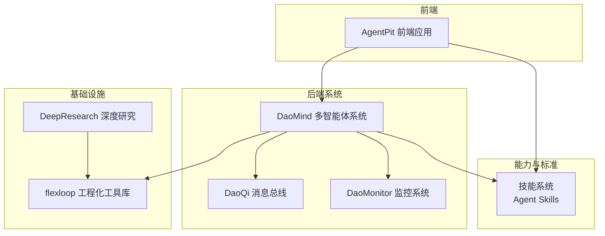
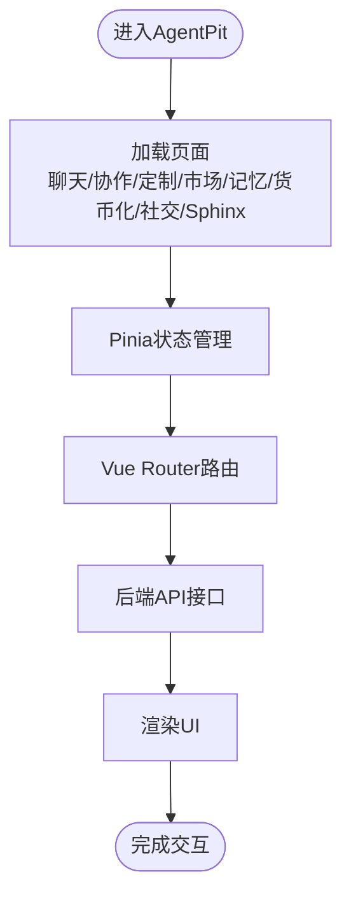
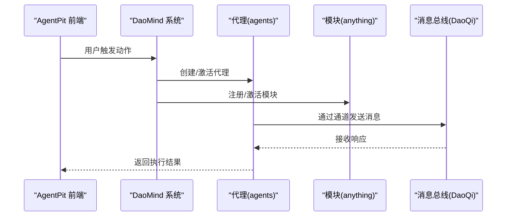
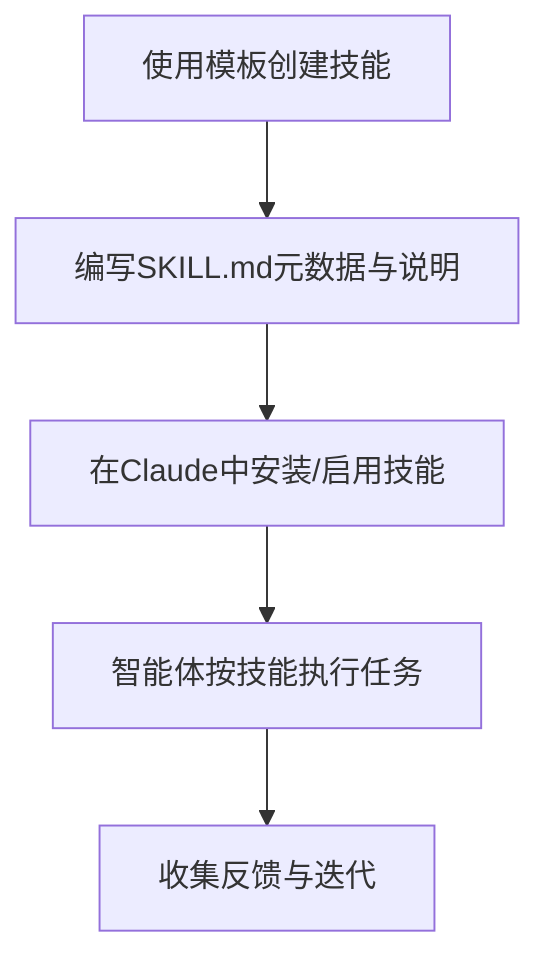
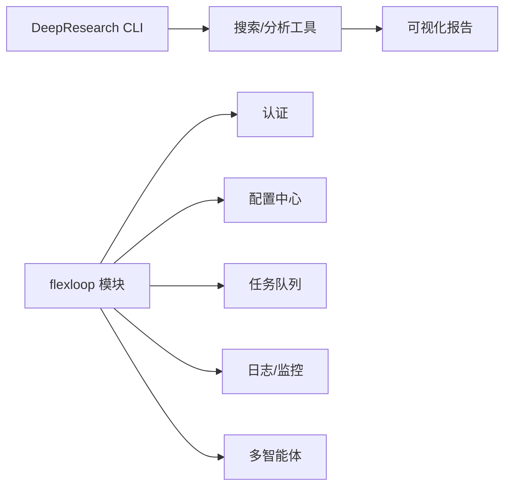
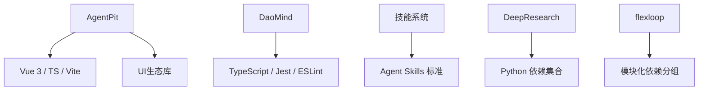

# 核心组件介绍

<cite>
**本文引用的文件**
- [apps/AgentPit/README.md](file://apps/AgentPit/README.md)
- [apps/AgentPit/package.json](file://apps/AgentPit/package.json)
- [apps/DaoMind/README.md](file://apps/DaoMind/README.md)
- [apps/DaoMind/package.json](file://apps/DaoMind/package.json)
- [skills/daoSkilLs/skills/anthropics-skills/README.md](file://skills/daoSkilLs/skills/anthropics-skills/README.md)
- [skills/daoSkilLs/skills/anthropics-skills/template/SKILL.md](file://skills/daoSkilLs/skills/anthropics-skills/template/SKILL.md)
- [tools/DeepResearch/README.md](file://tools/DeepResearch/README.md)
- [tools/DeepResearch/pyproject.toml](file://tools/DeepResearch/pyproject.toml)
- [tools/flexloop/README.md](file://tools/flexloop/README.md)
- [tools/flexloop/pyproject.toml](file://tools/flexloop/pyproject.toml)
</cite>

## 目录
1. [引言](#引言)
2. [项目结构](#项目结构)
3. [核心组件](#核心组件)
4. [架构总览](#架构总览)
5. [详细组件分析](#详细组件分析)
6. [依赖分析](#依赖分析)
7. [性能考虑](#性能考虑)
8. [故障排查指南](#故障排查指南)
9. [结论](#结论)
10. [附录](#附录)

## 引言
本文件面向DAOApps项目的核心组件，系统性介绍以下关键模块及其协作关系：
- AgentPit智能体平台：以Vue 3 + TypeScript + Vite构建的前端应用，提供聊天、协作、定制、市场、记忆、货币化、社交、Sphinx等业务页面与状态管理。
- DaoMind多智能体系统：基于道家哲学思想的现代化系统框架，采用monorepo架构，提供代理管理、模块管理、消息总线（DaoQi）、监控系统（DaoMonitor）等能力。
- 技能系统：以“技能”为单位封装可复用的任务执行模板，支持Claude生态的Agent Skills标准，便于在不同智能体间共享与复用。
- 工具链：包含深度研究框架（DeepResearch）与多智能体工具库（flexloop），分别面向复杂信息分析与多智能体系统的工程化支撑。

本指南旨在帮助用户理解各组件的功能定位、技术特点、适用场景与集成方式，并提供组件选择与使用的指导建议。

## 项目结构
DAOApps采用多应用与多工具并行的组织方式，核心组件分布如下：
- 应用层
  - AgentPit：前端单页应用，覆盖聊天、协作、定制、市场、记忆、货币化、社交、Sphinx等页面，配合Pinia状态管理与Vue Router路由。
  - DaoMind：monorepo，包含代理、模块、消息总线、监控等多个子包，提供系统级能力与可复用组件库。
  - 其他应用：daoNexus、forum、growth-tracker、habit-tracker、moodflow、oauth-admin、time-capsule、xinyu等，作为DAO生态的配套应用。
- 技能系统：skills/daoSkilLs/skills/anthropics-skills，遵循Agent Skills标准，提供技能模板与示例。
- 工具链：tools/DeepResearch（Python）与tools/flexloop（Python），分别提供深度研究与多智能体工程化能力。

**图表来源**
- [apps/AgentPit/package.json:1-74](file://apps/AgentPit/package.json#L1-L74)
- [apps/DaoMind/package.json:1-1](file://apps/DaoMind/package.json#L1-L1)
- [skills/daoSkilLs/skills/anthropics-skills/README.md:1-95](file://skills/daoSkilLs/skills/anthropics-skills/README.md#L1-L95)
- [tools/DeepResearch/README.md:1-69](file://tools/DeepResearch/README.md#L1-L69)
- [tools/flexloop/README.md:1-100](file://tools/flexloop/README.md#L1-L100)

**章节来源**
- [apps/AgentPit/README.md:1-6](file://apps/AgentPit/README.md#L1-L6)
- [apps/DaoMind/README.md:1-552](file://apps/DaoMind/README.md#L1-L552)
- [skills/daoSkilLs/skills/anthropics-skills/README.md:1-95](file://skills/daoSkilLs/skills/anthropics-skills/README.md#L1-L95)
- [tools/DeepResearch/README.md:1-69](file://tools/DeepResearch/README.md#L1-L69)
- [tools/flexloop/README.md:1-100](file://tools/flexloop/README.md#L1-L100)

## 核心组件
本节聚焦四大核心组件的功能定位、技术特点与适用场景：

- AgentPit智能体平台
  - 功能定位：提供智能体交互与协作的前端界面，覆盖聊天、协作、定制、市场、记忆、货币化、社交、Sphinx等页面；通过Pinia进行状态管理，Vue Router负责页面导航。
  - 技术特点：Vue 3单页应用，TypeScript强类型，Vite构建，TailwindCSS样式，集成了图表、表单校验、持久化存储等生态库。
  - 适用场景：需要快速搭建智能体交互界面、进行多页面状态管理与路由编排的前端项目。
  - 集成要点：与后端API服务解耦，通过HTTP接口对接；可与DaoMind的代理/模块能力结合，实现前端展示与后端逻辑分离。

- DaoMind多智能体系统
  - 功能定位：提供系统级的代理与模块管理、消息总线（DaoQi）、监控系统（DaoMonitor），并以道家哲学为架构思想，强调反馈回归、阴阳平衡与自然无为。
  - 技术特点：monorepo架构，TypeScript开发，包含代理管理、模块管理、消息通道（天/地/人/冲）、监控仪表盘与告警引擎等。
  - 适用场景：需要构建可扩展、可观测、可治理的多智能体系统，或希望以哲学思想指导系统设计与演进。
  - 集成要点：通过子包形式提供可复用能力；与AgentPit前端结合，形成“前端展示 + 后端系统”的完整闭环。

- 技能系统
  - 功能定位：以“技能”为单位封装可复用的任务执行模板，支持Claude生态的Agent Skills标准，便于在不同智能体间共享与复用。
  - 技术特点：每个技能为独立文件夹，包含SKILL.md元数据与说明；提供模板与示例，便于开发者快速创建自定义技能。
  - 适用场景：需要在智能体中快速扩展特定任务能力（如文档处理、数据分析、创意设计等）。
  - 集成要点：遵循Agent Skills规范，可在Claude Code、Claude.ai或API中直接使用或上传自定义技能。

- 工具链
  - DeepResearch（Python）
    - 功能定位：基于多LLM协同与交叉评估的轻量级深度研究框架，支持任务规划、工具调用与可视化报告生成。
    - 技术特点：支持大小模型协同、幻觉抑制、轻量部署与灵活配置；提供CLI与示例报告。
    - 适用场景：需要进行复杂信息分析、生成可视化报告的研究与分析场景。
  - flexloop（Python）
    - 功能定位：多智能体工程化工具库，提供认证、配置中心、数据同步、日志平台、限流、任务队列、邮件服务、分析、文件存储、OAuth、二维码、审计、多智能体等模块化能力。
    - 技术特点：模块化依赖分组，支持服务端与客户端SDK；提供测试与覆盖率配置。
    - 适用场景：需要在多智能体系统中快速接入基础设施能力（如认证、配置、日志、队列等）。

**章节来源**
- [apps/AgentPit/package.json:1-74](file://apps/AgentPit/package.json#L1-L74)
- [apps/DaoMind/README.md:1-552](file://apps/DaoMind/README.md#L1-L552)
- [skills/daoSkilLs/skills/anthropics-skills/README.md:1-95](file://skills/daoSkilLs/skills/anthropics-skills/README.md#L1-L95)
- [tools/DeepResearch/README.md:1-69](file://tools/DeepResearch/README.md#L1-L69)
- [tools/flexloop/README.md:1-100](file://tools/flexloop/README.md#L1-L100)

## 架构总览
下图展示了AgentPit、DaoMind、技能系统与工具链之间的关系与协作方向。AgentPit作为前端入口，通过API与DaoMind后端交互；DaoMind内部通过消息总线与监控系统实现可观测与治理；技能系统为智能体能力提供标准化封装；工具链为多智能体系统提供基础设施能力。

**图表来源**
- [apps/AgentPit/package.json:1-74](file://apps/AgentPit/package.json#L1-L74)
- [apps/DaoMind/README.md:1-552](file://apps/DaoMind/README.md#L1-L552)
- [skills/daoSkilLs/skills/anthropics-skills/README.md:1-95](file://skills/daoSkilLs/skills/anthropics-skills/README.md#L1-L95)
- [tools/DeepResearch/README.md:1-69](file://tools/DeepResearch/README.md#L1-L69)
- [tools/flexloop/README.md:1-100](file://tools/flexloop/README.md#L1-L100)

## 详细组件分析

### AgentPit智能体平台
- 组件职责
  - 提供聊天、协作、定制、市场、记忆、货币化、社交、Sphinx等页面与交互。
  - 通过Pinia进行状态管理，Vue Router进行页面导航。
  - 集成图表、表单校验、持久化存储等生态库，提升开发效率与用户体验。
- 技术实现要点
  - 前端技术栈：Vue 3、TypeScript、Vite、TailwindCSS、Pinia、Vue Router。
  - 开发与测试：ESLint + Prettier + Vitest，支持类型检查与覆盖率。
- 适用场景
  - 需要快速搭建智能体交互界面与多页面状态管理的前端项目。
- 集成方式
  - 与后端API解耦，通过HTTP接口对接；可与DaoMind的代理/模块能力结合，实现前后端分离。

**图表来源**
- [apps/AgentPit/package.json:1-74](file://apps/AgentPit/package.json#L1-L74)

**章节来源**
- [apps/AgentPit/README.md:1-6](file://apps/AgentPit/README.md#L1-L6)
- [apps/AgentPit/package.json:1-74](file://apps/AgentPit/package.json#L1-L74)

### DaoMind多智能体系统
- 组件职责
  - 代理管理：创建、初始化、激活、执行动作与终止。
  - 模块管理：注册、初始化、激活与查询模块。
  - 消息总线（DaoQi）：四通道（天/地/人/冲）消息传递与统计。
  - 监控系统（DaoMonitor）：阴阳仪表盘、热力图、向量场、告警引擎与诊断引擎。
- 技术实现要点
  - monorepo架构，TypeScript开发，提供清晰的接口与类型定义。
  - 哲学架构：道宇宙、无、有、反者道之动、阴阳平衡、自然无为。
- 适用场景
  - 需要构建可扩展、可观测、可治理的多智能体系统。
- 集成方式
  - 通过子包导入代理、模块、消息总线与监控能力；与AgentPit前端结合，形成“前端展示 + 后端系统”。

**图表来源**
- [apps/DaoMind/README.md:1-552](file://apps/DaoMind/README.md#L1-L552)

**章节来源**
- [apps/DaoMind/README.md:1-552](file://apps/DaoMind/README.md#L1-L552)

### 技能系统
- 组件职责
  - 以“技能”为单位封装可复用的任务执行模板，支持Claude生态的Agent Skills标准。
  - 提供模板与示例，便于开发者快速创建自定义技能。
- 技术实现要点
  - 每个技能为独立文件夹，包含SKILL.md元数据与说明。
  - 支持在Claude Code、Claude.ai或API中直接使用或上传自定义技能。
- 适用场景
  - 需要在智能体中快速扩展特定任务能力（如文档处理、数据分析、创意设计等）。
- 集成方式
  - 遵循Agent Skills规范，与DaoMind代理/模块能力结合，实现“能力封装 + 系统集成”。

**图表来源**
- [skills/daoSkilLs/skills/anthropics-skills/template/SKILL.md:1-7](file://skills/daoSkilLs/skills/anthropics-skills/template/SKILL.md#L1-L7)
- [skills/daoSkilLs/skills/anthropics-skills/README.md:1-95](file://skills/daoSkilLs/skills/anthropics-skills/README.md#L1-L95)

**章节来源**
- [skills/daoSkilLs/skills/anthropics-skills/README.md:1-95](file://skills/daoSkilLs/skills/anthropics-skills/README.md#L1-L95)
- [skills/daoSkilLs/skills/anthropics-skills/template/SKILL.md:1-7](file://skills/daoSkilLs/skills/anthropics-skills/template/SKILL.md#L1-L7)

### 工具链
- DeepResearch（Python）
  - 核心特性：无需模型定制即可获得高质量结果；大小模型协同工作；通过知识提取与交叉评估减少幻觉；轻量部署，配置灵活。
  - 适用场景：复杂信息分析与可视化报告生成。
- flexloop（Python）
  - 模块化能力：认证、配置中心、数据同步、日志平台、限流、任务队列、邮件服务、分析、文件存储、OAuth、二维码、审计、多智能体等。
  - 适用场景：多智能体系统基础设施能力的快速接入与扩展。

**图表来源**
- [tools/DeepResearch/README.md:1-69](file://tools/DeepResearch/README.md#L1-L69)
- [tools/flexloop/README.md:1-100](file://tools/flexloop/README.md#L1-L100)

**章节来源**
- [tools/DeepResearch/README.md:1-69](file://tools/DeepResearch/README.md#L1-L69)
- [tools/flexloop/README.md:1-100](file://tools/flexloop/README.md#L1-L100)

## 依赖分析
- AgentPit
  - 依赖：Vue 3、TypeScript、Vite、TailwindCSS、Pinia、Vue Router、图表与表单相关生态库。
  - 开发工具：ESLint、Prettier、Vitest、TypeScript编译器。
- DaoMind
  - 依赖：TypeScript、Jest、ESLint等，monorepo工作区管理。
- 技能系统
  - 依赖：遵循Agent Skills标准，可在Claude生态中直接使用或上传。
- 工具链
  - DeepResearch：Python依赖（httpx、langchain、langgraph、tavily等）。
  - flexloop：模块化依赖分组，支持服务端与客户端SDK，提供测试与覆盖率配置。

**图表来源**
- [apps/AgentPit/package.json:1-74](file://apps/AgentPit/package.json#L1-L74)
- [apps/DaoMind/package.json:1-1](file://apps/DaoMind/package.json#L1-L1)
- [tools/DeepResearch/pyproject.toml:1-93](file://tools/DeepResearch/pyproject.toml#L1-L93)
- [tools/flexloop/pyproject.toml:1-318](file://tools/flexloop/pyproject.toml#L1-L318)

**章节来源**
- [apps/AgentPit/package.json:1-74](file://apps/AgentPit/package.json#L1-L74)
- [apps/DaoMind/package.json:1-1](file://apps/DaoMind/package.json#L1-L1)
- [tools/DeepResearch/pyproject.toml:1-93](file://tools/DeepResearch/pyproject.toml#L1-L93)
- [tools/flexloop/pyproject.toml:1-318](file://tools/flexloop/pyproject.toml#L1-L318)

## 性能考虑
- AgentPit
  - 建议：合理拆分页面与组件，避免一次性加载过多资源；利用Pinia持久化与缓存策略降低重复计算。
- DaoMind
  - 建议：通过DaoMonitor监控系统健康状态，关注消息吞吐量与反馈回路延迟；在代理与模块层面进行性能基准测试。
- 技能系统
  - 建议：在技能执行前进行输入校验与上下文裁剪，减少不必要的计算与外部调用。
- 工具链
  - 建议：DeepResearch在任务规划阶段进行资源调度与并发控制；flexloop按需启用模块，避免不必要的依赖加载。

## 故障排查指南
- AgentPit
  - 常见问题：依赖安装失败、构建失败、测试失败、子包导入失败。
  - 解决方案：检查Node与包管理器版本、运行类型检查、确保已构建项目、核对导入路径与tsconfig配置。
- DaoMind
  - 常见问题：安装依赖失败、构建失败、测试失败、子包导入失败、性能问题。
  - 解决方案：参考安装与构建步骤，运行基准测试，使用监控工具进行性能分析。
- 技能系统
  - 常见问题：技能安装/启用失败、使用示例不符合预期。
  - 解决方案：遵循Agent Skills规范，确保SKILL.md元数据完整，测试技能在目标平台的行为。
- 工具链
  - 建议：DeepResearch与flexloop均提供测试与覆盖率配置，遇到问题时先运行单元/集成测试，定位具体模块。

**章节来源**
- [apps/AgentPit/README.md:1-6](file://apps/AgentPit/README.md#L1-L6)
- [apps/DaoMind/README.md:1-552](file://apps/DaoMind/README.md#L1-L552)
- [skills/daoSkilLs/skills/anthropics-skills/README.md:1-95](file://skills/daoSkilLs/skills/anthropics-skills/README.md#L1-L95)
- [tools/DeepResearch/README.md:1-69](file://tools/DeepResearch/README.md#L1-L69)
- [tools/flexloop/README.md:1-100](file://tools/flexloop/README.md#L1-L100)

## 结论
DAOApps通过AgentPit、DaoMind、技能系统与工具链的协同，形成了从前端交互到系统治理、从能力封装到基础设施的完整能力谱系。用户可根据自身需求选择合适的组件组合：
- 若侧重前端交互与多页面状态管理，优先AgentPit；
- 若需要构建可扩展、可观测的多智能体系统，优先DaoMind；
- 若需要快速扩展特定任务能力，优先技能系统；
- 若需要深度研究或多智能体工程化支撑，优先工具链。

## 附录
- 组件选择与使用建议
  - AgentPit：适合需要快速搭建智能体交互界面的团队；建议与DaoMind后端配合，实现前后端分离。
  - DaoMind：适合需要系统级治理与可观测性的团队；建议结合监控与消息总线能力，建立反馈闭环。
  - 技能系统：适合需要在智能体中快速扩展任务能力的团队；建议遵循Agent Skills标准，形成可复用的能力资产。
  - 工具链：适合需要深度研究或多智能体工程化支撑的团队；建议按需启用模块，避免过度依赖。