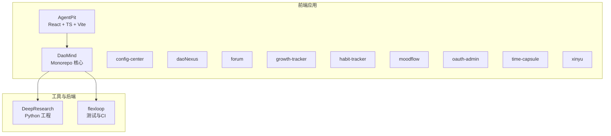
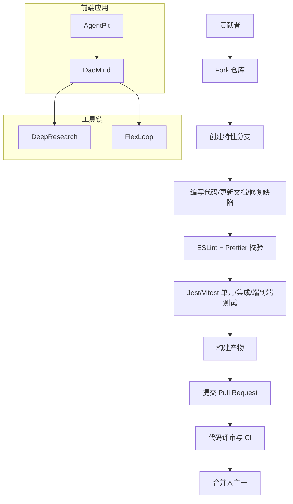
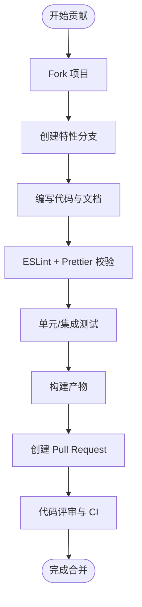
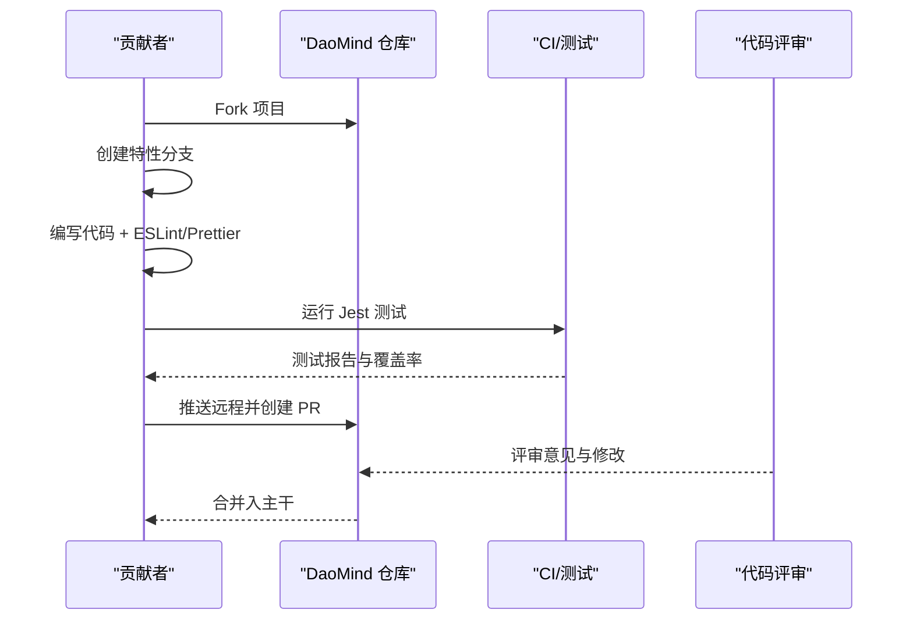
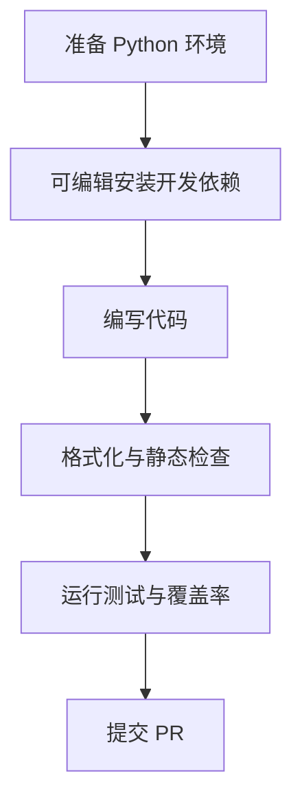
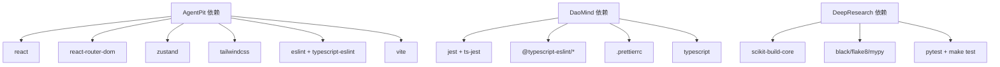

# 贡献指南

<cite>
**本文引用的文件**
- [apps/AgentPit/README.md](file://apps/AgentPit/README.md)
- [apps/AgentPit/package.json](file://apps/AgentPit/package.json)
- [apps/AgentPit/eslint.config.js](file://apps/AgentPit/eslint.config.js)
- [apps/AgentPit/tailwind.config.ts](file://apps/AgentPit/tailwind.config.ts)
- [apps/DaoMind/README.md](file://apps/DaoMind/README.md)
- [apps/DaoMind/eslint.config.js](file://apps/DaoMind/eslint.config.js)
- [apps/DaoMind/.prettierrc](file://apps/DaoMind/.prettierrc)
- [apps/DaoMind/jest.config.js](file://apps/DaoMind/jest.config.js)
- [tools/DeepResearch/CONTRIBUTING.md](file://tools/DeepResearch/CONTRIBUTING.md)
- [tools/flexloop/CONTRIBUTING.md](file://tools/flexloop/CONTRIBUTING.md)
</cite>

## 目录
1. [引言](#引言)
2. [项目结构](#项目结构)
3. [核心组件](#核心组件)
4. [架构总览](#架构总览)
5. [详细组件分析](#详细组件分析)
6. [依赖分析](#依赖分析)
7. [性能考虑](#性能考虑)
8. [故障排查指南](#故障排查指南)
9. [结论](#结论)
10. [附录](#附录)

## 引言
本指南面向 DAO Collective 项目的新老贡献者，提供从环境搭建、开发流程、代码风格、测试要求到协作规范的完整说明。项目采用多应用与多包混合的 monorepo 结构，前端以 React + TypeScript + Vite 为主，后端与工具链包含 Python 工程与复杂测试体系。本文将帮助你快速理解并参与贡献。

## 项目结构
- 前端应用集中在 apps 目录，包含多个独立的前端应用与组件库示例，如 AgentPit、DaoMind、config-center、daoNexus、forum、growth-tracker、habit-tracker、moodflow、oauth-admin、time-capsule、xinyu 等。
- 核心框架与工具链位于 tools 目录，包含 Python 工程 DeepResearch 与 flexloop 等。
- 各应用与包均具备独立的 package.json、TypeScript 配置、ESLint/Prettier 配置以及测试配置，遵循一致的开发与发布流程。

章节来源
- [apps/AgentPit/README.md:1-74](file://apps/AgentPit/README.md#L1-L74)
- [apps/DaoMind/README.md:323-358](file://apps/DaoMind/README.md#L323-L358)

## 核心组件
- 前端开发栈：React、TypeScript、Vite、TailwindCSS、ESLint、Prettier、Zustand、React Router 等。
- Monorepo 核心：DaoMind 提供代理、模块、消息总线、监控等核心能力，配套 Jest 测试与严格的覆盖率门槛。
- 工具链：DeepResearch 与 flexloop 分别提供 Python 工程与测试体系，贡献流程与测试规范明确。

章节来源
- [apps/AgentPit/package.json:1-37](file://apps/AgentPit/package.json#L1-L37)
- [apps/DaoMind/README.md:445-481](file://apps/DaoMind/README.md#L445-L481)

## 架构总览
下图展示贡献者在不同应用与工具间的协作关系与典型贡献路径。

## 详细组件分析

### 前端应用（AgentPit）贡献流程
- Fork 项目至个人仓库，创建特性分支，提交更改并推送远程，随后在 GitHub 创建 Pull Request。
- 代码风格：ESLint 与 TypeScript 类型检查；UI 框架使用 TailwindCSS，主题色与内容扫描范围已在配置中定义。
- 测试：Vite 应用通常配合 Vitest 或 Jest 进行单元与集成测试，建议在新增功能时补充测试用例。

章节来源
- [apps/AgentPit/README.md:14-74](file://apps/AgentPit/README.md#L14-L74)
- [apps/AgentPit/package.json:6-11](file://apps/AgentPit/package.json#L6-L11)
- [apps/AgentPit/eslint.config.js:1-24](file://apps/AgentPit/eslint.config.js#L1-L24)
- [apps/AgentPit/tailwind.config.ts:1-30](file://apps/AgentPit/tailwind.config.ts#L1-L30)

### Monorepo 核心（DaoMind）贡献流程与规范
- 贡献流程：Fork → 创建分支 → 提交更改 → 推送远程 → 创建 PR。
- 代码风格：ESLint 配置启用 TypeScript 规则，Prettier 统一格式；建议在提交前运行类型检查与代码格式化。
- 测试：Jest 配置覆盖 packages 下的源码，设置全局覆盖率门槛；测试匹配规则与模块映射清晰，便于扩展。
- 性能与监控：README 提供基准测试与监控系统的使用示例，建议在改动涉及性能的关键路径时进行回归测试。

章节来源
- [apps/DaoMind/README.md:445-481](file://apps/DaoMind/README.md#L445-L481)
- [apps/DaoMind/eslint.config.js:1-27](file://apps/DaoMind/eslint.config.js#L1-L27)
- [apps/DaoMind/.prettierrc:1-1](file://apps/DaoMind/.prettierrc#L1-L1)
- [apps/DaoMind/jest.config.js:1-59](file://apps/DaoMind/jest.config.js#L1-L59)

### 工具链（DeepResearch）贡献流程
- 环境要求：Python 版本与构建系统要求明确；推荐使用虚拟环境与可编辑安装。
- 开发流程：创建分支 → 编写代码 → 格式化与测试 → 提交并推送 → 提交 PR。
- 测试：提供 make test 与 pytest 的使用示例，建议在变更后运行测试套件与覆盖率检查。

章节来源
- [tools/DeepResearch/CONTRIBUTING.md:17-104](file://tools/DeepResearch/CONTRIBUTING.md#L17-L104)

### 工具链（flexloop）贡献流程
- 贡献指南链接指向集中化的贡献文档，遵循统一的协作流程与社区规范。

章节来源
- [tools/flexloop/CONTRIBUTING.md:1-3](file://tools/flexloop/CONTRIBUTING.md#L1-L3)

## 依赖分析
- 前端应用依赖：React、React Router、TailwindCSS、Zustand、Recharts 等；开发依赖包含 ESLint、TypeScript、Vite、PostCSS、TailwindCSS 插件等。
- Monorepo 核心依赖：Jest、ts-jest、TypeScript、ESLint 插件等；Prettier 统一格式化。
- 工具链依赖：Python 生态与构建工具，提供可编辑安装与测试任务。

章节来源
- [apps/AgentPit/package.json:12-35](file://apps/AgentPit/package.json#L12-L35)
- [apps/DaoMind/eslint.config.js:1-27](file://apps/DaoMind/eslint.config.js#L1-L27)
- [apps/DaoMind/.prettierrc:1-1](file://apps/DaoMind/.prettierrc#L1-L1)
- [tools/DeepResearch/CONTRIBUTING.md:69-72](file://tools/DeepResearch/CONTRIBUTING.md#L69-L72)

## 性能考虑
- 前端应用：合理拆分组件与路由，避免不必要的重渲染；使用 Zustand 管理轻量状态；TailwindCSS 动态类名需控制范围，避免样式爆炸。
- Monorepo 核心：Jest 并行度与超时设置已配置，建议在大型测试套件中关注 worker 数量与测试隔离。
- 工具链：Python 工程建议在 CI 中缓存依赖，减少构建时间；测试覆盖率与性能基准应纳入 PR 要求。

## 故障排查指南
- 依赖安装失败（DaoMind）：确认 pnpm 版本与网络环境，必要时清理缓存后重试。
- 构建失败：先运行类型检查，修正 TS 错误后再尝试构建。
- 测试失败：查看测试输出与覆盖率报告，定位失败用例并修复。
- 子包导入失败：确保已构建项目，检查 tsconfig 路径映射与包导出字段。
- 性能问题：运行基准测试与监控工具，识别瓶颈并优化关键路径。

章节来源
- [apps/DaoMind/README.md:418-444](file://apps/DaoMind/README.md#L418-L444)

## 结论
DAO Collective 项目通过清晰的贡献流程、统一的代码风格与完善的测试体系，为多语言、多应用的协作提供了坚实基础。建议贡献者在提交前完成本地校验与测试，并遵循各子项目的具体规范，共同维护高质量的开源生态。

## 附录

### 贡献流程速查表
- Fork 项目至个人仓库
- 创建特性分支（feature/xxx）
- 编写代码与文档
- 运行 ESLint、Prettier、类型检查与测试
- 推送远程并创建 PR
- 根据评审意见修改并重复测试
- 合并入主干

章节来源
- [apps/DaoMind/README.md:445-468](file://apps/DaoMind/README.md#L445-L468)
- [tools/DeepResearch/CONTRIBUTING.md:74-104](file://tools/DeepResearch/CONTRIBUTING.md#L74-L104)

### 代码风格与类型定义最佳实践
- ESLint：启用 TypeScript 规则集，避免未使用变量与任意类型滥用；允许控制台警告与错误输出。
- Prettier：统一分号、单引号、缩进宽度、尾随逗号、打印宽度与括号风格。
- TypeScript：为公共 API 提供完整类型定义；函数与模块职责单一；复杂逻辑添加注释与文档字符串。
- 前端 UI：TailwindCSS 主题与内容扫描范围明确，避免过度动态类名导致体积膨胀。

章节来源
- [apps/DaoMind/eslint.config.js:19-25](file://apps/DaoMind/eslint.config.js#L19-L25)
- [apps/DaoMind/.prettierrc:1-1](file://apps/DaoMind/.prettierrc#L1-L1)
- [apps/AgentPit/tailwind.config.ts:8-26](file://apps/AgentPit/tailwind.config.ts#L8-L26)

### 测试要求与运行指南
- 单元测试：Jest 配置覆盖 packages 下源码，设置全局覆盖率门槛；测试匹配规则与模块映射完善。
- 集成测试：按包划分测试目录，确保模块间交互稳定。
- 端到端测试：建议在前端应用中引入 Vitest 或 Playwright，并在 CI 中执行。
- 工具链测试：Python 工程提供 make test 与 pytest 示例，建议在变更后运行测试与覆盖率。

章节来源
- [apps/DaoMind/jest.config.js:5-29](file://apps/DaoMind/jest.config.js#L5-L29)
- [apps/DaoMind/README.md:309-322](file://apps/DaoMind/README.md#L309-L322)
- [tools/DeepResearch/CONTRIBUTING.md:120-131](file://tools/DeepResearch/CONTRIBUTING.md#L120-L131)