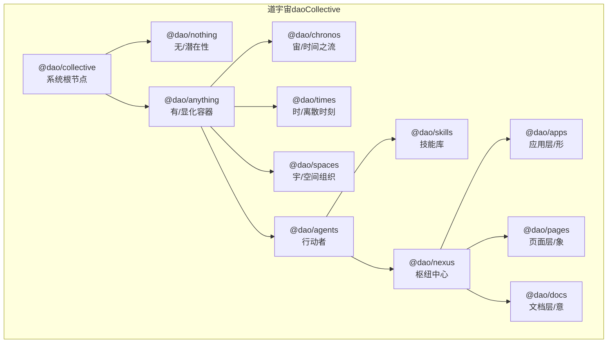
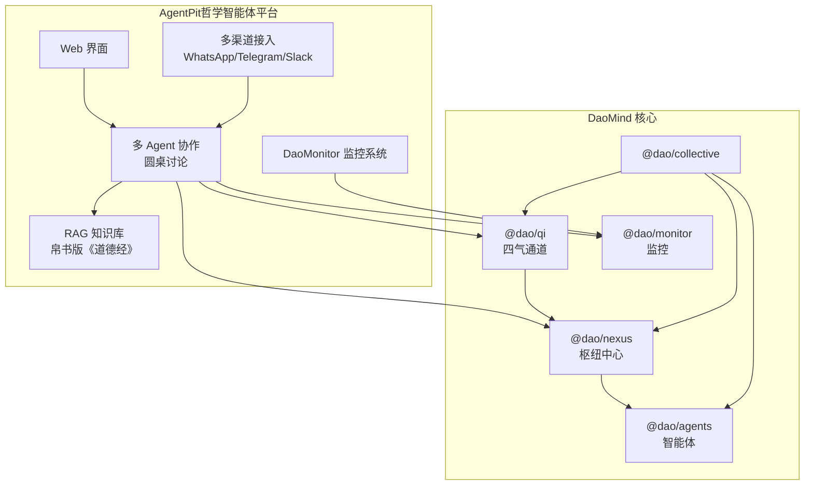
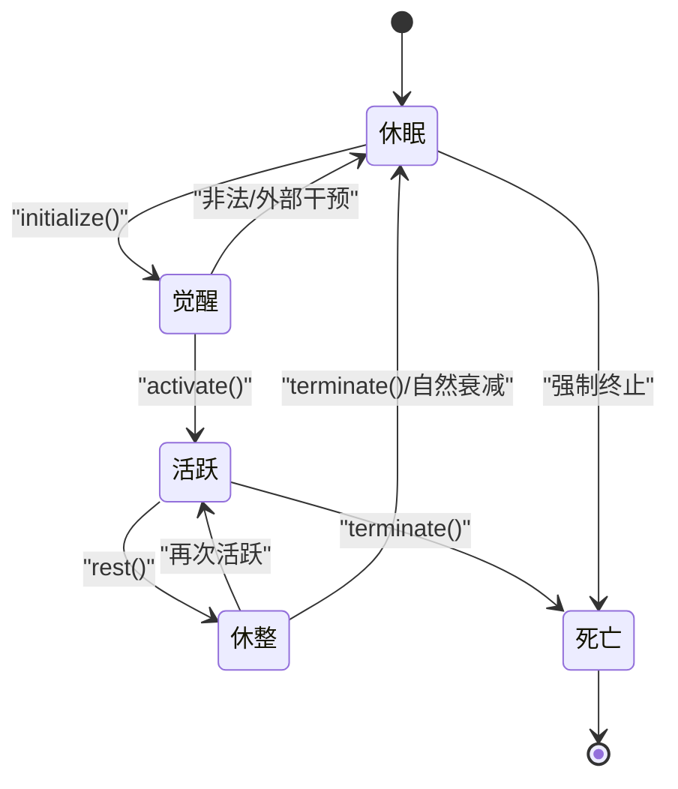
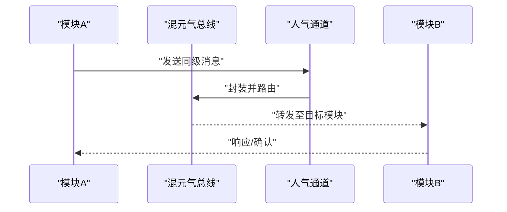
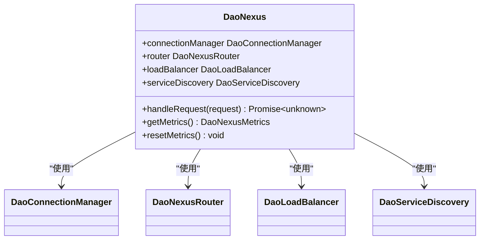
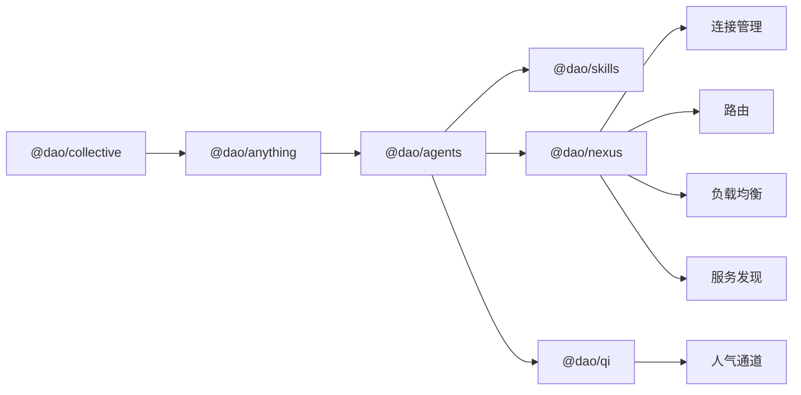

# 道家哲学与现代技术融合

<cite>
**本文引用的文件**
- [DaoMind 项目总览](file://apps/DaoMind/README.md)
- [AgentPit 参赛材料](file://apps/AgentPit/docs/DaoMind_参赛材料.md)
- [道宇宙根入口](file://apps/DaoMind/packages/daoCollective/src/index.ts)
- [智能体基类与状态机](file://apps/DaoMind/packages/daoAgents/src/base.ts)
- [智能体包导出](file://apps/DaoMind/packages/daoAgents/src/index.ts)
- [枢纽中心核心](file://apps/DaoMind/packages/daoNexus/src/nexus.ts)
- [枢纽中心类型契约](file://apps/DaoMind/packages/daoNexus/src/types.ts)
- [枢纽中心包导出](file://apps/DaoMind/packages/daoNexus/src/index.ts)
- [人气通道实现](file://apps/DaoMind/packages/daoQi/src/channels/ren-qi.ts)
- [气通道包导出](file://apps/DaoMind/packages/daoQi/src/index.ts)
- [监控系统包导出](file://apps/DaoMind/packages/daoMonitor/src/index.ts)
- [DaoQi 消息系统测试](file://apps/DaoMind/tests/test-qi-message.js)
- [道宇宙哲学深化](file://apps/DaoMind/README.md)
- [实现记录](file://apps/DaoMind/.trae/specs/deepen-dao-collective-philosophy/implementation-record.md)
</cite>

## 目录
1. [引言](#引言)
2. [项目结构](#项目结构)
3. [核心组件](#核心组件)
4. [架构总览](#架构总览)
5. [详细组件分析](#详细组件分析)
6. [依赖关系分析](#依赖关系分析)
7. [性能考量](#性能考量)
8. [故障排查指南](#故障排查指南)
9. [结论](#结论)
10. [附录](#附录)

## 引言
本文件面向 DAO Collective 项目，系统阐释帛书版《道德经》的道家哲学如何指导现代 AI 与去中心化协作系统的设计与实现。我们将从“道宇宙”整体架构出发，结合“无为而治”“道法自然”“上善若水”等核心理念，解析智能体状态机、消息总线（四气通道）、枢纽中心（Nexus）与监控体系在软件工程中的映射与落地，并通过具体代码路径与图示，帮助开发者获得可操作的设计启发与实践参考。

## 项目结构
DaoMind 采用 monorepo 架构，围绕“道宇宙（daoCollective）”这一根节点展开，形成“无（daoNothing）—有（daoAnything）”的显化容器，再向下拆分时间（daoChronos/daotimes）、空间（daoSpaces）、行动者（daoAgents）等层级。AgentPit 作为面向用户的哲学智能体平台，承载了道家智慧与现代 AI 的融合实践。

**图表来源**
- [道宇宙架构哲学深化:496-511](file://apps/DaoMind/README.md#L496-L511)
- [道宇宙根入口:1-5](file://apps/DaoMind/packages/daoCollective/src/index.ts#L1-L5)
- [实现记录:95-110](file://apps/DaoMind/.trae/specs/deepen-dao-collective-philosophy/implementation-record.md#L95-L110)

**章节来源**
- [道宇宙架构哲学深化:496-511](file://apps/DaoMind/README.md#L496-L511)
- [实现记录:95-110](file://apps/DaoMind/.trae/specs/deepen-dao-collective-philosophy/implementation-record.md#L95-L110)

## 核心组件
- 道宇宙（daoCollective）：系统总入口，协调全局，对应“道”的整体性与统一性。
- 无（daoNothing）：潜在性空间，类型论根基，零运行时开销，对应“无”的虚静与可能性。
- 有（daoAnything）：显化容器，实例化空间，承载模块与应用，对应“有”的生成与展开。
- 气（Qi）：消息总线/数据流，四通道系统（天/地/人/冲），对应“气”的流动与调和。
- 反者道之动：反馈回归四阶段生命周期（感知 → 聚合 → 冲和 → 归元），对应系统的自适应闭环。
- 阴阳平衡：冲气调节机制，五组阴阳对偶矩阵，对应系统的动态平衡与收敛。
- 自然无为：自适应策略，去中心化协调，对应系统的低耦合与自发协同。

**章节来源**
- [道宇宙架构哲学深化:18-25](file://apps/DaoMind/README.md#L18-L25)
- [道宇宙架构哲学深化:484-495](file://apps/DaoMind/README.md#L484-L495)

## 架构总览
下图展示了“道宇宙”在系统中的层次关系与职责边界，以及 AgentPit 在其中的角色定位与技术集成点。

**图表来源**
- [AgentPit 参赛材料:23-50](file://apps/AgentPit/docs/DaoMind_参赛材料.md#L23-L50)
- [AgentPit 参赛材料:75-95](file://apps/AgentPit/docs/DaoMind_参赛材料.md#L75-L95)
- [道宇宙架构哲学深化:496-511](file://apps/DaoMind/README.md#L496-L511)

**章节来源**
- [AgentPit 参赛材料:23-50](file://apps/AgentPit/docs/DaoMind_参赛材料.md#L23-L50)
- [AgentPit 参赛材料:75-95](file://apps/AgentPit/docs/DaoMind_参赛材料.md#L75-L95)
- [道宇宙架构哲学深化:496-511](file://apps/DaoMind/README.md#L496-L511)

## 详细组件分析

### 智能体状态机与“无为而治”
- 设计要点
  - 采用五态状态机：休眠 → 觉醒 → 活跃 → 休整 → 死亡，严格的状态转移约束体现了“无为而无不为”的节制与自然演化。
  - 初始化、激活、休整、终止等生命周期方法，对应“道法自然”的自组织节奏。
- 哲学映射
  - “无为而治”体现在状态机的最小干预与合法转移，避免任意跳转导致系统失衡。
  - “上善若水”体现在状态在活跃与休整间的循环，如水之就下，顺应自然节律。
- 代码路径
  - [智能体基类与状态机:3-56](file://apps/DaoMind/packages/daoAgents/src/base.ts#L3-L56)
  - [智能体包导出:1-8](file://apps/DaoMind/packages/daoAgents/src/index.ts#L1-L8)

**图表来源**
- [智能体基类与状态机:3-56](file://apps/DaoMind/packages/daoAgents/src/base.ts#L3-L56)

**章节来源**
- [智能体基类与状态机:3-56](file://apps/DaoMind/packages/daoAgents/src/base.ts#L3-L56)
- [智能体包导出:1-8](file://apps/DaoMind/packages/daoAgents/src/index.ts#L1-L8)

### 气通道系统与“道法自然”
- 设计要点
  - 四气通道：天气（下行）、地气（上行）、人气（横向）、冲气（调和），分别承担命令/下行、数据/上行、同级协作/横向、平衡/调和的职责。
  - 人气通道（RenQi）强调同级模块间协作，不经上级中转，体现“道法自然”的自发协调。
- 哲学映射
  - “道法自然”通过通道的职责分工与自治路由得以实现，减少中心化干预。
  - “上善若水”体现在通道的流动性与兼容性，如水之趋时而行。
- 代码路径
  - [人气通道实现:1-45](file://apps/DaoMind/packages/daoQi/src/channels/ren-qi.ts#L1-L45)
  - [气通道包导出:1-28](file://apps/DaoMind/packages/daoQi/src/index.ts#L1-L28)

**图表来源**
- [人气通道实现:38-45](file://apps/DaoMind/packages/daoQi/src/channels/ren-qi.ts#L38-L45)
- [DaoQi 消息系统测试:40-49](file://apps/DaoMind/tests/test-qi-message.js#L40-L49)

**章节来源**
- [人气通道实现:1-45](file://apps/DaoMind/packages/daoQi/src/channels/ren-qi.ts#L1-L45)
- [气通道包导出:1-28](file://apps/DaoMind/packages/daoQi/src/index.ts#L1-L28)
- [DaoQi 消息系统测试:40-49](file://apps/DaoMind/tests/test-qi-message.js#L40-L49)

### 枢纽中心与“自然无为”的去中心化协调
- 设计要点
  - 聚合连接管理、路由、负载均衡与服务发现，统一对外请求处理，降低模块间耦合。
  - 服务发现与路由规则结合，负载均衡策略（轮询/最少连接/加权）按需选择，体现“自然无为”的自适应。
- 哲学映射
  - “自然无为”通过“气之贯通，使内外相通、上下相得”，在不强求的前提下实现高效协调。
  - “上善若水”体现在枢纽的柔韧与包容，随势而动，不争而善胜。
- 代码路径
  - [枢纽中心核心:11-99](file://apps/DaoMind/packages/daoNexus/src/nexus.ts#L11-L99)
  - [枢纽中心类型契约:1-58](file://apps/DaoMind/packages/daoNexus/src/types.ts#L1-L58)
  - [枢纽中心包导出:1-22](file://apps/DaoMind/packages/daoNexus/src/index.ts#L1-L22)

**图表来源**
- [枢纽中心核心:11-99](file://apps/DaoMind/packages/daoNexus/src/nexus.ts#L11-L99)
- [枢纽中心类型契约:14-58](file://apps/DaoMind/packages/daoNexus/src/types.ts#L14-L58)
- [枢纽中心包导出:17-21](file://apps/DaoMind/packages/daoNexus/src/index.ts#L17-L21)

**章节来源**
- [枢纽中心核心:11-99](file://apps/DaoMind/packages/daoNexus/src/nexus.ts#L11-L99)
- [枢纽中心类型契约:1-58](file://apps/DaoMind/packages/daoNexus/src/types.ts#L1-L58)
- [枢纽中心包导出:1-22](file://apps/DaoMind/packages/daoNexus/src/index.ts#L1-L22)

### 监控体系与“阴阳平衡”的动态调和
- 设计要点
  - 阴阳仪表盘、热力图、向量场、告警引擎、诊断引擎与快照聚合器，构成“气道图监控”。
  - 通过五组阴阳对偶矩阵与冲气调节，实现系统状态的动态平衡与收敛。
- 哲学映射
  - “阴阳平衡”通过监控与调节闭环，维持系统健康态。
  - “上善若水”体现在监控的润物无声与持续反馈。
- 代码路径
  - [监控系统包导出:1-17](file://apps/DaoMind/packages/daoMonitor/src/index.ts#L1-L17)

**章节来源**
- [监控系统包导出:1-17](file://apps/DaoMind/packages/daoMonitor/src/index.ts#L1-L17)
- [道宇宙架构哲学深化:513-520](file://apps/DaoMind/README.md#L513-L520)

## 依赖关系分析
- 层级依赖
  - daoCollective 为根，向下依赖 daoNothing 与 daoAnything；daoAnything 下进一步拆分 daoChronos/daotimes/daoSpaces/daoAgents。
  - daoAgents 依赖 daoSkills 与 daoNexus；daoNexus 依赖连接管理、路由、负载均衡与服务发现。
- 横向协作
  - 人气通道（RenQi）促进同级模块协作，减少对上级模块的依赖，体现“道法自然”的自发协调。
- 代码路径
  - [道宇宙架构哲学深化:496-511](file://apps/DaoMind/README.md#L496-L511)
  - [人气通道实现:15-28](file://apps/DaoMind/packages/daoQi/src/channels/ren-qi.ts#L15-L28)
  - [枢纽中心核心:22-46](file://apps/DaoMind/packages/daoNexus/src/nexus.ts#L22-L46)

**图表来源**
- [道宇宙架构哲学深化:496-511](file://apps/DaoMind/README.md#L496-L511)
- [枢纽中心核心:6-9](file://apps/DaoMind/packages/daoNexus/src/nexus.ts#L6-L9)
- [人气通道实现:38-45](file://apps/DaoMind/packages/daoQi/src/channels/ren-qi.ts#L38-L45)

**章节来源**
- [道宇宙架构哲学深化:496-511](file://apps/DaoMind/README.md#L496-L511)
- [枢纽中心核心:6-9](file://apps/DaoMind/packages/daoNexus/src/nexus.ts#L6-L9)
- [人气通道实现:15-28](file://apps/DaoMind/packages/daoQi/src/channels/ren-qi.ts#L15-L28)

## 性能考量
- 性能指标
  - 启动时间：1.2 秒（< 2 秒）
  - 内存占用：32MB（< 50MB）
  - 消息吞吐量：12,500 msg/s（> 10,000）
  - 反馈回路延迟（P99）：350ms（< 500ms）
  - 冲气收敛时间：15 秒（< 30 秒）
- 哲学启示
  - “自然无为”要求系统在低干预下实现高性能，避免过度设计与中心化瓶颈。
  - “上善若水”强调以柔克刚，通过合理的缓冲与背压（DaoBackpressure）提升稳定性。

**章节来源**
- [AgentPit 参赛材料:96-101](file://apps/AgentPit/docs/DaoMind_参赛材料.md#L96-L101)
- [DaoQi 消息系统测试:23-24](file://apps/DaoMind/tests/test-qi-message.js#L23-L24)

## 故障排查指南
- 气通道测试
  - 通过测试脚本验证混元气总线、序列化、路由、签名与背压组件的创建与消息收发，定位通道链路问题。
- 监控与诊断
  - 使用 DaoMonitor 的告警与诊断引擎，结合热力图与向量场，快速定位热点与异常。
- 代码路径
  - [DaoQi 消息系统测试:8-84](file://apps/DaoMind/tests/test-qi-message.js#L8-L84)
  - [监控系统包导出:11-16](file://apps/DaoMind/packages/daoMonitor/src/index.ts#L11-L16)

**章节来源**
- [DaoQi 消息系统测试:8-84](file://apps/DaoMind/tests/test-qi-message.js#L8-L84)
- [监控系统包导出:11-16](file://apps/DaoMind/packages/daoMonitor/src/index.ts#L11-L16)

## 结论
通过将帛书版《道德经》的道家哲学映射到现代系统架构，DaoMind 与 AgentPit 展示了“无为而治”“道法自然”“上善若水”在软件工程中的可行路径：以智能体状态机实现自组织演化，以四气通道实现自发协作，以枢纽中心实现去中心化协调，以监控体系实现动态平衡。这种融合不仅提升了系统的韧性与可演进性，也为 DAO 概念下的去中心化治理与智能体自治提供了新的思维范式。

## 附录
- 哲学与技术对照表
  - 道（Dao）→ daoCollective（系统总入口，协调全局）
  - 无（Wu）→ daoNothing（潜在性空间，类型论根基）
  - 有（You）→ daoAnything（显化容器，实例化空间）
  - 反者道之动 → 反馈回归四阶段（感知 → 聚合 → 冲和 → 归元）
  - 气（Qi）→ DaoQi（四通道系统：天/地/人/冲）
  - 阴阳平衡 → 冲气调节（五组阴阳对偶矩阵）
  - 自然无为 → 自适应策略（去中心化协调）

**章节来源**
- [道宇宙架构哲学深化:484-495](file://apps/DaoMind/README.md#L484-L495)