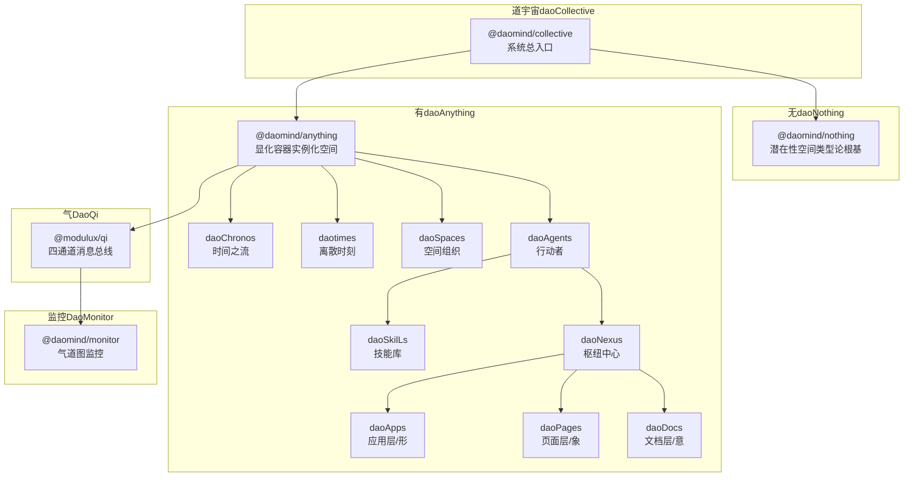
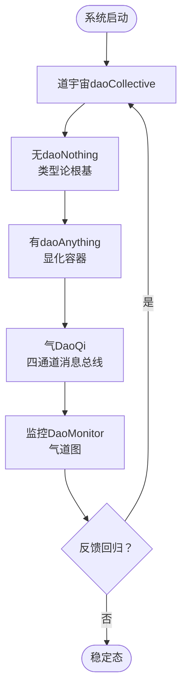
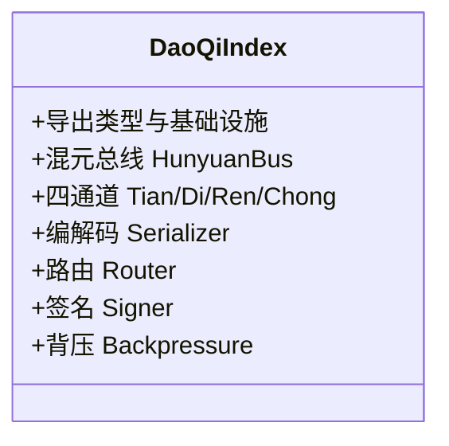
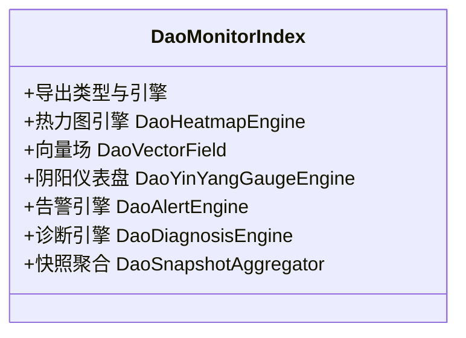
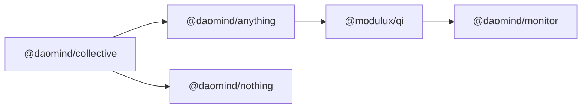

# 项目介绍

<cite>
**本文引用的文件**
- [apps/DaoMind/README.md](file://apps/DaoMind/README.md)
- [apps/DaoMind/packages/daoCollective/src/index.ts](file://apps/DaoMind/packages/daoCollective/src/index.ts)
- [apps/DaoMind/packages/daoCollective/package.json](file://apps/DaoMind/packages/daoCollective/package.json)
- [apps/DaoMind/packages/daoNothing/src/index.ts](file://apps/DaoMind/packages/daoNothing/src/index.ts)
- [apps/DaoMind/packages/daoNothing/package.json](file://apps/DaoMind/packages/daoNothing/package.json)
- [apps/DaoMind/packages/daoAnything/src/index.ts](file://apps/DaoMind/packages/daoAnything/src/index.ts)
- [apps/DaoMind/packages/daoAnything/package.json](file://apps/DaoMind/packages/daoAnything/package.json)
- [apps/DaoMind/packages/daoQi/src/index.ts](file://apps/DaoMind/packages/daoQi/src/index.ts)
- [apps/DaoMind/packages/daoQi/package.json](file://apps/DaoMind/packages/daoQi/package.json)
- [apps/DaoMind/packages/daoMonitor/src/index.ts](file://apps/DaoMind/packages/daoMonitor/src/index.ts)
</cite>

## 目录
1. [引言](#引言)
2. [项目结构](#项目结构)
3. [核心组件](#核心组件)
4. [架构总览](#架构总览)
5. [详细组件分析](#详细组件分析)
6. [依赖分析](#依赖分析)
7. [性能考虑](#性能考虑)
8. [故障排查指南](#故障排查指南)
9. [结论](#结论)
10. [附录](#附录)

## 引言
DAO Collective 是一个以道家哲学为思想内核的现代化系统框架，融合“道（daoCollective）”“无（daoNothing）”“有（daoAnything）”等核心概念，构建从潜在性空间到显化容器的完整架构闭环；同时以“气（Qi）”作为消息总线与数据流的生命线，配合“反者道之动”的反馈回归四阶段生命周期与“阴阳平衡”的冲气调节机制，形成自然无为、去中心化的自适应协调体系。项目采用 monorepo 架构，基于 TypeScript 提供类型安全，辅以完善的监控系统与基准测试，既适合初学者循序渐进理解概念，也为资深工程师提供可深挖的架构决策与实现细节。

## 项目结构
项目采用 monorepo 管理多子包，根 README 对整体结构与哲学架构有系统说明；核心包包括：
- 道宇宙（daoCollective）：系统总入口，协调全局
- 潜在性空间（daoNothing）：类型论根基，零运行时开销
- 显化容器（daoAnything）：实例化空间，承载模块与生命周期
- 气（DaoQi）：四通道消息总线（天、地、人、冲），统一数据流
- 监控（DaoMonitor）：气道图监控（热力图、向量场、仪表盘、告警、诊断）

图表来源
- [apps/DaoMind/README.md:496-511](file://apps/DaoMind/README.md#L496-L511)
- [apps/DaoMind/packages/daoCollective/src/index.ts:1-5](file://apps/DaoMind/packages/daoCollective/src/index.ts#L1-L5)
- [apps/DaoMind/packages/daoNothing/src/index.ts:1-13](file://apps/DaoMind/packages/daoNothing/src/index.ts#L1-L13)
- [apps/DaoMind/packages/daoAnything/src/index.ts:1-13](file://apps/DaoMind/packages/daoAnything/src/index.ts#L1-L13)
- [apps/DaoMind/packages/daoQi/src/index.ts:1-28](file://apps/DaoMind/packages/daoQi/src/index.ts#L1-L28)
- [apps/DaoMind/packages/daoMonitor/src/index.ts:1-17](file://apps/DaoMind/packages/daoMonitor/src/index.ts#L1-L17)

章节来源
- [apps/DaoMind/README.md:323-359](file://apps/DaoMind/README.md#L323-L359)

## 核心组件
- 道宇宙（daoCollective）：系统总入口，负责整体协调与边界定义，体现“道法自然”的全局视角。
- 无（daoNothing）：潜在性空间，仅导出类型与守卫，不产生运行时实例，零开销，奠定类型论根基。
- 有（daoAnything）：显化容器，承载模块注册、生命周期管理与实例化，形成“万物之形”。
- 气（DaoQi）：四通道消息总线（天、地、人、冲），统一消息协议、路由与背压控制，支撑系统内部高效通信。
- 监控（DaoMonitor）：提供热力图、向量场、仪表盘、告警与诊断能力，形成“气道图”闭环，保障系统可观测性。

章节来源
- [apps/DaoMind/README.md:7-16](file://apps/DaoMind/README.md#L7-L16)
- [apps/DaoMind/README.md:482-521](file://apps/DaoMind/README.md#L482-L521)

## 架构总览
从“道”出发，经由“无”的潜在性空间，落于“有”的显化容器，再由“气”的四通道驱动，最终通过“监控”实现可视化与反馈，形成“感知 → 聚合 → 冲和 → 归元”的闭环。

图表来源
- [apps/DaoMind/README.md:491-494](file://apps/DaoMind/README.md#L491-L494)
- [apps/DaoMind/README.md:513-521](file://apps/DaoMind/README.md#L513-L521)

## 详细组件分析

### 道宇宙（daoCollective）
- 角色定位：系统总入口，协调全局，体现“道”的整体性与统一性。
- 设计要点：以最小运行时暴露核心元信息，避免侵入性，确保“无为而治”。

章节来源
- [apps/DaoMind/packages/daoCollective/src/index.ts:1-5](file://apps/DaoMind/packages/daoCollective/src/index.ts#L1-L5)
- [apps/DaoMind/packages/daoCollective/package.json:1-1](file://apps/DaoMind/packages/daoCollective/package.json#L1-L1)

### 无（daoNothing）
- 角色定位：潜在性空间，零运行时开销，仅导出类型、守卫与契约。
- 设计要点：不实现任何可能，仅定义一切“可能”，确保类型安全与最小耦合。

章节来源
- [apps/DaoMind/packages/daoNothing/src/index.ts:1-13](file://apps/DaoMind/packages/daoNothing/src/index.ts#L1-L13)
- [apps/DaoMind/packages/daoNothing/package.json:1-1](file://apps/DaoMind/packages/daoNothing/package.json#L1-L1)

### 有（daoAnything）
- 角色定位：显化容器，承载模块注册、生命周期与实例化。
- 设计要点：提供模块化容器与元数据类型，支撑“万物之形”的组织与演化。

章节来源
- [apps/DaoMind/packages/daoAnything/src/index.ts:1-13](file://apps/DaoMind/packages/daoAnything/src/index.ts#L1-L13)
- [apps/DaoMind/packages/daoAnything/package.json:1-1](file://apps/DaoMind/packages/daoAnything/package.json#L1-L1)

### 气（DaoQi）
- 角色定位：消息总线与数据流传输层，四通道（天、地、人、冲）协同。
- 设计要点：统一消息协议、路由与签名校验，支持背压控制与双模式序列化，保障高吞吐与低延迟。

图表来源
- [apps/DaoMind/packages/daoQi/src/index.ts:1-28](file://apps/DaoMind/packages/daoQi/src/index.ts#L1-L28)

章节来源
- [apps/DaoMind/packages/daoQi/src/index.ts:1-28](file://apps/DaoMind/packages/daoQi/src/index.ts#L1-L28)
- [apps/DaoMind/packages/daoQi/package.json:1-1](file://apps/DaoMind/packages/daoQi/package.json#L1-L1)

### 监控（DaoMonitor）
- 角色定位：气道图监控，提供热力图、向量场、仪表盘、告警与诊断。
- 设计要点：以“气”的流动为观测对象，形成系统健康快照与历史趋势，支撑自适应调节。

图表来源
- [apps/DaoMind/packages/daoMonitor/src/index.ts:1-17](file://apps/DaoMind/packages/daoMonitor/src/index.ts#L1-L17)

章节来源
- [apps/DaoMind/packages/daoMonitor/src/index.ts:1-17](file://apps/DaoMind/packages/daoMonitor/src/index.ts#L1-L17)

## 依赖分析
- 组件耦合：daoCollective 作为根节点，向下协调 daoNothing 与 daoAnything；daoAnything 通过 DaoQi 与其他模块交互；DaoMonitor 作为观测与反馈层，贯穿全链路。
- 外部依赖：monorepo 工具链（如 pnpm 工作区）、TypeScript 类型系统、Jest 测试框架、ESLint/Prettier 代码质量工具。
- 架构优势：模块边界清晰、类型安全、可观测性强、可扩展性高，便于按需裁剪与组合。

图表来源
- [apps/DaoMind/packages/daoCollective/src/index.ts:1-5](file://apps/DaoMind/packages/daoCollective/src/index.ts#L1-L5)
- [apps/DaoMind/packages/daoAnything/src/index.ts:1-13](file://apps/DaoMind/packages/daoAnything/src/index.ts#L1-L13)
- [apps/DaoMind/packages/daoQi/src/index.ts:1-28](file://apps/DaoMind/packages/daoQi/src/index.ts#L1-L28)
- [apps/DaoMind/packages/daoMonitor/src/index.ts:1-17](file://apps/DaoMind/packages/daoMonitor/src/index.ts#L1-L17)

## 性能考虑
- 类型安全与零运行时开销：daoNothing 仅导出类型与守卫，降低运行时成本。
- 消息总线优化：DaoQi 支持背压控制与双模式序列化，兼顾吞吐与延迟。
- 监控与基准：DaoMonitor 提供热力图、向量场与仪表盘，结合基准测试，持续优化反馈回路延迟与冲气收敛时间。

章节来源
- [apps/DaoMind/README.md:528-534](file://apps/DaoMind/README.md#L528-L534)

## 故障排查指南
- 安装与环境
  - 确认 Node.js、pnpm、TypeScript 版本满足要求，并执行类型检查与构建验证。
- 导入与构建
  - 若子包导入失败，先执行构建并检查 tsconfig 路径映射。
- 测试与验证
  - 使用项目内置的验证工具与测试脚本，定位问题范围。
- 性能问题
  - 利用 DaoMonitor 的气道图能力采集快照，结合基准测试定位瓶颈。

章节来源
- [apps/DaoMind/README.md:398-444](file://apps/DaoMind/README.md#L398-L444)

## 结论
DAO Collective 以道家哲学为思想内核，通过“道—无—有—气—反—冲”的架构闭环，实现了从潜在性到显化、从消息流到监控反馈的完整系统模型。基于 monorepo 与 TypeScript 的工程实践，既保证了类型安全与可维护性，又提供了强大的扩展能力与可观测性。对于初学者，可从“道—无—有”的概念入手；对于资深开发者，则可在“气—反—冲—监控”的实现层面深入探索。

## 附录
- 哲学与架构映射表（节选）
  - 道（daoCollective）：系统总入口，协调全局
  - 无（daoNothing）：潜在性空间，类型论根基
  - 有（daoAnything）：显化容器，实例化空间
  - 气（DaoQi）：消息总线/数据流，四通道系统（天/地/人/冲）
  - 反者道之动：反馈回归四阶段生命周期（感知 → 聚合 → 冲和 → 归元）
  - 阴阳平衡：冲气调节机制，五组阴阳对偶矩阵
  - 自然无为：自适应策略，去中心化协调

章节来源
- [apps/DaoMind/README.md:482-495](file://apps/DaoMind/README.md#L482-L495)