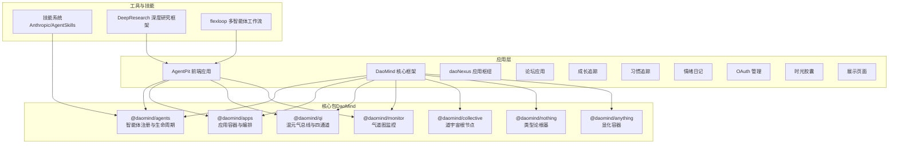
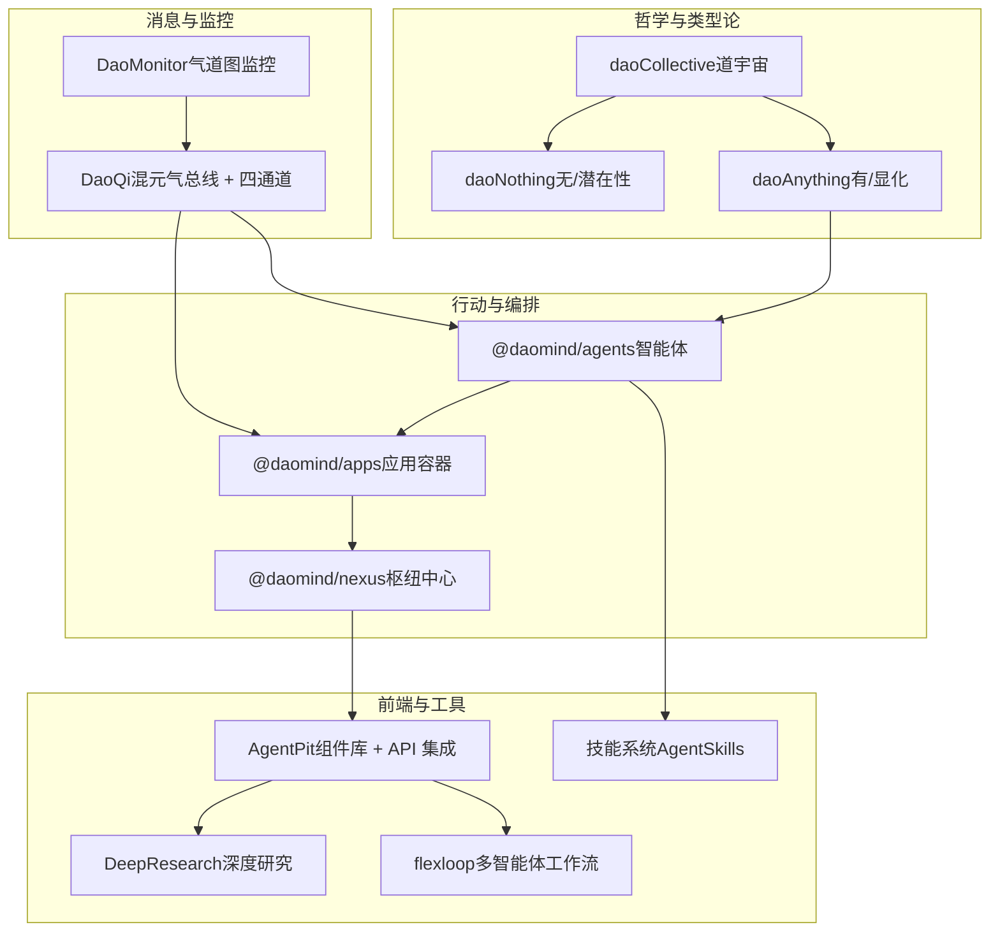
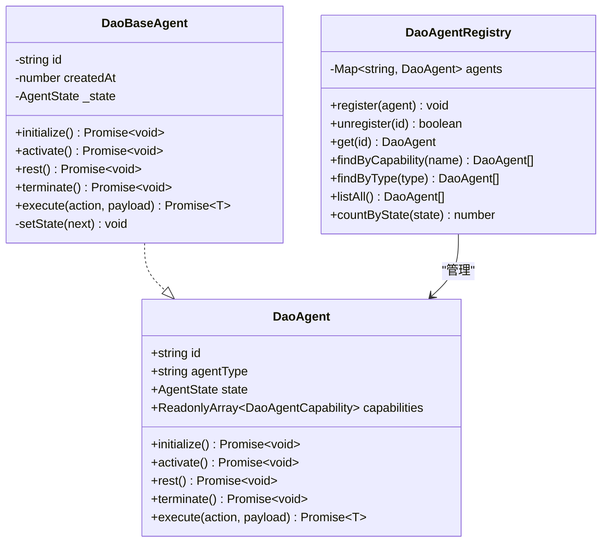
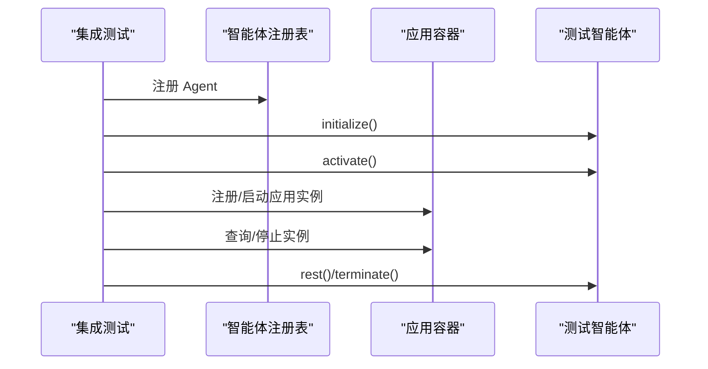
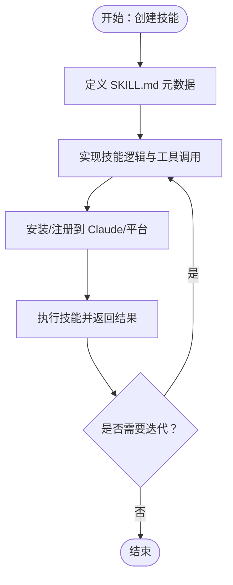
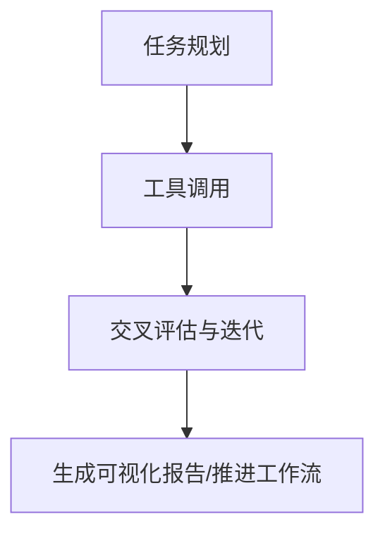
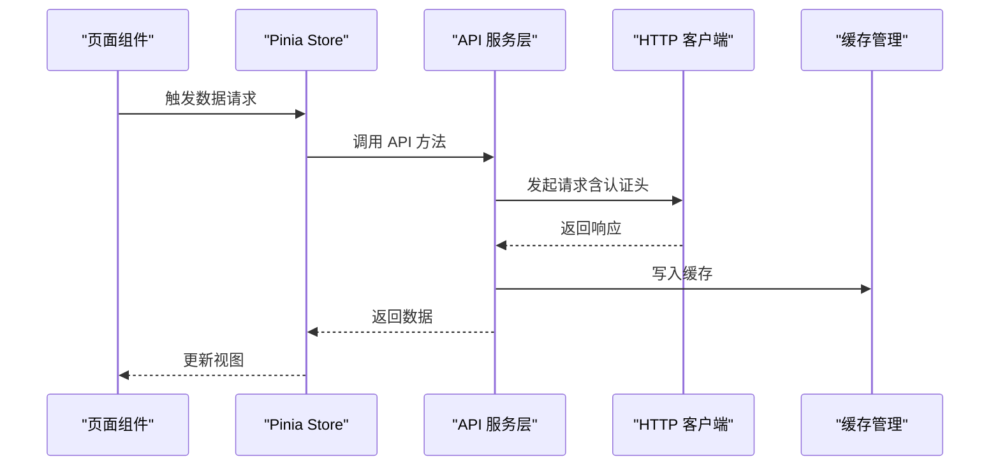
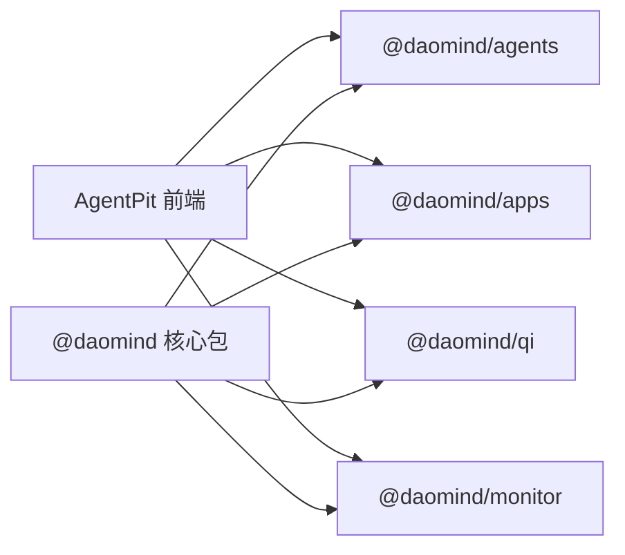

# 项目介绍

<cite>
**本文引用的文件**
- [pyproject.toml](file://pyproject.toml)
- [apps/DaoMind/README.md](file://apps/DaoMind/README.md)
- [apps/AgentPit/docs/API_INTEGRATION_PLAN.md](file://apps/AgentPit/docs/API_INTEGRATION_PLAN.md)
- [apps/AgentPit/docs/COMPONENT_LIBRARY_ARCHITECTURE.md](file://apps/AgentPit/docs/COMPONENT_LIBRARY_ARCHITECTURE.md)
- [apps/AgentPit/README.md](file://apps/AgentPit/README.md)
- [skills/daoSkilLs/skills/anthropics-skills/README.md](file://skills/daoSkilLs/skills/anthropics-skills/README.md)
- [tools/DeepResearch/README.md](file://tools/DeepResearch/README.md)
- [tools/flexloop/README.md](file://tools/flexloop/README.md)
- [apps/DaoMind/src/__tests__/integration/agents-apps-integration.test.ts](file://apps/DaoMind/src/__tests__/integration/agents-apps-integration.test.ts)
- [apps/DaoMind/packages/daoAgents/src/index.ts](file://apps/DaoMind/packages/daoAgents/src/index.ts)
- [apps/DaoMind/packages/daoAgents/src/types.ts](file://apps/DaoMind/packages/daoAgents/src/types.ts)
- [apps/DaoMind/packages/daoAgents/src/registry.ts](file://apps/DaoMind/packages/daoAgents/src/registry.ts)
- [apps/DaoMind/packages/daoAgents/src/base.ts](file://apps/DaoMind/packages/daoAgents/src/base.ts)
</cite>

## 目录
1. [引言](#引言)
2. [项目结构](#项目结构)
3. [核心组件](#核心组件)
4. [架构总览](#架构总览)
5. [详细组件分析](#详细组件分析)
6. [依赖分析](#依赖分析)
7. [性能考量](#性能考量)
8. [故障排查指南](#故障排查指南)
9. [结论](#结论)
10. [附录](#附录)

## 引言
DAOApps 是一个面向去中心化自治组织（DAO）的应用生态与工具集合，旨在通过“智能体平台 + 多智能体系统 + 技能系统 + 工具链”的协同，构建可演进、可治理、可协作的 DAO 生态闭环。项目以 DaoMind 的道家哲学架构为思想内核，强调“自然无为”的去中心化协调与“反者道之动”的反馈回归生命周期；同时结合 AgentPit 的前端组件库与 API 集成方案，以及技能系统与工具链（DeepResearch、flexloop），形成从理念到实现的一体化工程实践。

DAOApps 的核心价值主张：
- 以“道”为本的系统观：以 daoCollective 为总入口，通过 daoNothing 与 daoAnything 的类型论根基，构建“无为而治”的自治系统。
- 以“气”为脉的通信观：以 DaoQi 四通道消息总线驱动系统内聚与跨模块协作。
- 以“反者道之动”为循环观：以感知—聚合—冲和—归元的反馈生命周期，持续优化系统行为。
- 以“阴阳平衡”为治理观：通过 DaoMonitor 的仪表盘、热力图、向量场与告警引擎，实现系统健康与风险控制。

目标用户群体：
- 技术决策者：需要系统架构与治理能力的参考与评估。
- 前端与全栈工程师：需要可复用组件库、API 服务层与状态管理的最佳实践。
- 产品经理与运营：需要多智能体协作、技能编排与工具链的落地方案。
- 研究者与爱好者：希望理解“道家哲学 + 现代技术”的融合实践。

## 项目结构
DAOApps 采用多应用与多包并存的 monorepo 结构，围绕 DaoMind 的核心包（agents、apps、qi、monitor 等）与 AgentPit 的前端组件库、API 集成方案，以及技能系统与工具链共同构成完整的 DAO 生态。

图表来源
- [apps/DaoMind/README.md: 项目概述与核心功能:3-16](file://apps/DaoMind/README.md#L3-L16)
- [apps/AgentPit/docs/API_INTEGRATION_PLAN.md: API 服务层架构设计:52-88](file://apps/AgentPit/docs/API_INTEGRATION_PLAN.md#L52-L88)
- [apps/AgentPit/docs/COMPONENT_LIBRARY_ARCHITECTURE.md: 组件库目录结构:28-93](file://apps/AgentPit/docs/COMPONENT_LIBRARY_ARCHITECTURE.md#L28-L93)
- [skills/daoSkilLs/skills/anthropics-skills/README.md: 技能系统说明:1-27](file://skills/daoSkilLs/skills/anthropics-skills/README.md#L1-L27)
- [tools/DeepResearch/README.md: 深度研究框架:15-24](file://tools/DeepResearch/README.md#L15-L24)
- [tools/flexloop/README.md: 多智能体工作流:1-15](file://tools/flexloop/README.md#L1-L15)

章节来源
- [apps/DaoMind/README.md: 项目概述与核心功能:3-16](file://apps/DaoMind/README.md#L3-L16)
- [apps/AgentPit/docs/API_INTEGRATION_PLAN.md: API 服务层架构设计:52-88](file://apps/AgentPit/docs/API_INTEGRATION_PLAN.md#L52-L88)
- [apps/AgentPit/docs/COMPONENT_LIBRARY_ARCHITECTURE.md: 组件库目录结构:28-93](file://apps/AgentPit/docs/COMPONENT_LIBRARY_ARCHITECTURE.md#L28-L93)
- [skills/daoSkilLs/skills/anthropics-skills/README.md: 技能系统说明:1-27](file://skills/daoSkilLs/skills/anthropics-skills/README.md#L1-L27)
- [tools/DeepResearch/README.md: 深度研究框架:15-24](file://tools/DeepResearch/README.md#L15-L24)
- [tools/flexloop/README.md: 多智能体工作流:1-15](file://tools/flexloop/README.md#L1-L15)

## 核心组件
- 智能体平台（@daomind/agents）
  - 提供智能体注册、生命周期管理（觉醒/激活/休眠/终止）、能力声明与按能力检索。
  - 通过 DaoBaseAgent 抽象与状态机约束，保证行为一致性与可治理性。
- 多智能体系统（@daomind/apps + @daomind/nexus）
  - 应用容器与编排，支持多智能体协作、任务分发与上下文共享。
  - 通过 daoNexus 作为枢纽中心，协调应用层/页面层/文档层的形态与象意。
- 技能系统（@daomind/skills + Anthropic AgentSkills）
  - 以技能为可复用能力单元，支持文档创作、数据分析、测试自动化等任务。
  - 通过 SKILL.md 元数据与指令，实现可解释、可迭代的能力扩展。
- 工具链（DeepResearch、flexloop）
  - DeepResearch：多模型协同、渐进式搜索与交叉评估，生成可视化报告。
  - flexloop：多智能体工作流与测试体系，支撑系统稳定性与可验证性。
- 前端组件与 API（AgentPit）
  - 组件库：基于 Vue 3 + Tailwind CSS + CVA 的高复用、可维护、可扩展 UI 体系。
  - API 集成：以 Pinia Store 为中心，渐进式替换 Mock 数据，统一错误处理与缓存。

章节来源
- [apps/DaoMind/packages/daoAgents/src/index.ts: 智能体包导出:1-8](file://apps/DaoMind/packages/daoAgents/src/index.ts#L1-L8)
- [apps/DaoMind/packages/daoAgents/src/types.ts: 智能体能力与状态:1-25](file://apps/DaoMind/packages/daoAgents/src/types.ts#L1-L25)
- [apps/DaoMind/packages/daoAgents/src/registry.ts: 智能体注册表:1-55](file://apps/DaoMind/packages/daoAgents/src/registry.ts#L1-L55)
- [apps/DaoMind/packages/daoAgents/src/base.ts: 智能体基类与状态机:1-58](file://apps/DaoMind/packages/daoAgents/src/base.ts#L1-L58)
- [apps/AgentPit/docs/COMPONENT_LIBRARY_ARCHITECTURE.md: 组件库架构:1-658](file://apps/AgentPit/docs/COMPONENT_LIBRARY_ARCHITECTURE.md#L1-L658)
- [apps/AgentPit/docs/API_INTEGRATION_PLAN.md: API 服务层:52-88](file://apps/AgentPit/docs/API_INTEGRATION_PLAN.md#L52-L88)
- [skills/daoSkilLs/skills/anthropics-skills/README.md: 技能系统:1-27](file://skills/daoSkilLs/skills/anthropics-skills/README.md#L1-L27)
- [tools/DeepResearch/README.md: 深度研究框架:15-24](file://tools/DeepResearch/README.md#L15-L24)
- [tools/flexloop/README.md: 多智能体工作流:1-15](file://tools/flexloop/README.md#L1-L15)

## 架构总览
DAOApps 的系统架构以 DaoMind 的“道宇宙”为思想内核，通过“无（daoNothing）—有（daoAnything）—行动者（agents）—枢纽（nexus）—应用（apps/pages/docs）—消息（qi）—监控（monitor）—验证（verify/benchmark）”的层级关系，形成从哲学到工程的贯通。

图表来源
- [apps/DaoMind/README.md: 哲学架构与层级关系:18-511](file://apps/DaoMind/README.md#L18-L511)
- [apps/AgentPit/docs/API_INTEGRATION_PLAN.md: API 服务层与前端集成:52-88](file://apps/AgentPit/docs/API_INTEGRATION_PLAN.md#L52-L88)
- [apps/AgentPit/docs/COMPONENT_LIBRARY_ARCHITECTURE.md: 组件库与样式系统:142-200](file://apps/AgentPit/docs/COMPONENT_LIBRARY_ARCHITECTURE.md#L142-L200)
- [skills/daoSkilLs/skills/anthropics-skills/README.md: 技能系统:1-27](file://skills/daoSkilLs/skills/anthropics-skills/README.md#L1-L27)
- [tools/DeepResearch/README.md: 深度研究框架:15-24](file://tools/DeepResearch/README.md#L15-L24)
- [tools/flexloop/README.md: 多智能体工作流:1-15](file://tools/flexloop/README.md#L1-L15)

## 详细组件分析

### 智能体平台（@daomind/agents）
- 设计要点
  - 智能体能力以只读数组声明，支持按能力检索与匹配。
  - 生命周期状态机限定合法转换，避免非法状态导致的系统不稳定。
  - 注册表集中管理，支持按类型/能力/状态统计与查询。
- 关键流程
  - 注册 → 初始化（觉醒）→ 激活（活跃）→ 执行动作 → 休眠/终止。
- 适用场景
  - 多智能体协作、任务分发、能力编排与治理。

图表来源
- [apps/DaoMind/packages/daoAgents/src/types.ts: 智能体接口与状态:1-25](file://apps/DaoMind/packages/daoAgents/src/types.ts#L1-L25)
- [apps/DaoMind/packages/daoAgents/src/base.ts: 基类与状态机:1-58](file://apps/DaoMind/packages/daoAgents/src/base.ts#L1-L58)
- [apps/DaoMind/packages/daoAgents/src/registry.ts: 注册表实现:1-55](file://apps/DaoMind/packages/daoAgents/src/registry.ts#L1-L55)

章节来源
- [apps/DaoMind/packages/daoAgents/src/types.ts: 智能体能力与状态:1-25](file://apps/DaoMind/packages/daoAgents/src/types.ts#L1-L25)
- [apps/DaoMind/packages/daoAgents/src/registry.ts: 智能体注册表:1-55](file://apps/DaoMind/packages/daoAgents/src/registry.ts#L1-L55)
- [apps/DaoMind/packages/daoAgents/src/base.ts: 智能体基类与状态机:1-58](file://apps/DaoMind/packages/daoAgents/src/base.ts#L1-L58)

### 多智能体系统（应用容器与编排）
- 设计要点
  - 应用容器统一管理应用实例的生命周期与上下文。
  - 通过 daoNexus 作为枢纽，协调应用层/页面层/文档层的形态与象意。
- 关键流程
  - 应用注册 → 容器启动 → 智能体绑定 → 任务分发 → 监控与诊断。

图表来源
- [apps/DaoMind/src/__tests__/integration/agents-apps-integration.test.ts: 集成测试流程:1-47](file://apps/DaoMind/src/__tests__/integration/agents-apps-integration.test.ts#L1-L47)

章节来源
- [apps/DaoMind/src/__tests__/integration/agents-apps-integration.test.ts: 集成测试流程:1-47](file://apps/DaoMind/src/__tests__/integration/agents-apps-integration.test.ts#L1-L47)

### 技能系统（AgentSkills）
- 设计要点
  - 以 SKILL.md 为元数据载体，声明技能名称、描述与使用示例。
  - 支持多种技能类型：创意设计、开发测试、企业协作、文档处理等。
- 关键流程
  - 技能创建 → 元数据定义 → 安装/加载 → 执行与迭代。

图表来源
- [skills/daoSkilLs/skills/anthropics-skills/README.md: 技能系统说明:61-88](file://skills/daoSkilLs/skills/anthropics-skills/README.md#L61-L88)

章节来源
- [skills/daoSkilLs/skills/anthropics-skills/README.md: 技能系统说明:1-95](file://skills/daoSkilLs/skills/anthropics-skills/README.md#L1-L95)

### 工具链（DeepResearch 与 flexloop）
- 设计要点
  - DeepResearch：多模型协同、渐进式搜索与交叉评估，生成可视化报告。
  - flexloop：多智能体工作流与测试体系，支撑系统稳定性与可验证性。
- 关键流程
  - 任务规划 → 工具调用 → 评估与迭代 → 报告生成/工作流推进。

图表来源
- [tools/DeepResearch/README.md: 深度研究框架:15-24](file://tools/DeepResearch/README.md#L15-L24)
- [tools/flexloop/README.md: 多智能体工作流:1-15](file://tools/flexloop/README.md#L1-L15)

章节来源
- [tools/DeepResearch/README.md: 深度研究框架:1-69](file://tools/DeepResearch/README.md#L1-L69)
- [tools/flexloop/README.md: 多智能体工作流:1-100](file://tools/flexloop/README.md#L1-L100)

### 前端组件与 API 集成（AgentPit）
- 设计要点
  - 组件库采用独立文件夹组织，统一通过 index.ts 导出，类型与实现分离。
  - API 服务层以 Pinia Store 为中心，渐进式替换 Mock 数据，统一错误处理与缓存。
- 关键流程
  - Mock 数据 → 服务层封装 → Store 更新 → 组件消费 → 缓存与错误处理。

图表来源
- [apps/AgentPit/docs/API_INTEGRATION_PLAN.md: API 服务层架构:90-203](file://apps/AgentPit/docs/API_INTEGRATION_PLAN.md#L90-L203)
- [apps/AgentPit/docs/API_INTEGRATION_PLAN.md: 错误处理设计:205-252](file://apps/AgentPit/docs/API_INTEGRATION_PLAN.md#L205-L252)
- [apps/AgentPit/docs/API_INTEGRATION_PLAN.md: 缓存管理设计:254-306](file://apps/AgentPit/docs/API_INTEGRATION_PLAN.md#L254-L306)

章节来源
- [apps/AgentPit/docs/API_INTEGRATION_PLAN.md: API 服务层架构设计:52-88](file://apps/AgentPit/docs/API_INTEGRATION_PLAN.md#L52-L88)
- [apps/AgentPit/docs/API_INTEGRATION_PLAN.md: HTTP 客户端设计:90-203](file://apps/AgentPit/docs/API_INTEGRATION_PLAN.md#L90-L203)
- [apps/AgentPit/docs/API_INTEGRATION_PLAN.md: 错误处理设计:205-252](file://apps/AgentPit/docs/API_INTEGRATION_PLAN.md#L205-L252)
- [apps/AgentPit/docs/API_INTEGRATION_PLAN.md: 缓存管理设计:254-306](file://apps/AgentPit/docs/API_INTEGRATION_PLAN.md#L254-L306)
- [apps/AgentPit/docs/COMPONENT_LIBRARY_ARCHITECTURE.md: 组件库目录结构:28-93](file://apps/AgentPit/docs/COMPONENT_LIBRARY_ARCHITECTURE.md#L28-L93)

## 依赖分析
- 内部依赖
  - AgentPit 前端应用依赖 @daomind/agents、@daomind/apps、@daomind/qi、@daomind/monitor 等核心包。
  - DaoMind 核心包之间存在清晰的层级依赖：daoCollective → daoNothing/daoAnything → agents → apps → nexus → apps/pages/docs。
- 外部依赖
  - 前端：Vue 3、Tailwind CSS、Vite、TypeScript。
  - 工具链：Python >= 3.14，PDM、pytest、ruff、mypy 等开发工具。
- 风险与耦合
  - API 迁移过程中需注意后端接口变更与 Mock 数据回退策略。
  - 组件库与服务层需保持类型定义与导出一致性，避免消费者侧的类型漂移。

图表来源
- [apps/AgentPit/docs/API_INTEGRATION_PLAN.md: API 服务层与前端集成:52-88](file://apps/AgentPit/docs/API_INTEGRATION_PLAN.md#L52-L88)
- [apps/DaoMind/README.md: 项目结构与包说明:323-360](file://apps/DaoMind/README.md#L323-L360)

章节来源
- [apps/AgentPit/docs/API_INTEGRATION_PLAN.md: API 服务层与前端集成:52-88](file://apps/AgentPit/docs/API_INTEGRATION_PLAN.md#L52-L88)
- [apps/DaoMind/README.md: 项目结构与包说明:323-360](file://apps/DaoMind/README.md#L323-L360)

## 性能考量
- 智能体与应用容器
  - 通过状态机与注册表的高效查找，降低调度与查询开销。
  - 建议在高频场景下引入轻量缓存与批量操作，避免重复初始化。
- 前端 API 服务层
  - 使用分层缓存（Pinia + localStorage）与超时重试，提升用户体验与稳定性。
  - 对长耗时请求采用流式传输（SSE）与进度反馈。
- 工具链
  - DeepResearch 与 flexloop 的并发与稳定性测试应纳入 CI/CD，确保关键流程的可靠性。

## 故障排查指南
- 智能体状态异常
  - 现象：智能体无法从某状态转换到目标状态。
  - 排查：检查状态机允许转换表与 setState 调用链，定位非法转换点。
- API 请求失败
  - 现象：请求超时、网络错误或服务端错误。
  - 排查：检查环境变量配置、认证头、超时与重试策略，查看错误分类与堆栈。
- 组件样式冲突
  - 现象：组件样式被覆盖或类名冲突。
  - 排查：确认 Tailwind 配置与设计令牌、CVA 变体合并顺序，避免覆盖类名。
- 工具链执行异常
  - 现象：多模型协同任务失败或报告生成异常。
  - 排查：检查任务规划与工具调用链，关注交叉评估与迭代环节的输入输出。

章节来源
- [apps/DaoMind/packages/daoAgents/src/base.ts: 状态机与转换:3-9](file://apps/DaoMind/packages/daoAgents/src/base.ts#L3-L9)
- [apps/AgentPit/docs/API_INTEGRATION_PLAN.md: 错误处理设计:205-252](file://apps/AgentPit/docs/API_INTEGRATION_PLAN.md#L205-L252)
- [apps/AgentPit/docs/COMPONENT_LIBRARY_ARCHITECTURE.md: 样式系统与类名合并:142-241](file://apps/AgentPit/docs/COMPONENT_LIBRARY_ARCHITECTURE.md#L142-L241)
- [tools/DeepResearch/README.md: 框架与示例:15-38](file://tools/DeepResearch/README.md#L15-L38)

## 结论
DAOApps 以 DaoMind 的道家哲学为思想内核，结合智能体平台、多智能体系统、技能系统与工具链，构建了从理念到工程的完整 DAO 生态闭环。对于初学者，项目提供了清晰的组件库与 API 集成方案；对于技术决策者，项目展示了可治理、可演进、可协作的系统架构与最佳实践。通过持续的验证与基准测试，DAOApps 为 DAO 的长期发展提供了坚实的技术底座。

## 附录
- 项目元信息与开发工具
  - Python >= 3.14，PDM 构建，pytest 测试，ruff/lint/mypy 类型检查。
- 快速开始
  - 安装依赖、构建项目、运行测试与类型检查，参考各应用与工具的 README。

章节来源
- [pyproject.toml: 项目元信息与开发工具:5-61](file://pyproject.toml#L5-L61)
- [apps/AgentPit/README.md: 项目模板说明:1-6](file://apps/AgentPit/README.md#L1-L6)
- [apps/DaoMind/README.md: 快速开始与使用说明:74-92](file://apps/DaoMind/README.md#L74-L92)