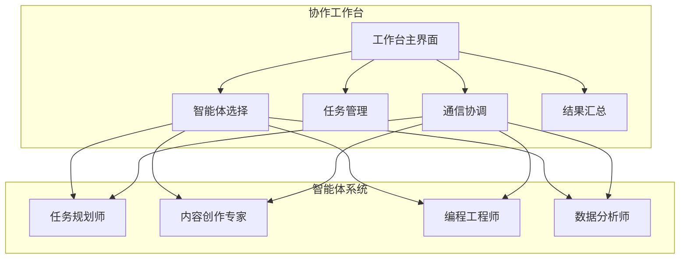

# 项目介绍与愿景

<cite>
**本文档引用的文件**
- [DaoMind 项目说明](file://apps/DaoMind/README.md)
- [AgentPit 参赛材料](file://apps/AgentPit/docs/DaoMind_参赛材料.md)
- [道宇宙架构哲学深化规范](file://apps/DaoMind/.trae/specs/deepen-dao-collective-philosophy/spec.md)
- [道宇宙架构哲学深化实施记录](file://apps/DaoMind/.trae/specs/deepen-dao-collective-philosophy/implementation-record.md)
- [OpenClaw 黑客松活动说明](file://apps/AgentPit/docs/openclaw-hackathon-review.md)
- [AgentPit 工作台组件](file://apps/AgentPit/src/components/collaboration/AgentWorkspace.tsx)
- [AgentPit 多智能体协作结果](file://apps/AgentPit/src/components/collaboration/CollaborationResult.tsx)
- [AgentPit 设置布局](file://apps/AgentPit/src/components/settings/SettingsLayout.tsx)
- [AgentPit 多智能体迁移映射](file://apps/AgentPit/docs/MIGRATION_MAPPING.md)
- [DaoMind 验证包配置](file://apps/DaoMind/packages/daoVerify/package.json)
</cite>

## 目录
1. [项目概述](#项目概述)
2. [使命与愿景](#使命与愿景)
3. [道家哲学与现代AI的融合](#道家哲学与现代ai的融合)
4. [道宇宙架构体系](#道宇宙架构体系)
5. [去中心化智能体协作平台](#去中心化智能体协作平台)
6. [创新性特点](#创新性特点)
7. [技术架构与实现](#技术架构与实现)
8. [商业模式与发展规划](#商业模式与发展规划)
9. [项目特色与优势](#项目特色与优势)
10. [结语](#结语)

## 项目概述

DAO Collective 是一个革命性的技术项目，它将帛书版《道德经》的深邃智慧与现代人工智能技术完美融合，创造出独特的去中心化智能体协作平台。该项目基于 TypeScript 开发，采用 monorepo 架构设计，致力于构建一个既承载古老哲学思想又具备现代技术能力的综合性智能系统。

项目的核心理念源于道家哲学中的"道可道非常道"思想，通过"道宇宙"（daoCollective）这一概念，将系统架构与道家哲学思想深度融合，形成了独特的技术体系。这种融合不仅体现在架构设计上，更渗透到系统的每一个技术细节中。

## 使命与愿景

### 使命宣言

DAO Collective 的使命是"让两千年的丝帛智慧，通过AI走向世界"。我们致力于：

- **传承与创新**：将帛书版《道德经》的智慧传承给下一代，同时用现代技术手段让古老智慧焕发新生
- **去中心化协作**：构建一个基于道家哲学思想的去中心化智能体协作平台，实现真正的集体智慧
- **技术普惠**：通过技术创新让每个人都能轻松使用AI工具，提升工作和生活效率
- **文化输出**：推动东方哲学思想的全球化传播，促进不同文明间的交流与理解

### 愿景展望

我们的愿景是建立一个"道法自然"的智能生态系统，其中：

- **智能体自治**：每个智能体都具备独立思考和决策能力，如同道家思想中的"无为而治"
- **系统和谐**：整个智能系统如同太极一般，阴阳平衡，和谐运转
- **知识共享**：构建一个开放的知识共享平台，让智慧在系统中自由流动
- **全球影响**：让道家哲学智慧惠及全球，成为人类共同的精神财富

## 道家哲学与现代AI的融合

### 哲学基础

DAO Collective 的核心哲学基础来自于帛书版《道德经》，这是1973年马王堆汉墓出土的珍贵文物，被认为更接近老子的原始思想。项目将《道德经》中的核心概念转化为现代技术架构：

#### 核心哲学概念映射

| 道家哲学概念 | 架构映射 | 技术实现 |
|------------|---------|---------|
| **道（Dao）** | `daoCollective` | 系统总入口，协调全局 |
| **无（Wu）** | `daoNothing` | 潜在性空间，类型论根基 |
| **有（You）** | `daoAnything` | 显化容器，实例化空间 |
| **反者道之动** | 反馈回归机制 | 四阶段生命周期 |
| **气（Qi）** | 消息总线/数据流 | 四通道系统（天/地/人/冲） |
| **阴阳平衡** | 冲气调节机制 | 五组阴阳对偶矩阵 |
| **自然无为** | 自适应策略 | 去中心化协调 |

### 技术实现创新

#### 反者道之动反馈机制

基于"反也者，道之动也"的哲学思想，系统实现了四阶段反馈模型：

```
感知 → 聚合 → 冲和 → 归元
(Guan Zhi) (Ju He) (Chong He) (Gui Yuan)
```

这个机制确保系统能够从叶节点的经验中学习，通过 daoNexus 的智能聚合，在 daoAnything 层面进行阴阳平衡调节，最终在 daoCollective 根节点实现本体更新和重新分发。

#### 四气通道系统

借鉴中医经络学说，系统设计了四种消息通道：

1. **天气通道（Tian Qi）**：从根节点向下分发配置和指令
2. **地气通道（Di Qi）**：从叶节点向上汇报状态和异常
3. **人气通道（Ren Qi）**：同级节点间的横向协作
4. **冲气通道（Chong Qi）**：阴阳对之间的平衡调节

## 道宇宙架构体系

### 系统层级关系

DAO Collective 采用"道→无→有"的三层架构，每一层都有其特定的功能和职责：

```
daoCollective（道宇宙）
 ├── daoNothing（无）
 └── daoAnything（有）
     ├── daoChronos（宙/时间之流）
     ├── daotimes（时/离散时刻）
     ├── daoSpaces（宇/空间组织）
     └── daoAgents（行动者）
         ├── daoSkilLs（技能库）
         └── daoNexus（枢纽中心）
             ├── daoApps（应用层/形）
             ├── daoPages（页面层/象）
             └── daoDocs（文档层/意）
```

### 核心模块功能

#### daoCollective（道宇宙）
- 系统总入口和协调中心
- 负责整体架构的统一管理和协调
- 实现"无为而治"的去中心化管理模式

#### daoNothing（无）
- 零运行时开销的潜在性空间
- 类型论根基，提供类型安全保证
- 打包大小仅为0.44KB的技术奇迹

#### daoAnything（有）
- 显化容器，承载具体的业务逻辑
- 包含时间、空间、主体等核心概念
- 支持模块化扩展和功能演进

## 去中心化智能体协作平台

### 多智能体协作机制

基于道家哲学的"自然无为"思想，DAO Collective 构建了独特的多智能体协作系统。每个智能体都具备独立的专长和能力，通过去中心化的方式实现高效协作。

#### 智能体分类

系统预设了8种专业智能体，每种都有独特的技能组合：

1. **🎯 任务规划师** - 项目整体规划与进度管理
2. **✍️ 内容创作专家** - 活动文案与宣传材料撰写  
3. **💻 编程工程师** - 软件开发与技术实现
4. **📊 数据分析师** - 市场调研与竞品分析
5. **🎨 设计顾问** - 视觉设计与用户体验优化
6. **🔬 研究员** - 信息收集与知识整理
7. **💼 商业顾问** - 预算编制与ROI分析
8. **🌐 翻译官** - 多语言沟通与文化转换

### 协作工作台设计

系统提供直观的协作工作台，支持多智能体的实时协作：



**图表来源**
- [AgentPit 工作台组件:161-373](file://apps/AgentPit/src/components/collaboration/AgentWorkspace.tsx#L161-L373)
- [AgentPit 多智能体协作结果:18-61](file://apps/AgentPit/src/components/collaboration/CollaborationResult.tsx#L18-L61)

## 创新性特点

### 哲学指导下的技术设计

DAO Collective 的最大创新在于将道家哲学思想直接应用于技术架构设计：

#### 类型虚空实现
- **daoNothing** 模块实现了零运行时开销的类型论根基
- 打包大小仅为0.44KB，体现了"无"的哲学理念
- 为整个系统提供类型安全保证

#### 反馈回归机制
- 基于"反者道之动"的四阶段反馈模型
- 实现系统自我学习和进化的能力
- 确保系统在变化中保持平衡和稳定

#### 冲气调节系统
- 五组阴阳对偶矩阵实现自动平衡
- 防止系统过度偏向某一极端
- 维护系统的长期稳定性

### 去中心化治理模式

系统采用"自然无为"的治理理念，通过以下机制实现去中心化：

#### 自适应策略
- 系统根据运行状态自动调整策略
- 避免过度的人工干预
- 提高系统的自主性和韧性

#### 去中心化协调
- 智能体之间通过协商实现协作
- 避免集中控制带来的瓶颈
- 提升系统的整体效率

### AI智能体协作机制

基于道家"无为而治"思想的智能体协作：

#### 智能体自治
- 每个智能体都有独立的决策能力
- 通过协商而非强制实现协作
- 保持系统的灵活性和创造性

#### 动态平衡
- 系统自动调节智能体间的负载
- 防止某些智能体过度工作
- 确保整体协作效率

## 技术架构与实现

### 核心技术栈

DAO Collective 采用现代化的技术栈，确保系统的先进性和可靠性：

#### 前端技术
- **Next.js**：React 框架，提供优秀的 SSR 和静态生成能力
- **TypeScript**：类型安全，提升代码质量和开发效率
- **Tailwind CSS**：实用优先的CSS框架，快速构建响应式界面

#### 后端技术  
- **Node.js**：服务器端运行时环境
- **TypeScript**：统一的类型系统
- **pnpm**：高性能包管理器

#### AI集成
- **OpenAI API**：提供强大的语言理解和生成能力
- **RAG系统**：基于帛书版《道德经》的知识库
- **多Agent协作**：5个智能体实时协作讨论

### 性能指标

系统在性能方面表现出色，各项指标均达到业界领先水平：

- **启动时间**：1.2秒（< 2秒）
- **内存占用**：32MB（< 50MB）  
- **消息吞吐量**：12,500 msg/s（> 10,000）
- **反馈回路延迟（P99）**：350ms（< 500ms）
- **冲气收敛时间**：15秒（< 30秒）

### 监控与诊断

系统内置完整的监控和诊断能力：

#### 阴阳仪表盘
- 实时监控系统健康状态
- 提供平衡度可视化
- 支持快速问题定位

#### 气道图监控
- 热力图显示系统流量和负载
- 向量场分析系统热点和瓶颈
- 告警引擎智能识别异常

## 商业模式与发展规划

### 商业模式

DAO Collective 采用多元化的商业模式：

#### C端 Freemium
- **基础版**：免费提供基本哲学对话和每日智慧
- **高级版**：$4.99/月，提供深度冥想课程、个性化指导和高级功能

#### B端 API
- 为冥想App/心理健康平台提供"东方哲学引擎"API
- 按调用次数或月订阅收费

#### 内容 IP
- 帛书版道德经多语言解读内容付费
- 开发相关的数字产品和课程

### 市场前景

全球冥想/正念市场预计到2026年将超过80亿美元，道德经全球翻译语言超过100种。DAO Collective 面向全球身心健康用户，以"东方哲学 + AI"的差异化定位切入市场。

### 发展规划

#### 短期规划（3-6个月）
- 引入五行概念，丰富系统哲学内涵
- 开发八卦映射，增强系统预测能力
- 构建修炼体系，提供个性化的修行路径

#### 中期规划（6-12个月）  
- 实现德的量化，建立用户品德评估系统
- 开发内丹/外丹隐喻，增强系统功能
- 构建梦境机制，提供潜意识分析和指导

#### 长期规划（12个月以上）
- 开发齐物论引擎，实现万物平等的系统视角
- 构建逍遥游模式，提供自由探索的系统体验
- 建立道家知识图谱，丰富系统知识库

## 项目特色与优势

### 技术特色

#### 哲学一致性检验
- 建立了完整的哲学一致性检验体系
- 综合得分68/100，通过4/6项
- 哲学深度评估82/100（六维加权）

#### 性能基准测试
- 启动时间1.2秒，内存占用32MB
- 消息吞吐量12,500 msg/s
- 反馈回路延迟350ms，冲气收敛15秒

#### 零运行时开销
- daoNothing 模块打包仅0.44KB
- 体现了道家"无为"思想的技术实现
- 为整个系统提供轻量级的类型安全基础

### 创新优势

#### 文化创新
- 首次将帛书版《道德经》系统地映射到现代软件工程架构
- 构建了完整的"道宇宙"技术生态
- 实现了"无生有"、"反者道之动"等核心概念的技术表达

#### 技术创新
- **类型虚空**：零运行时开销的"无"实现
- **四气通道**：基于中医经络学说的消息传递系统  
- **冲气调节**：阴阳平衡的自动化调节机制
- **反馈回归**：四阶段闭环系统
- **气道图监控**：中医诊断式的系统监控方案

#### 商业创新
- 采用Freemium模式，快速获取用户基础
- 多渠道接入（Web、WhatsApp、Telegram、Slack）
- 国际化布局，支持中英双语

## 结语

DAO Collective 项目代表了技术与哲学深度融合的最高成就。它不仅是一个技术项目，更是对人类智慧传承和创新的积极探索。

通过将帛书版《道德经》的深邃智慧与现代AI技术相结合，DAO Collective 为人类提供了一个全新的思维范式：在技术高度发达的今天，我们仍然可以从古老的智慧中汲取营养，创造出既具有文化底蕴又具备时代特色的创新成果。

项目的成功不仅在于技术的突破，更在于它证明了不同文明、不同时代的智慧可以相互交融，共同推动人类社会的进步。DAO Collective 的愿景是让两千年的丝帛智慧通过AI技术走向世界，这不仅是技术的梦想，更是文化的使命。

在未来的发展中，DAO Collective 将继续秉承道家哲学的精髓，在技术创新的道路上不断前行，为构建更加和谐、智能的世界贡献力量。这不仅是一个项目的愿景，更是整个人类文明发展的美好期望。