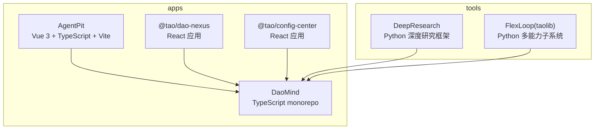
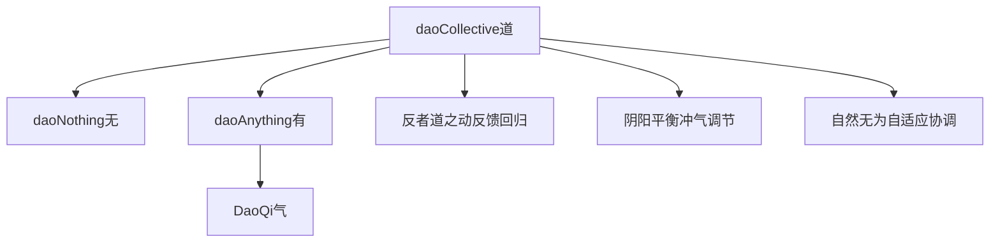
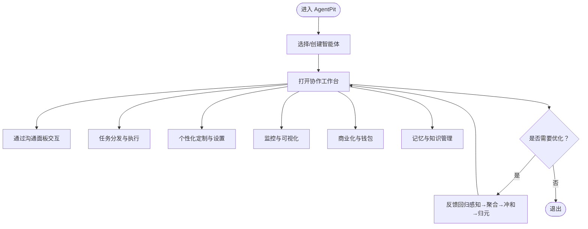
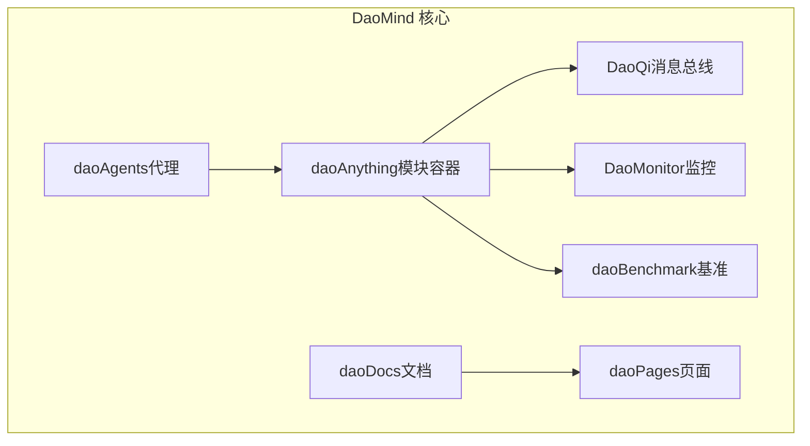
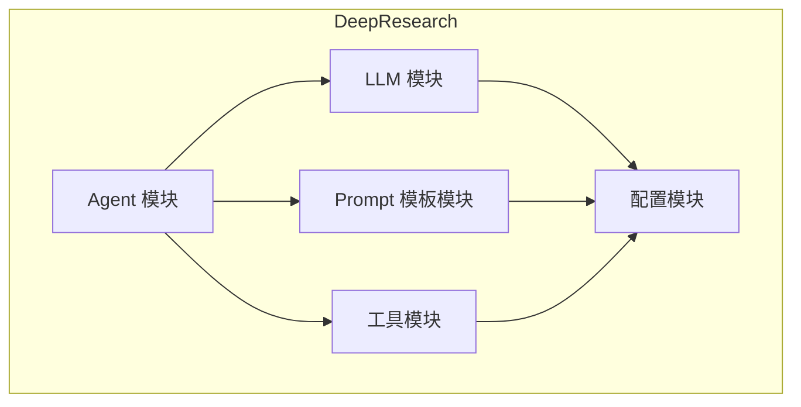
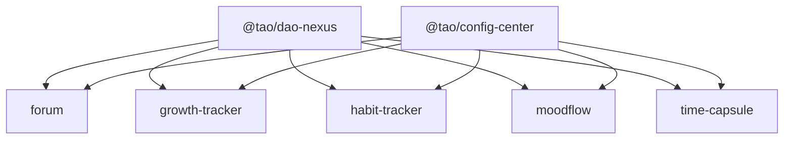
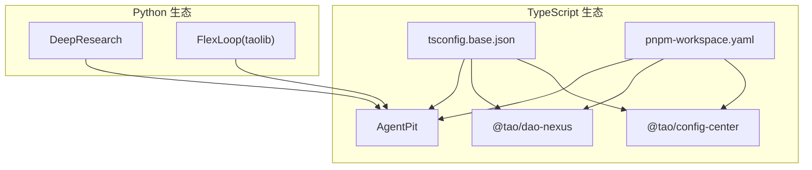

# 项目概述

<cite>
**本文引用的文件**
- [apps/AgentPit/README.md](file://apps/AgentPit/README.md)
- [apps/AgentPit/package.json](file://apps/AgentPit/package.json)
- [apps/DaoMind/README.md](file://apps/DaoMind/README.md)
- [apps/DaoMind/pnpm-workspace.yaml](file://apps/DaoMind/pnpm-workspace.yaml)
- [apps/DaoMind/tsconfig.base.json](file://apps/DaoMind/tsconfig.base.json)
- [tools/DeepResearch/README.md](file://tools/DeepResearch/README.md)
- [tools/DeepResearch/pyproject.toml](file://tools/DeepResearch/pyproject.toml)
- [tools/DeepResearch/doc/architecture/architecture.md](file://tools/DeepResearch/doc/architecture/architecture.md)
- [tools/flexloop/README.md](file://tools/flexloop/README.md)
- [tools/flexloop/pyproject.toml](file://tools/flexloop/pyproject.toml)
- [apps/daoNexus/package.json](file://apps/daoNexus/package.json)
- [apps/config-center/package.json](file://apps/config-center/package.json)
- [apps/DaoMind/.trae/specs/deepen-dao-collective-philosophy/spec.md](file://apps/DaoMind/.trae/specs/deepen-dao-collective-philosophy/spec.md)
- [apps/DaoMind/.trae/specs/deepen-dao-collective-philosophy/implementation-record.md](file://apps/DaoMind/.trae/specs/deepen-dao-collective-philosophy/implementation-record.md)
</cite>

## 目录
1. [引言](#引言)
2. [项目结构](#项目结构)
3. [核心组件](#核心组件)
4. [架构总览](#架构总览)
5. [详细组件分析](#详细组件分析)
6. [依赖分析](#依赖分析)
7. [性能考虑](#性能考虑)
8. [故障排查指南](#故障排查指南)
9. [结论](#结论)
10. [附录](#附录)

## 引言
DAO Collective 项目以帛书版《道德经》为哲学根基，融合道家“无为”“反者道之动”“冲气以为和”等思想，构建一套面向未来的系统架构与应用生态。项目通过 monorepo 组织四大核心模块：智能体协作平台（AgentPit）、DAO 应用开发框架（DaoMind）、AI 工具平台（DeepResearch/FlexLoop），以及业务应用集合。目标是用“关系优先于实体、过程优先于结果、和谐优先于效率”的设计哲学，指导现代 AI 与 DAO 技术的实践，既适合初学者建立概念认知，也为资深开发者提供可落地的架构蓝图与实现路径。

## 项目结构
项目采用 monorepo 架构，以 pnpm workspace 管理多包协同开发，核心模块分布于 apps 与 tools 两大区域：
- apps：前端与全栈应用集合，包含 AgentPit、DaoMind 生态内的若干子应用与共享包（如 daoNexus、config-center）。
- tools：Python 生态的 AI 工具链，包含 DeepResearch（深度研究框架）与 FlexLoop（taolib 多能力子系统）。

图表来源
- [apps/AgentPit/package.json:1-73](file://apps/AgentPit/package.json#L1-L73)
- [apps/DaoMind/pnpm-workspace.yaml:1-3](file://apps/DaoMind/pnpm-workspace.yaml#L1-L3)
- [apps/daoNexus/package.json:1-34](file://apps/daoNexus/package.json#L1-L34)
- [apps/config-center/package.json:1-41](file://apps/config-center/package.json#L1-L41)
- [tools/DeepResearch/pyproject.toml:1-93](file://tools/DeepResearch/pyproject.toml#L1-L93)
- [tools/flexloop/pyproject.toml:1-318](file://tools/flexloop/pyproject.toml#L1-L318)

章节来源
- [apps/AgentPit/README.md:1-6](file://apps/AgentPit/README.md#L1-L6)
- [apps/AgentPit/package.json:1-73](file://apps/AgentPit/package.json#L1-L73)
- [apps/DaoMind/README.md:1-552](file://apps/DaoMind/README.md#L1-L552)
- [apps/DaoMind/pnpm-workspace.yaml:1-3](file://apps/DaoMind/pnpm-workspace.yaml#L1-L3)
- [apps/DaoMind/tsconfig.base.json:1-1](file://apps/DaoMind/tsconfig.base.json#L1-L1)
- [apps/daoNexus/package.json:1-34](file://apps/daoNexus/package.json#L1-L34)
- [apps/config-center/package.json:1-41](file://apps/config-center/package.json#L1-L41)
- [tools/DeepResearch/README.md:1-69](file://tools/DeepResearch/README.md#L1-L69)
- [tools/DeepResearch/pyproject.toml:1-93](file://tools/DeepResearch/pyproject.toml#L1-L93)
- [tools/flexloop/README.md:1-100](file://tools/flexloop/README.md#L1-L100)
- [tools/flexloop/pyproject.toml:1-318](file://tools/flexloop/pyproject.toml#L1-L318)

## 核心组件
- 智能体协作平台（AgentPit）
  - 基于 Vue 3 + TypeScript + Vite 的前端应用，提供智能体工作台、协作面板、社交连接、记忆与知识管理、商业化与钱包等功能模块，支撑多智能体协同与可视化运营。
- DAO 应用开发框架（DaoMind）
  - 以道家哲学为内核的 TypeScript monorepo，包含代理管理、模块管理、消息总线（DaoQi）、监控系统（DaoMonitor）、基准测试、文档与页面管理等，提供“无（daoNothing）—有（daoAnything）—气（Qi）—反者道之动”的架构闭环。
- AI 工具平台（DeepResearch / FlexLoop）
  - DeepResearch：多 LLM 协作的深度研究框架，采用“任务规划 → 工具调用 → 评估与迭代”的工作流，集成搜索与可视化报告生成。
  - FlexLoop（taolib）：Python 多能力子系统，覆盖认证、配置中心、数据同步、邮件服务、文件存储、任务队列、OAuth、限流、分析、二维码、审计、多智能体等模块，形成可插拔的服务能力池。
- 业务应用集合
  - 包括 daoNexus（枢纽门户）、config-center（配置中心）、以及多个业务侧应用（如论坛、成长追踪、时间胶囊等），均以 React/Vite 或 Vue 技术栈构建，共享 @tao/* 共享包与 UI 组件。

章节来源
- [apps/AgentPit/README.md:1-6](file://apps/AgentPit/README.md#L1-L6)
- [apps/AgentPit/package.json:1-73](file://apps/AgentPit/package.json#L1-L73)
- [apps/DaoMind/README.md:1-552](file://apps/DaoMind/README.md#L1-L552)
- [tools/DeepResearch/README.md:1-69](file://tools/DeepResearch/README.md#L1-L69)
- [tools/DeepResearch/doc/architecture/architecture.md:1-163](file://tools/DeepResearch/doc/architecture/architecture.md#L1-L163)
- [tools/flexloop/README.md:1-100](file://tools/flexloop/README.md#L1-L100)

## 架构总览
项目以“道宇宙（daoCollective）”为核心，将帛书《道德经》的哲学概念映射为技术架构：
- 道（Dao）：系统总入口与运行法则（daoCollective）
- 无（Wu）：潜在性空间与类型论根基（daoNothing）
- 有（You）：显化容器与实例化空间（daoAnything）
- 气（Qi）：消息总线与数据流（四通道：天、地、人、冲）
- 反者道之动：反馈回归四阶段（感知 → 聚合 → 冲和 → 归元）
- 阴阳平衡：冲气调节机制与五组阴阳对偶矩阵
- 自然无为：自适应策略与去中心化协调

图表来源
- [apps/DaoMind/.trae/specs/deepen-dao-collective-philosophy/spec.md:29-1054](file://apps/DaoMind/.trae/specs/deepen-dao-collective-philosophy/spec.md#L29-L1054)
- [apps/DaoMind/.trae/specs/deepen-dao-collective-philosophy/implementation-record.md:10-389](file://apps/DaoMind/.trae/specs/deepen-dao-collective-philosophy/implementation-record.md#L10-L389)

章节来源
- [apps/DaoMind/.trae/specs/deepen-dao-collective-philosophy/spec.md:1-1054](file://apps/DaoMind/.trae/specs/deepen-dao-collective-philosophy/spec.md#L1-L1054)
- [apps/DaoMind/.trae/specs/deepen-dao-collective-philosophy/implementation-record.md:1-389](file://apps/DaoMind/.trae/specs/deepen-dao-collective-philosophy/implementation-record.md#L1-L389)

## 详细组件分析

### 智能体协作平台（AgentPit）
- 技术栈：Vue 3 + TypeScript + Vite，使用 Pinia 状态管理、Vue Router 路由、TailwindCSS 样式、ECharts 可视化、VeeValidate 表单校验等。
- 功能域：协作工作台、智能体选择与配置、沟通面板、任务分发、个性化定制、记忆与知识图谱、商业化与钱包、生活服务（日程、旅行、游戏）等。
- 设计理念：以“无为”为指导，降低使用门槛，让智能体在“自然无为”的状态下高效协作；通过“反者道之动”的反馈机制持续优化协作效果。

图表来源
- [apps/AgentPit/package.json:1-73](file://apps/AgentPit/package.json#L1-L73)

章节来源
- [apps/AgentPit/README.md:1-6](file://apps/AgentPit/README.md#L1-L6)
- [apps/AgentPit/package.json:1-73](file://apps/AgentPit/package.json#L1-L73)

### DAO 应用开发框架（DaoMind）
- monorepo：使用 pnpm workspace 管理子包，TypeScript 基础配置集中于 tsconfig.base.json，包命名空间以 @daomind 与 @modulux 为主。
- 核心能力：
  - 代理管理（daoAgents）：创建、初始化、激活、执行与终止代理。
  - 模块管理（daoAnything）：注册、初始化、激活模块，支持多形态存在类型。
  - 消息总线（DaoQi）：四通道（天、地、人、冲）消息通道与混元气总线。
  - 监控系统（DaoMonitor）：阴阳仪表盘、热力图、向量场、告警引擎、诊断引擎与快照聚合。
  - 基准测试（daoBenchmark）：性能基线与回归测试。
  - 文档与页面（daoDocs、daoPages）：文档与页面层的统一管理。
- 哲学闭环：通过“反者道之动”驱动系统自适应优化，以“阴阳平衡”维持系统稳定，以“自然无为”实现去中心化协调。

图表来源
- [apps/DaoMind/README.md:323-350](file://apps/DaoMind/README.md#L323-L350)
- [apps/DaoMind/tsconfig.base.json:1-1](file://apps/DaoMind/tsconfig.base.json#L1-L1)

章节来源
- [apps/DaoMind/README.md:1-552](file://apps/DaoMind/README.md#L1-L552)
- [apps/DaoMind/pnpm-workspace.yaml:1-3](file://apps/DaoMind/pnpm-workspace.yaml#L1-L3)
- [apps/DaoMind/tsconfig.base.json:1-1](file://apps/DaoMind/tsconfig.base.json#L1-L1)

### AI 工具平台（DeepResearch / FlexLoop）
- DeepResearch（Python）
  - 模块化架构：LLM 模块、Prompt 模板模块、Agent 模块、工具模块、配置模块。
  - 工作流：任务规划 → 工具调用 → 评估与迭代 → 结果生成。
  - 性能优化：LLM 实例缓存、响应缓存、Prompt 模板懒加载、并行处理。
- FlexLoop（taolib，Python）
  - 服务化能力：认证、配置中心、数据同步、邮件服务、文件存储、任务队列、OAuth、限流、分析、二维码、审计、多智能体等。
  - 可插拔扩展：通过 optional-dependencies 与子集特性组合，按需启用能力。

图表来源
- [tools/DeepResearch/doc/architecture/architecture.md:19-27](file://tools/DeepResearch/doc/architecture/architecture.md#L19-L27)

章节来源
- [tools/DeepResearch/README.md:1-69](file://tools/DeepResearch/README.md#L1-L69)
- [tools/DeepResearch/pyproject.toml:1-93](file://tools/DeepResearch/pyproject.toml#L1-L93)
- [tools/DeepResearch/doc/architecture/architecture.md:1-163](file://tools/DeepResearch/doc/architecture/architecture.md#L1-L163)
- [tools/flexloop/README.md:1-100](file://tools/flexloop/README.md#L1-L100)
- [tools/flexloop/pyproject.toml:1-318](file://tools/flexloop/pyproject.toml#L1-L318)

### 业务应用集合
- daoNexus：枢纽门户应用，承载应用目录与导航。
- config-center：配置中心应用，提供配置列表、详情、审计日志、角色与用户管理等。
- 其他业务应用：如论坛、成长追踪、习惯追踪、情绪日记、时间胶囊等，均采用 React/Vite 或 Vue 技术栈，共享 @tao/* 共享包与 UI 组件，统一状态与路由管理。

图表来源
- [apps/daoNexus/package.json:1-34](file://apps/daoNexus/package.json#L1-L34)
- [apps/config-center/package.json:1-41](file://apps/config-center/package.json#L1-L41)

章节来源
- [apps/daoNexus/package.json:1-34](file://apps/daoNexus/package.json#L1-L34)
- [apps/config-center/package.json:1-41](file://apps/config-center/package.json#L1-L41)

## 依赖分析
- 包管理与工作区
  - DaoMind 使用 pnpm workspace 管理子包，tsconfig.base.json 统一路径映射，确保跨包引用与类型检查的一致性。
- 前端生态
  - AgentPit 采用 Vue 3 + TypeScript + Vite，依赖 Pinia、Vue Router、TailwindCSS、ECharts 等，强调类型安全与开发体验。
  - 业务应用（daoNexus、config-center）采用 React + Vite，共享 @tao/* 共享包与 UI 组件，提升复用性与一致性。
- Python 生态
  - DeepResearch 依赖 httpx、langchain、langgraph、tavily-python、pydantic 等，支持多 LLM 协作与流式响应。
  - FlexLoop（taolib）通过 optional-dependencies 提供认证、配置中心、数据同步、任务队列、OAuth、限流、分析、二维码、审计、多智能体等能力，按需启用。

图表来源
- [apps/DaoMind/pnpm-workspace.yaml:1-3](file://apps/DaoMind/pnpm-workspace.yaml#L1-L3)
- [apps/DaoMind/tsconfig.base.json:1-1](file://apps/DaoMind/tsconfig.base.json#L1-L1)
- [apps/AgentPit/package.json:1-73](file://apps/AgentPit/package.json#L1-L73)
- [apps/daoNexus/package.json:1-34](file://apps/daoNexus/package.json#L1-L34)
- [apps/config-center/package.json:1-41](file://apps/config-center/package.json#L1-L41)
- [tools/DeepResearch/pyproject.toml:1-93](file://tools/DeepResearch/pyproject.toml#L1-L93)
- [tools/flexloop/pyproject.toml:1-318](file://tools/flexloop/pyproject.toml#L1-L318)

章节来源
- [apps/DaoMind/pnpm-workspace.yaml:1-3](file://apps/DaoMind/pnpm-workspace.yaml#L1-L3)
- [apps/DaoMind/tsconfig.base.json:1-1](file://apps/DaoMind/tsconfig.base.json#L1-L1)
- [apps/AgentPit/package.json:1-73](file://apps/AgentPit/package.json#L1-L73)
- [apps/daoNexus/package.json:1-34](file://apps/daoNexus/package.json#L1-L34)
- [apps/config-center/package.json:1-41](file://apps/config-center/package.json#L1-L41)
- [tools/DeepResearch/pyproject.toml:1-93](file://tools/DeepResearch/pyproject.toml#L1-L93)
- [tools/flexloop/pyproject.toml:1-318](file://tools/flexloop/pyproject.toml#L1-L318)

## 性能考虑
- DaoMind
  - 内置基准测试套件，确保启动时间、内存占用、消息吞吐量、反馈回路延迟与冲气收敛时间等指标达标。
  - 通过 DaoMonitor 的热力图、向量场、告警与诊断引擎，持续监控系统健康状态，及时发现性能瓶颈。
- DeepResearch
  - LLM 实例缓存与响应缓存减少重复调用；Prompt 模板懒加载提升启动速度；并行处理提升吞吐。
- FlexLoop（taolib）
  - 按需启用 optional-dependencies，避免不必要的依赖加载；通过 FastAPI + Redis/Motor 等异步组件提升并发能力。

章节来源
- [apps/DaoMind/README.md:528-534](file://apps/DaoMind/README.md#L528-L534)
- [tools/DeepResearch/doc/architecture/architecture.md:122-139](file://tools/DeepResearch/doc/architecture/architecture.md#L122-L139)
- [tools/flexloop/pyproject.toml:116-142](file://tools/flexloop/pyproject.toml#L116-L142)

## 故障排查指南
- 安装与环境
  - pnpm 版本不足：升级至 6.0+，清理缓存后重试。
  - Node.js/TypeScript 版本不符：确保 Node ≥ 18，TypeScript ≥ 6.0。
  - Python 环境：DeepResearch/FlexLoop 要求 Python ≥ 3.14。
- 构建与测试
  - 构建失败：先执行类型检查，修复 TS 错误后再构建。
  - 测试失败：检查测试环境与依赖，查看详细错误日志。
  - 子包导入失败：先执行根级构建，确认 tsconfig 路径映射正确。
- 性能问题
  - 使用 DaoMonitor 的监控工具定位瓶颈；运行基准测试评估性能。
  - DeepResearch：检查 LLM 缓存与 Prompt 懒加载配置；评估工具调用频率。
  - FlexLoop：检查 Redis/Mongo 连接与 FastAPI 配置，关注限流与队列积压。

章节来源
- [apps/DaoMind/README.md:398-444](file://apps/DaoMind/README.md#L398-L444)
- [tools/DeepResearch/README.md:1-69](file://tools/DeepResearch/README.md#L1-L69)
- [tools/flexloop/README.md:1-100](file://tools/flexloop/README.md#L1-L100)

## 结论
DAO Collective 以帛书《道德经》为思想基石，构建了“道—无—有—气—反者道之动—阴阳平衡—自然无为”的技术架构闭环。通过 AgentPit 的智能体协作、DaoMind 的模块化框架、DeepResearch 的多模型协同研究、FlexLoop 的多能力服务化，以及业务应用集合的统一治理，项目实现了哲学深度与工程落地的双重价值。对于初学者，项目提供了清晰的概念地图与入门路径；对于开发者，项目提供了可扩展、可验证、可演进的工程范式。

## 附录
- 哲学映射与架构层级
  - 道（daoCollective）：系统总入口
  - 无（daoNothing）：潜在性空间
  - 有（daoAnything）：显化容器
  - 气（DaoQi）：消息总线/数据流
  - 反者道之动：反馈回归四阶段
  - 阴阳平衡：冲气调节机制
  - 自然无为：自适应策略

章节来源
- [apps/DaoMind/.trae/specs/deepen-dao-collective-philosophy/spec.md:482-521](file://apps/DaoMind/.trae/specs/deepen-dao-collective-philosophy/spec.md#L482-L521)
- [apps/DaoMind/.trae/specs/deepen-dao-collective-philosophy/implementation-record.md:24-38](file://apps/DaoMind/.trae/specs/deepen-dao-collective-philosophy/implementation-record.md#L24-L38)