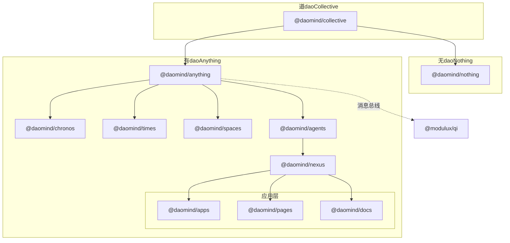
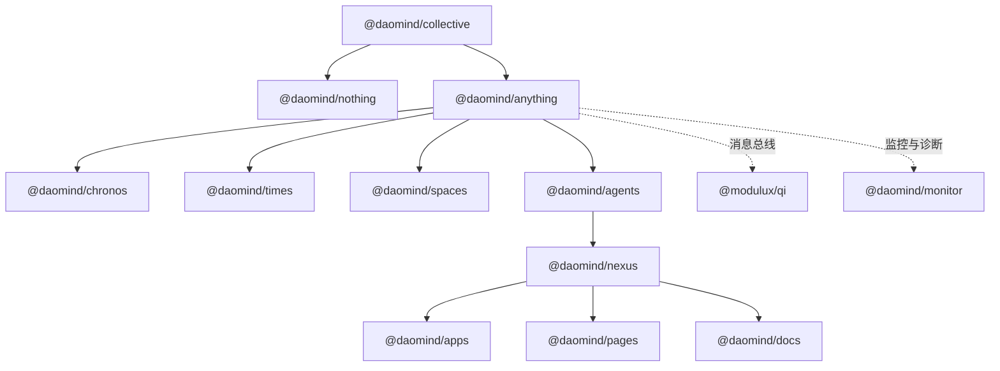
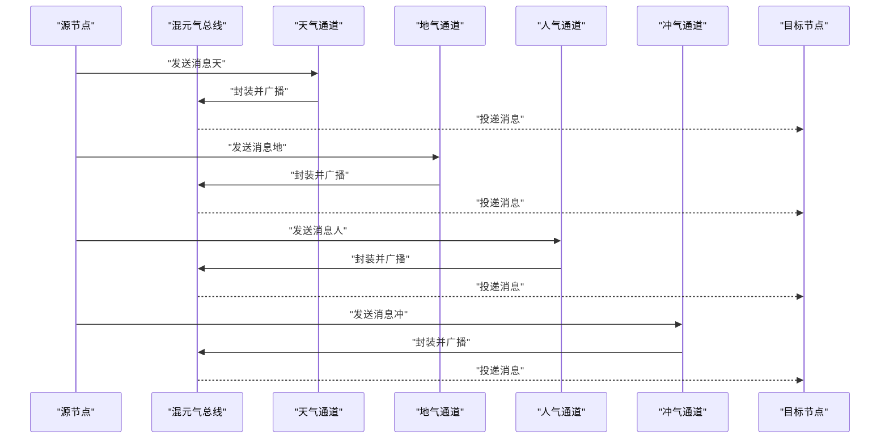
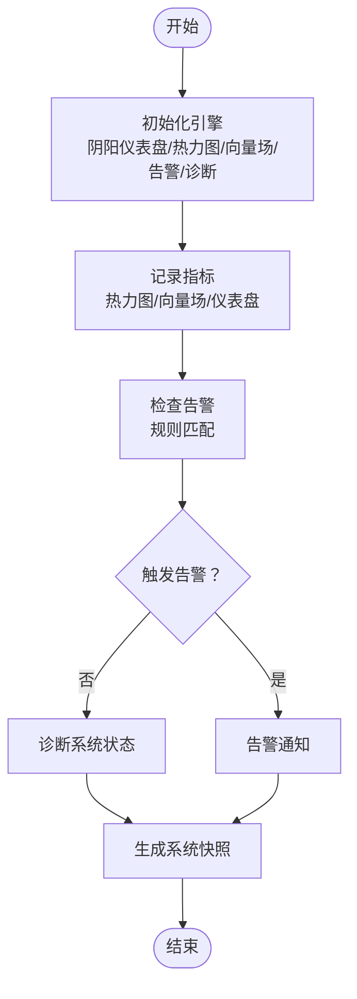
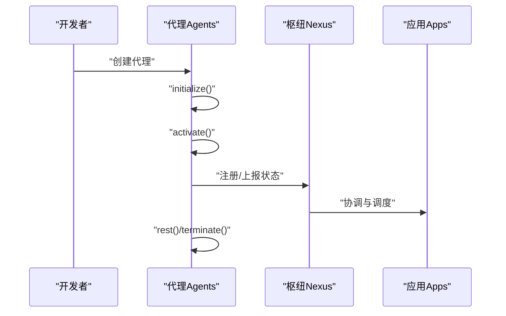
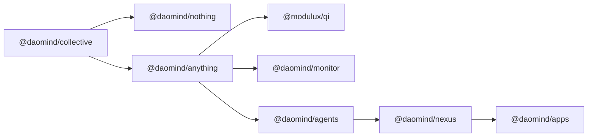

# 项目概述

<cite>
**本文引用的文件**
- [apps/DaoMind/README.md](file://apps/DaoMind/README.md)
- [apps/DaoMind/pnpm-workspace.yaml](file://apps/DaoMind/pnpm-workspace.yaml)
- [apps/DaoMind/packages/daoCollective/package.json](file://apps/DaoMind/packages/daoCollective/package.json)
- [apps/DaoMind/packages/daoNothing/package.json](file://apps/DaoMind/packages/daoNothing/package.json)
- [apps/DaoMind/packages/daoAnything/package.json](file://apps/DaoMind/packages/daoAnything/package.json)
- [apps/DaoMind/packages/daoAgents/package.json](file://apps/DaoMind/packages/daoAgents/package.json)
- [apps/DaoMind/packages/daoMonitor/package.json](file://apps/DaoMind/packages/daoMonitor/package.json)
- [apps/DaoMind/packages/daoQi/package.json](file://apps/DaoMind/packages/daoQi/package.json)
- [apps/DaoMind/packages/daoNexus/package.json](file://apps/DaoMind/packages/daoNexus/package.json)
- [apps/DaoMind/packages/daoApps/package.json](file://apps/DaoMind/packages/daoApps/package.json)
- [apps/AgentPit/README.md](file://apps/AgentPit/README.md)
- [tools/DeepResearch/README.md](file://tools/DeepResearch/README.md)
- [tools/flexloop/README.md](file://tools/flexloop/README.md)
</cite>

## 目录
1. [引言](#引言)
2. [项目结构](#项目结构)
3. [核心组件](#核心组件)
4. [架构总览](#架构总览)
5. [详细组件分析](#详细组件分析)
6. [依赖分析](#依赖分析)
7. [性能考虑](#性能考虑)
8. [故障排查指南](#故障排查指南)
9. [结论](#结论)
10. [附录](#附录)

## 引言
DAO Collective 是一个融合道家哲学思想与现代技术的系统框架，以“道”为核心入口，通过“无（潜在性空间）”与“有（显化容器）”的二元架构，构建模块化、可演化的智能系统。项目采用 monorepo 架构，围绕 DaoMind 生态组织多个子包与应用，既满足初学者的学习曲线，也为资深开发者提供深入的架构洞察与扩展空间。

- 核心价值主张
  - 哲学驱动的系统设计：以帛书版《道德经》为思想基石，强调“自然无为”“反者道之动”“阴阳平衡”，在技术实现中体现反馈闭环、自适应协调与动态平衡。
  - 类型安全与模块化：基于 TypeScript 的强类型体系，结合模块化子包，确保可维护性与可扩展性。
  - 消息总线与监控体系：提供四气通道（天/地/人/冲）的消息总线与多维度监控能力，支撑复杂系统的可观测性与稳定性。
  - 多语言与多工具链：同时覆盖前端（React/Vite/TypeScript）、后端（Python/模块化库）与研究工具链，形成跨域协同的生态。

- 设计理念
  - 道（daoCollective）：系统总入口，协调全局资源与生命周期。
  - 无（daoNothing）：潜在性空间，类型论根基，零运行时开销，奠定系统约束与抽象。
  - 有（daoAnything）：显化容器，实例化空间，承载具体模块与应用。
  - 气（Qi）：消息总线/数据流，四通道系统，实现高效、有序的数据流动。
  - 反者道之动：反馈回归四阶段生命周期（感知 → 聚合 → 冲和 → 归元），保证系统自修复与自演化。
  - 阴阳平衡：冲气调节机制，五组阴阳对偶矩阵，维持系统稳定与收敛。
  - 自然无为：自适应策略，去中心化协调，降低耦合并提升弹性。

- 应用场景
  - 智能体与代理管理：通过 daoAgents 与 daoNexus 协同，构建可编排、可演化的智能体系统。
  - 多应用与页面层：daoApps 与 daoPages 提供业务应用与页面层的实现范式。
  - 研究与分析：DeepResearch 工具链支持多模型协作、检索增强与可视化报告生成。
  - 监控与诊断：daoMonitor 提供热力图、向量场、仪表盘与告警引擎，保障系统健康。

- 未来方向
  - 短期：引入五行、八卦映射，完善修炼体系与阶段性目标。
  - 中期：量化“德”的概念，引入内丹/外丹隐喻与梦境机制，拓展意识层面的模拟。
  - 长期：构建齐物论引擎、逍遥游模式与道家知识图谱，实现更高层次的系统自组织与认知演进。

**章节来源**
- [apps/DaoMind/README.md:3–26:3-26](file://apps/DaoMind/README.md#L3-L26)
- [apps/DaoMind/README.md:482–540:482-540](file://apps/DaoMind/README.md#L482-L540)

## 项目结构
项目采用 monorepo 架构，根目录通过 pnpm workspace 管理多个子包与应用。核心子包围绕“道、无、有”三层抽象展开，并向下延伸至“时间、空间、行动者、枢纽、应用/页面/文档”等层级。

- 工作区与包组织
  - 工作区：packages/* 下的子包统一由 pnpm 管理，支持增量构建与依赖共享。
  - 包命名：以 @daomind 或 @modulux 前缀区分领域与归属，便于发布与消费。
  - 应用层：apps 目录包含多个前端应用（如 AgentPit、DaoMind、daoNexus、forum 等），采用 React/Vite/TypeScript 技术栈。

- 层级关系（概念示意）
  - 道（daoCollective）：系统总入口与协调者
  - 无（daoNothing）：潜在性空间，类型论根基
  - 有（daoAnything）：显化容器，承载模块与应用
  - 时间（daoChronos/daotimes）、空间（daoSpaces）、行动者（daoAgents）、枢纽（daoNexus）、应用/页面/文档（daoApps/daoPages/daoDocs）

**图表来源**
- [apps/DaoMind/README.md:496–511:496-511](file://apps/DaoMind/README.md#L496-L511)
- [apps/DaoMind/packages/daoCollective/package.json:1](file://apps/DaoMind/packages/daoCollective/package.json#L1)
- [apps/DaoMind/packages/daoNothing/package.json:1](file://apps/DaoMind/packages/daoNothing/package.json#L1)
- [apps/DaoMind/packages/daoAnything/package.json:1](file://apps/DaoMind/packages/daoAnything/package.json#L1)
- [apps/DaoMind/packages/daoAgents/package.json:1](file://apps/DaoMind/packages/daoAgents/package.json#L1)
- [apps/DaoMind/packages/daoNexus/package.json:1](file://apps/DaoMind/packages/daoNexus/package.json#L1)
- [apps/DaoMind/packages/daoApps/package.json:1](file://apps/DaoMind/packages/daoApps/package.json#L1)
- [apps/DaoMind/packages/daoQi/package.json:1](file://apps/DaoMind/packages/daoQi/package.json#L1)

**章节来源**
- [apps/DaoMind/pnpm-workspace.yaml:1–3:1-3](file://apps/DaoMind/pnpm-workspace.yaml#L1-L3)
- [apps/DaoMind/README.md:323–360:323-360](file://apps/DaoMind/README.md#L323-L360)

## 核心组件
- 道（daoCollective）
  - 角色：系统总入口，协调全局资源与生命周期。
  - 特性：作为根节点，承载整体架构的入口与契约。
  - 参考：系统总入口与整体架构入口的描述。

- 无（daoNothing）
  - 角色：潜在性空间，类型论根基，零运行时开销。
  - 特性：极小体积、零运行时成本，奠定系统约束与抽象。
  - 参考：潜在性空间与类型论根基的描述。

- 有（daoAnything）
  - 角色：显化容器，实例化空间，承载模块与应用。
  - 特性：向下扩展时间、空间、行动者、枢纽与应用层。
  - 参考：显化容器与层级关系的描述。

- 气（Qi）
  - 角色：消息总线/数据流，四通道系统（天/地/人/冲）。
  - 特性：统一消息协议、双模式序列化、三类路由；支持高效系统内部通信。
  - 参考：混元气总线、四气通道与消息传递系统的描述。

- 反者道之动
  - 角色：反馈回归四阶段生命周期（感知 → 聚合 → 冲和 → 归元）。
  - 特性：保证系统自修复与自演化，维持动态平衡。
  - 参考：反馈回归机制与四阶段生命周期的描述。

- 阴阳平衡
  - 角色：冲气调节机制，五组阴阳对偶矩阵。
  - 特性：维持系统稳定与收敛，实现信号生成与收敛验证。
  - 参考：冲气调节与阴阳平衡的描述。

- 自然无为
  - 角色：自适应策略，去中心化协调。
  - 特性：降低耦合并提升弹性，减少强制干预。
  - 参考：自然无为与去中心化协调的描述。

**章节来源**
- [apps/DaoMind/README.md:18–26:18-26](file://apps/DaoMind/README.md#L18-L26)
- [apps/DaoMind/README.md:513–521:513-521](file://apps/DaoMind/README.md#L513-L521)
- [apps/DaoMind/README.md:482–540:482-540](file://apps/DaoMind/README.md#L482-L540)

## 架构总览
下图展示了 DaoMind 生态的总体架构：以 daoCollective 为总入口，daoNothing 提供类型论根基，daoAnything 承载模块与应用，Qi 作为消息总线贯穿系统，daoMonitor 提供监控与诊断能力，daoAgents 与 daoNexus 协同实现行动者与枢纽功能，daoApps/daoPages/daoDocs 支撑应用层实现。

**图表来源**
- [apps/DaoMind/README.md:496–511:496-511](file://apps/DaoMind/README.md#L496-L511)
- [apps/DaoMind/packages/daoCollective/package.json:1](file://apps/DaoMind/packages/daoCollective/package.json#L1)
- [apps/DaoMind/packages/daoNothing/package.json:1](file://apps/DaoMind/packages/daoNothing/package.json#L1)
- [apps/DaoMind/packages/daoAnything/package.json:1](file://apps/DaoMind/packages/daoAnything/package.json#L1)
- [apps/DaoMind/packages/daoAgents/package.json:1](file://apps/DaoMind/packages/daoAgents/package.json#L1)
- [apps/DaoMind/packages/daoNexus/package.json:1](file://apps/DaoMind/packages/daoNexus/package.json#L1)
- [apps/DaoMind/packages/daoApps/package.json:1](file://apps/DaoMind/packages/daoApps/package.json#L1)
- [apps/DaoMind/packages/daoQi/package.json:1](file://apps/DaoMind/packages/daoQi/package.json#L1)
- [apps/DaoMind/packages/daoMonitor/package.json:1](file://apps/DaoMind/packages/daoMonitor/package.json#L1)

## 详细组件分析

### 组件：daoCollective（系统总入口）
- 职责：作为系统总入口，协调全局资源与生命周期，承载整体架构的入口与契约。
- 设计要点：与 daoNothing、daoAnything 形成“道—无—有”的哲学闭环；向下承接时间、空间、行动者、枢纽与应用层。
- 参考：系统总入口与整体架构入口的描述。

**章节来源**
- [apps/DaoMind/README.md:18–26:18-26](file://apps/DaoMind/README.md#L18-L26)
- [apps/DaoMind/README.md:496–511:496-511](file://apps/DaoMind/README.md#L496-L511)
- [apps/DaoMind/packages/daoCollective/package.json:1](file://apps/DaoMind/packages/daoCollective/package.json#L1)

### 组件：daoNothing（潜在性空间）
- 职责：类型论根基，零运行时开销，奠定系统约束与抽象。
- 设计要点：极小体积、零运行时成本，作为系统约束与抽象的基石。
- 参考：潜在性空间与类型论根基的描述。

**章节来源**
- [apps/DaoMind/README.md:18–26:18-26](file://apps/DaoMind/README.md#L18-L26)
- [apps/DaoMind/packages/daoNothing/package.json:1](file://apps/DaoMind/packages/daoNothing/package.json#L1)

### 组件：daoAnything（显化容器）
- 职责：显化容器，实例化空间，承载模块与应用。
- 设计要点：向下扩展时间（daoChronos/daotimes）、空间（daoSpaces）、行动者（daoAgents）、枢纽（daoNexus）与应用层（daoApps/daoPages/daoDocs）。
- 参考：显化容器与层级关系的描述。

**章节来源**
- [apps/DaoMind/README.md:18–26:18-26](file://apps/DaoMind/README.md#L18-L26)
- [apps/DaoMind/README.md:496–511:496-511](file://apps/DaoMind/README.md#L496-L511)
- [apps/DaoMind/packages/daoAnything/package.json:1](file://apps/DaoMind/packages/daoAnything/package.json#L1)

### 组件：daoQi（消息总线/数据流）
- 职责：四通道系统（天/地/人/冲），统一消息协议，支撑高效系统内部通信。
- 设计要点：混元气总线、双模式序列化、三类路由；支持天气（下行）、地气（上行）、人气（横向）、冲气（调和）四类通道。
- 参考：混元气总线、四气通道与消息传递系统的描述。

**图表来源**
- [apps/DaoMind/README.md:165–199:165-199](file://apps/DaoMind/README.md#L165-L199)
- [apps/DaoMind/packages/daoQi/package.json:1](file://apps/DaoMind/packages/daoQi/package.json#L1)

**章节来源**
- [apps/DaoMind/README.md:11–12:11-12](file://apps/DaoMind/README.md#L11-L12)
- [apps/DaoMind/README.md:165–199:165-199](file://apps/DaoMind/README.md#L165-L199)

### 组件：daoMonitor（监控与诊断）
- 职责：提供阴阳仪表盘、热力图、向量场、告警引擎与诊断引擎，支撑系统可观测性与稳定性。
- 设计要点：支持系统健康状态监测、热点识别、告警规则配置与诊断报告生成。
- 参考：气道图监控与监控系统的描述。

**图表来源**
- [apps/DaoMind/README.md:201–293:201-293](file://apps/DaoMind/README.md#L201-L293)
- [apps/DaoMind/packages/daoMonitor/package.json:1](file://apps/DaoMind/packages/daoMonitor/package.json#L1)

**章节来源**
- [apps/DaoMind/README.md:12–13:12-13](file://apps/DaoMind/README.md#L12-L13)
- [apps/DaoMind/README.md:201–293:201-293](file://apps/DaoMind/README.md#L201-L293)

### 组件：daoAgents 与 daoNexus（行动者与枢纽）
- 职责：daoAgents 管理代理的创建、初始化、激活与终止；daoNexus 作为连接与协调的核心，承载应用层与页面层。
- 设计要点：代理生命周期管理、模块注册与激活、应用与页面层的组织与渲染。
- 参考：代理管理与模块管理的描述。

**图表来源**
- [apps/DaoMind/README.md:109–163:109-163](file://apps/DaoMind/README.md#L109-L163)
- [apps/DaoMind/packages/daoAgents/package.json:1](file://apps/DaoMind/packages/daoAgents/package.json#L1)
- [apps/DaoMind/packages/daoNexus/package.json:1](file://apps/DaoMind/packages/daoNexus/package.json#L1)
- [apps/DaoMind/packages/daoApps/package.json:1](file://apps/DaoMind/packages/daoApps/package.json#L1)

**章节来源**
- [apps/DaoMind/README.md:13–14:13-14](file://apps/DaoMind/README.md#L13-L14)
- [apps/DaoMind/README.md:109–163:109-163](file://apps/DaoMind/README.md#L109-L163)

### 组件：应用层（daoApps/daoPages/daoDocs）
- 职责：支撑业务应用实现（daoApps）、页面层组织（daoPages）与文档层（daoDocs）。
- 设计要点：应用层负责业务逻辑与交互；页面层负责 UI 组织与导航；文档层负责知识沉淀与传播。
- 参考：应用层/页面层/文档层的描述。

**章节来源**
- [apps/DaoMind/README.md:508–510:508-510](file://apps/DaoMind/README.md#L508-L510)
- [apps/DaoMind/packages/daoApps/package.json:1](file://apps/DaoMind/packages/daoApps/package.json#L1)
- [apps/DaoMind/packages/daoPages/package.json:1](file://apps/DaoMind/packages/daoPages/package.json#L1)
- [apps/DaoMind/packages/daoDocs/package.json:1](file://apps/DaoMind/packages/daoDocs/package.json#L1)

### 组件：前端应用（AgentPit 等）
- 职责：提供 React/Vite/TypeScript 的前端应用模板与配置，支持 HMR、ESLint 与类型检查。
- 设计要点：最小化模板、官方插件集成、类型感知的 ESLint 配置。
- 参考：前端应用模板与配置说明。

**章节来源**
- [apps/AgentPit/README.md:1–74:1-74](file://apps/AgentPit/README.md#L1-L74)

### 组件：研究工具链（DeepResearch）
- 职责：多模型协作、检索增强与可视化报告生成，解决复杂信息分析问题。
- 设计要点：智能工作流“任务规划 → 工具调用 → 评估与迭代”，减少幻觉、轻量部署、灵活配置。
- 参考：研究框架与特性说明。

**章节来源**
- [tools/DeepResearch/README.md:1–69:1-69](file://tools/DeepResearch/README.md#L1-L69)

### 组件：模块化 Python 库（flexloop/taolib）
- 职责：提供模块化 Python 库与文档平台，支持数学、物理、化学、编程、英语、大模型等主题的知识记录与应用。
- 设计要点：以终为始的目标、可扩展的知识传播平台、在线文档与本地构建支持。
- 参考：模块化库与使用说明。

**章节来源**
- [tools/flexloop/README.md:1–100:1-100](file://tools/flexloop/README.md#L1-L100)

## 依赖分析
- 工作区与包管理
  - 工作区：packages/* 下的子包统一由 pnpm 管理，支持增量构建与依赖共享。
  - 包命名：以 @daomind 或 @modulux 前缀区分领域与归属，便于发布与消费。
  - 依赖关系：daoCollective 作为根节点，daoNothing 与 daoAnything 分别承担潜在性与显化容器职责；daoQi 作为消息总线贯穿系统；daoMonitor 提供监控与诊断能力；daoAgents 与 daoNexus 协同实现行动者与枢纽；daoApps/daoPages/daoDocs 支撑应用层实现。

**图表来源**
- [apps/DaoMind/pnpm-workspace.yaml:1–3:1-3](file://apps/DaoMind/pnpm-workspace.yaml#L1-L3)
- [apps/DaoMind/packages/daoCollective/package.json:1](file://apps/DaoMind/packages/daoCollective/package.json#L1)
- [apps/DaoMind/packages/daoNothing/package.json:1](file://apps/DaoMind/packages/daoNothing/package.json#L1)
- [apps/DaoMind/packages/daoAnything/package.json:1](file://apps/DaoMind/packages/daoAnything/package.json#L1)
- [apps/DaoMind/packages/daoQi/package.json:1](file://apps/DaoMind/packages/daoQi/package.json#L1)
- [apps/DaoMind/packages/daoMonitor/package.json:1](file://apps/DaoMind/packages/daoMonitor/package.json#L1)
- [apps/DaoMind/packages/daoAgents/package.json:1](file://apps/DaoMind/packages/daoAgents/package.json#L1)
- [apps/DaoMind/packages/daoNexus/package.json:1](file://apps/DaoMind/packages/daoNexus/package.json#L1)
- [apps/DaoMind/packages/daoApps/package.json:1](file://apps/DaoMind/packages/daoApps/package.json#L1)

**章节来源**
- [apps/DaoMind/pnpm-workspace.yaml:1–3:1-3](file://apps/DaoMind/pnpm-workspace.yaml#L1-L3)

## 性能考虑
- 性能基准测试
  - 启动时间：小于 2 秒
  - 内存占用：小于 50MB
  - 消息吞吐量：大于 10,000 msg/s
  - 反馈回路延迟（P99）：小于 500ms
  - 冲气收敛时间：小于 30 秒
- 优化建议
  - 利用 daoMonitor 的热力图与向量场识别系统热点，定位性能瓶颈。
  - 通过 DaoQi 的四气通道优化消息路由与序列化策略，降低网络与处理开销。
  - 结合基准测试套件持续评估系统性能，避免引入回归。

**章节来源**
- [apps/DaoMind/README.md:528–534:528-534](file://apps/DaoMind/README.md#L528-L534)

## 故障排查指南
- 安装依赖失败
  - 确保 pnpm 版本符合要求（6.0+），检查网络连接，尝试清理缓存。
- 构建失败
  - 运行类型检查，确保所有依赖项已正确安装，检查代码语法错误。
- 测试失败
  - 检查测试代码中的错误，确保测试环境配置正确，查看详细测试错误信息。
- 子包导入失败
  - 确保已构建项目，检查导入路径与 tsconfig.json 中的路径映射配置。
- 性能问题
  - 运行基准测试，检查代码中的性能瓶颈，参考 daoMonitor 包中的监控工具进行性能分析。

**章节来源**
- [apps/DaoMind/README.md:398–444:398-444](file://apps/DaoMind/README.md#L398-L444)

## 结论
DAO Collective 以道家哲学为思想内核，结合现代技术实现“道—无—有”的系统架构，通过消息总线与监控体系支撑复杂系统的可观测性与稳定性。其 monorepo 架构与模块化设计，既满足初学者的学习曲线，也为资深开发者提供了深入的架构洞察与扩展空间。未来将持续引入五行、八卦与修炼体系，逐步构建更高层次的系统自组织与认知演进能力。

## 附录
- 技术栈概览
  - 前端：React、Vite、TypeScript、TailwindCSS
  - 后端：Python（模块化库与工具链）
  - 构建与包管理：pnpm workspace
  - 测试：Jest
  - 文档：TypeDoc/Markdown/RST
- 哲学一致性与性能验证
  - 哲学深度评估：82/100（六维加权）
  - 综合得分：68/100（通过 4/6 项）

**章节来源**
- [apps/DaoMind/README.md:524–527:524-527](file://apps/DaoMind/README.md#L524-L527)
- [apps/DaoMind/README.md:528–534:528-534](file://apps/DaoMind/README.md#L528-L534)