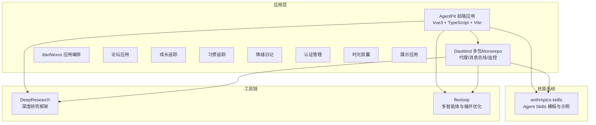
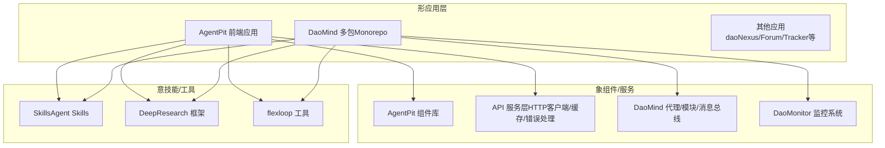
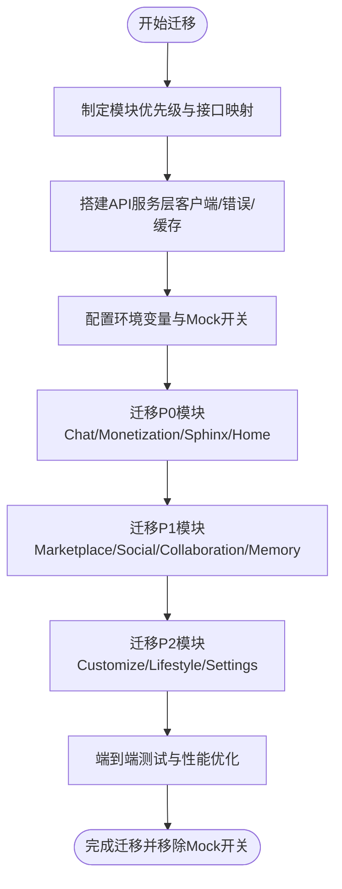
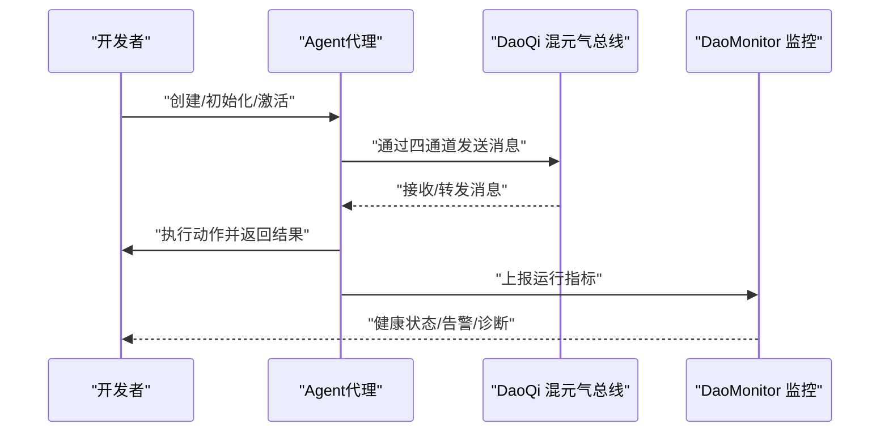
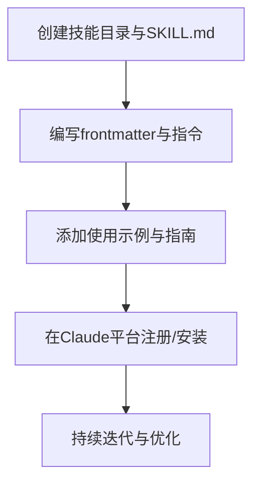
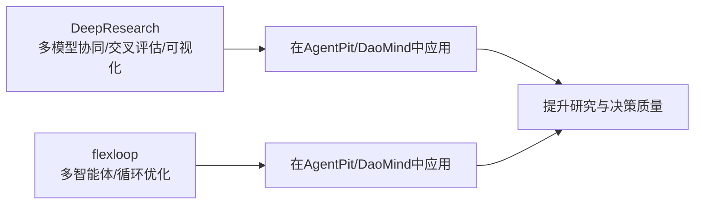
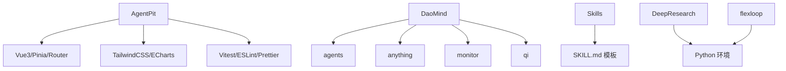

# 项目概述

<cite>
**本文档引用的文件**
- [apps/AgentPit/README.md](file://apps/AgentPit/README.md)
- [apps/AgentPit/package.json](file://apps/AgentPit/package.json)
- [apps/AgentPit/docs/COMPONENT_LIBRARY_ARCHITECTURE.md](file://apps/AgentPit/docs/COMPONENT_LIBRARY_ARCHITECTURE.md)
- [apps/AgentPit/docs/API_INTEGRATION_PLAN.md](file://apps/AgentPit/docs/API_INTEGRATION_PLAN.md)
- [apps/DaoMind/README.md](file://apps/DaoMind/README.md)
- [apps/DaoMind/packages/daoAgents/package.json](file://apps/DaoMind/packages/daoAgents/package.json)
- [skills/daoSkilLs/skills/anthropics-skills/README.md](file://skills/daoSkilLs/skills/anthropics-skills/README.md)
- [skills/daoSkilLs/skills/anthropics-skills/template/SKILL.md](file://skills/daoSkilLs/skills/anthropics-skills/template/SKILL.md)
- [tools/DeepResearch/README.md](file://tools/DeepResearch/README.md)
- [tools/flexloop/README.md](file://tools/flexloop/README.md)
</cite>

## 目录
1. [引言](#引言)
2. [项目结构](#项目结构)
3. [核心组件](#核心组件)
4. [架构总览](#架构总览)
5. [详细组件分析](#详细组件分析)
6. [依赖分析](#依赖分析)
7. [性能考量](#性能考量)
8. [故障排查指南](#故障排查指南)
9. [结论](#结论)
10. [附录](#附录)

## 引言
DAOApps 是一个面向去中心化自治组织（DAO）的应用生态系统，旨在通过模块化的智能体平台、多智能体协作系统、技能与工具链，构建“道法自然”的技术架构与哲学实践。项目以 DaoMind 的道家哲学为思想内核，结合现代工程实践，形成“道（daoCollective）—无（daoNothing）—有（daoAnything）—气（Qi）—反者道之动—阴阳平衡—自然无为”的系统观；同时以 AgentPit 的前端组件库与 API 集成方案为应用层基础设施，以技能系统（skills）与工具链（DeepResearch、flexloop）为能力增强与研究支撑，形成从“形”到“象”再到“意”的多层次架构。

本概述既面向初学者提供概念性理解，也为有经验的开发者提供技术细节与落地路径，帮助快速把握 DAOApps 的愿景、架构与常见用例。

## 项目结构
DAOApps 采用多应用与多工具并行的组织方式：
- 应用层
  - AgentPit：Vue3 + TypeScript + Vite 的前端应用，配套组件库与 API 集成方案
  - DaoMind：基于道家哲学的多包 monorepo，提供代理、消息总线、监控等核心能力
  - 其他应用：daoNexus、forum、growth-tracker、habit-tracker、moodflow、oauth-admin、time-capsule、xinyu 等
- 技能系统
  - anthropics-skills：Claude Agent Skills 的示例与模板
- 工具链
  - DeepResearch：基于渐进式搜索与交叉评估的深度研究框架
  - flexloop：多智能体与循环优化工具

**图表来源**
- [apps/AgentPit/package.json:1-74](file://apps/AgentPit/package.json#L1-L74)
- [apps/DaoMind/README.md:323-351](file://apps/DaoMind/README.md#L323-L351)
- [skills/daoSkilLs/skills/anthropics-skills/README.md:1-95](file://skills/daoSkilLs/skills/anthropics-skills/README.md#L1-L95)
- [tools/DeepResearch/README.md:1-69](file://tools/DeepResearch/README.md#L1-L69)
- [tools/flexloop/README.md:1-100](file://tools/flexloop/README.md#L1-L100)

**章节来源**
- [apps/AgentPit/README.md:1-6](file://apps/AgentPit/README.md#L1-L6)
- [apps/AgentPit/package.json:1-74](file://apps/AgentPit/package.json#L1-L74)
- [apps/DaoMind/README.md:323-351](file://apps/DaoMind/README.md#L323-L351)
- [skills/daoSkilLs/skills/anthropics-skills/README.md:1-95](file://skills/daoSkilLs/skills/anthropics-skills/README.md#L1-L95)
- [tools/DeepResearch/README.md:1-69](file://tools/DeepResearch/README.md#L1-L69)
- [tools/flexloop/README.md:1-100](file://tools/flexloop/README.md#L1-L100)

## 核心组件
- AgentPit 智能体平台（前端）
  - 以 Vue3 Composition API 为核心，配合 TypeScript、Pinia、Vue Router、TailwindCSS 等，提供统一的组件库与 API 服务层，支持从 Mock 数据平滑迁移到真实后端。
  - 组件库采用“设计令牌 + CVA + clsx/tailwind-merge”的样式体系，具备高复用、可维护、可扩展的特性，并提供 VitePress 文档。
- DaoMind 多智能体系统（后端/框架）
  - 基于道家哲学的系统框架，提供“道（daoCollective）—无（daoNothing）—有（daoAnything）—气（Qi）—反者道之动—阴阳平衡—自然无为”的架构映射。
  - 核心能力包括：代理管理、模块管理、消息总线（DaoQi 四通道）、监控系统（DaoMonitor）与基准测试等。
- 技能系统（skills）
  - 提供 Claude Agent Skills 的模板与示例，强调可重复的任务执行与企业工作流集成，支持文档创作、数据分析、测试自动化等场景。
- 工具链
  - DeepResearch：多模型协同、交叉评估、可视化报告的轻量级深度研究框架。
  - flexloop：多智能体与循环优化工具，支撑系统级的策略迭代与性能优化。

**章节来源**
- [apps/AgentPit/docs/COMPONENT_LIBRARY_ARCHITECTURE.md:1-658](file://apps/AgentPit/docs/COMPONENT_LIBRARY_ARCHITECTURE.md#L1-L658)
- [apps/AgentPit/docs/API_INTEGRATION_PLAN.md:1-431](file://apps/AgentPit/docs/API_INTEGRATION_PLAN.md#L1-L431)
- [apps/DaoMind/README.md:1-552](file://apps/DaoMind/README.md#L1-L552)
- [skills/daoSkilLs/skills/anthropics-skills/README.md:1-95](file://skills/daoSkilLs/skills/anthropics-skills/README.md#L1-L95)
- [skills/daoSkilLs/skills/anthropics-skills/template/SKILL.md:1-7](file://skills/daoSkilLs/skills/anthropics-skills/template/SKILL.md#L1-L7)
- [tools/DeepResearch/README.md:1-69](file://tools/DeepResearch/README.md#L1-L69)
- [tools/flexloop/README.md:1-100](file://tools/flexloop/README.md#L1-L100)

## 架构总览
DAOApps 的架构以“道家哲学”为思想内核，以“模块化、可复用、可观测、可演进”为工程原则，形成“形（应用层）—象（组件/服务）—意（技能/工具）”的三层结构。

**图表来源**
- [apps/AgentPit/docs/API_INTEGRATION_PLAN.md:52-88](file://apps/AgentPit/docs/API_INTEGRATION_PLAN.md#L52-L88)
- [apps/DaoMind/README.md:18-26](file://apps/DaoMind/README.md#L18-L26)
- [skills/daoSkilLs/skills/anthropics-skills/README.md:1-95](file://skills/daoSkilLs/skills/anthropics-skills/README.md#L1-L95)
- [tools/DeepResearch/README.md:1-69](file://tools/DeepResearch/README.md#L1-L69)
- [tools/flexloop/README.md:1-100](file://tools/flexloop/README.md#L1-L100)

## 详细组件分析

### AgentPit 组件库与 API 集成
- 组件库架构
  - 采用“原子组件—分子组件—组织组件”的分层设计，结合设计令牌与 Tailwind CSS，实现主题化与一致性。
  - 使用 class-variance-authority（CVA）管理组件变体，通过 cn 工具合并类名，确保样式可控与可扩展。
  - 提供完善的类型导出机制与文档（VitePress），支持组件 API 与示例的可视化呈现。
- API 服务层
  - 以原生 fetch 为基础封装 HTTP 客户端，统一错误处理与缓存策略，支持环境变量切换 Mock 与真实 API。
  - 通过 Pinia Store 保持前端状态层接口稳定，实现渐进式迁移与可回退机制。
- 迁移路线
  - 按模块优先级（P0/P1/P2）分阶段替换 Mock 数据为真实 API，配套缓存与错误处理，最终移除 Mock 开关。

**图表来源**
- [apps/AgentPit/docs/API_INTEGRATION_PLAN.md:348-378](file://apps/AgentPit/docs/API_INTEGRATION_PLAN.md#L348-L378)

**章节来源**
- [apps/AgentPit/docs/COMPONENT_LIBRARY_ARCHITECTURE.md:1-658](file://apps/AgentPit/docs/COMPONENT_LIBRARY_ARCHITECTURE.md#L1-L658)
- [apps/AgentPit/docs/API_INTEGRATION_PLAN.md:1-431](file://apps/AgentPit/docs/API_INTEGRATION_PLAN.md#L1-L431)

### DaoMind 多智能体系统
- 哲学与架构
  - “道宇宙（daoCollective）—无（daoNothing）—有（daoAnything）—气（Qi）—反者道之动—阴阳平衡—自然无为”的层级映射。
  - DaoQi 四通道（天/地/人/冲）构成消息总线，支持系统内部高效通信；DaoMonitor 提供仪表盘、热力图、向量场、告警与诊断。
- 核心能力
  - 代理生命周期管理（创建/初始化/激活/执行/休息/终止）
  - 模块注册与管理（注册/初始化/激活/获取）
  - 性能基准与监控快照聚合
- 使用示例
  - 代理管理、模块管理、消息总线与监控系统的代码级示例与命令行工具说明。

**图表来源**
- [apps/DaoMind/README.md:107-293](file://apps/DaoMind/README.md#L107-L293)

**章节来源**
- [apps/DaoMind/README.md:1-552](file://apps/DaoMind/README.md#L1-L552)
- [apps/DaoMind/packages/daoAgents/package.json:1-1](file://apps/DaoMind/packages/daoAgents/package.json#L1-L1)

### 技能系统（Skills）
- Agent Skills 规范与模板
  - 每个技能以独立文件夹包含 SKILL.md（含 YAML frontmatter 与指令），提供名称、描述与使用说明。
  - 支持文档、表格、演示文稿等多种产出形式，适配企业工作流与个人自动化。
- 示例与使用
  - 提供 Claude Code、Claude.ai 与 Claude API 的使用指引，支持插件市场注册与直接安装。

**图表来源**
- [skills/daoSkilLs/skills/anthropics-skills/template/SKILL.md:1-7](file://skills/daoSkilLs/skills/anthropics-skills/template/SKILL.md#L1-L7)
- [skills/daoSkilLs/skills/anthropics-skills/README.md:61-88](file://skills/daoSkilLs/skills/anthropics-skills/README.md#L61-L88)

**章节来源**
- [skills/daoSkilLs/skills/anthropics-skills/README.md:1-95](file://skills/daoSkilLs/skills/anthropics-skills/README.md#L1-L95)
- [skills/daoSkilLs/skills/anthropics-skills/template/SKILL.md:1-7](file://skills/daoSkilLs/skills/anthropics-skills/template/SKILL.md#L1-L7)

### 工具链（DeepResearch 与 flexloop）
- DeepResearch
  - 多模型协同、交叉评估、可视化报告的轻量级框架，支持任务规划—工具调用—评估与迭代的智能工作流。
- flexloop
  - 多智能体与循环优化工具，支撑系统级策略迭代与性能优化，强调“以终为始”的知识传播与开源友好。

**图表来源**
- [tools/DeepResearch/README.md:1-69](file://tools/DeepResearch/README.md#L1-L69)
- [tools/flexloop/README.md:1-100](file://tools/flexloop/README.md#L1-L100)

**章节来源**
- [tools/DeepResearch/README.md:1-69](file://tools/DeepResearch/README.md#L1-L69)
- [tools/flexloop/README.md:1-100](file://tools/flexloop/README.md#L1-L100)

## 依赖分析
- AgentPit
  - 前端依赖：Vue3、Pinia、Vue Router、TailwindCSS、ECharts、marked、vee-validate 等
  - 开发依赖：Vite、TypeScript、ESLint、Prettier、Vitest 等
- DaoMind
  - 多包 monorepo，核心包包括 agents、anything、apps、monitor、qi 等
- Skills
  - 以 SKILL.md 为标准，提供模板与示例，适配 Claude 平台
- 工具链
  - DeepResearch 与 flexloop 分别提供 Python 与 CLI 能力，与应用层解耦

**图表来源**
- [apps/AgentPit/package.json:20-63](file://apps/AgentPit/package.json#L20-L63)
- [apps/DaoMind/README.md:323-351](file://apps/DaoMind/README.md#L323-L351)
- [skills/daoSkilLs/skills/anthropics-skills/README.md:1-95](file://skills/daoSkilLs/skills/anthropics-skills/README.md#L1-L95)
- [tools/DeepResearch/README.md:1-69](file://tools/DeepResearch/README.md#L1-L69)
- [tools/flexloop/README.md:1-100](file://tools/flexloop/README.md#L1-L100)

**章节来源**
- [apps/AgentPit/package.json:1-74](file://apps/AgentPit/package.json#L1-L74)
- [apps/DaoMind/README.md:323-351](file://apps/DaoMind/README.md#L323-L351)
- [skills/daoSkilLs/skills/anthropics-skills/README.md:1-95](file://skills/daoSkilLs/skills/anthropics-skills/README.md#L1-L95)
- [tools/DeepResearch/README.md:1-69](file://tools/DeepResearch/README.md#L1-L69)
- [tools/flexloop/README.md:1-100](file://tools/flexloop/README.md#L1-L100)

## 性能考量
- 组件库与样式
  - 设计令牌驱动的 Tailwind 配置，结合 CVA 与类名合并工具，减少运行时开销，提升渲染性能与主题一致性。
- API 服务层
  - 分层缓存（Pinia + localStorage）与超时控制，降低网络压力与重复请求。
- DaoMind 监控
  - DaoMonitor 提供热力图、向量场、仪表盘与告警，支持性能基准测试与快照聚合，辅助定位瓶颈。
- 工具链
  - DeepResearch 与 flexloop 提供研究与优化能力，支撑系统级性能与策略迭代。

**章节来源**
- [apps/AgentPit/docs/COMPONENT_LIBRARY_ARCHITECTURE.md:140-241](file://apps/AgentPit/docs/COMPONENT_LIBRARY_ARCHITECTURE.md#L140-L241)
- [apps/AgentPit/docs/API_INTEGRATION_PLAN.md:254-306](file://apps/AgentPit/docs/API_INTEGRATION_PLAN.md#L254-L306)
- [apps/DaoMind/README.md:528-534](file://apps/DaoMind/README.md#L528-L534)

## 故障排查指南
- AgentPit
  - Mock 切换与 API 配置：检查环境变量与 API 基础地址，确认是否启用 Mock。
  - 错误处理：区分网络错误、服务器错误与校验错误，按类别进行提示与重试。
  - 缓存清理：针对特定模式的缓存键进行清理，避免脏数据影响。
- DaoMind
  - 代理与模块生命周期：确认初始化与激活顺序，检查执行结果与错误日志。
  - 监控告警：根据 DaoMonitor 输出的健康状态与告警规则，定位异常节点与通道。
- Skills
  - 插件安装与使用：在 Claude 平台注册 marketplace 或直接安装插件，确保权限与版本匹配。
- 工具链
  - DeepResearch：确认模型可用性与配置文件，关注任务规划与评估迭代过程。
  - flexloop：检查 Python 环境与依赖，遵循使用许可与贡献流程。

**章节来源**
- [apps/AgentPit/docs/API_INTEGRATION_PLAN.md:404-425](file://apps/AgentPit/docs/API_INTEGRATION_PLAN.md#L404-L425)
- [apps/DaoMind/README.md:398-444](file://apps/DaoMind/README.md#L398-L444)
- [skills/daoSkilLs/skills/anthropics-skills/README.md:29-59](file://skills/daoSkilLs/skills/anthropics-skills/README.md#L29-L59)
- [tools/DeepResearch/README.md:57-69](file://tools/DeepResearch/README.md#L57-L69)
- [tools/flexloop/README.md:82-92](file://tools/flexloop/README.md#L82-L92)

## 结论
DAOApps 以“道家哲学”为思想内核，以“模块化、可复用、可观测、可演进”为工程原则，构建了从应用层到技能与工具链的完整生态。AgentPit 提供统一的前端基础设施与 API 迁移方案，DaoMind 提供多智能体与消息总线能力，Skills 与工具链则为任务执行与研究优化提供支撑。该架构既适合初学者理解系统思想，也便于有经验的开发者快速落地与扩展。

## 附录
- 常见用例示例
  - 智能体聊天与变现：通过 AgentPit 的 Chat 与 Monetization 模块，结合 DaoMind 的代理与消息总线，实现对话与收益管理。
  - 建站与发布：利用 Sphinx 模块与 DaoMind 的模块管理，完成站点模板选择、预览与发布。
  - 技能自动化：基于 Skills 的模板与示例，在 Claude 平台上实现文档、数据分析与测试自动化。
  - 研究与优化：借助 DeepResearch 与 flexloop，进行跨模态研究与系统级优化。

**章节来源**
- [apps/AgentPit/docs/API_INTEGRATION_PLAN.md:310-344](file://apps/AgentPit/docs/API_INTEGRATION_PLAN.md#L310-L344)
- [apps/DaoMind/README.md:107-293](file://apps/DaoMind/README.md#L107-L293)
- [skills/daoSkilLs/skills/anthropics-skills/README.md:12-28](file://skills/daoSkilLs/skills/anthropics-skills/README.md#L12-L28)
- [tools/DeepResearch/README.md:15-32](file://tools/DeepResearch/README.md#L15-L32)
- [tools/flexloop/README.md:40-80](file://tools/flexloop/README.md#L40-L80)