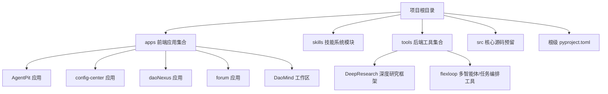
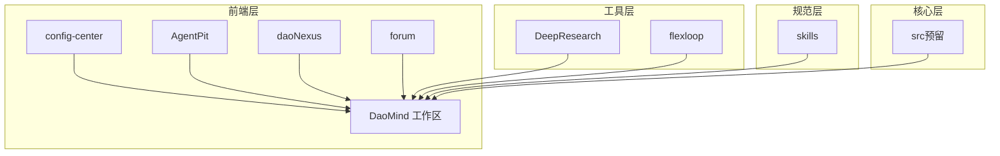
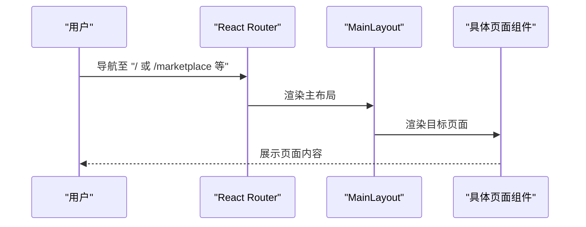
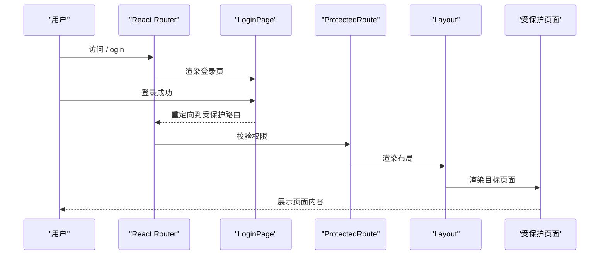
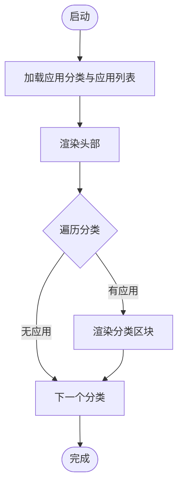
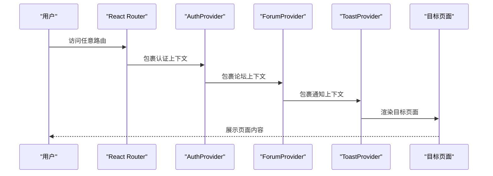
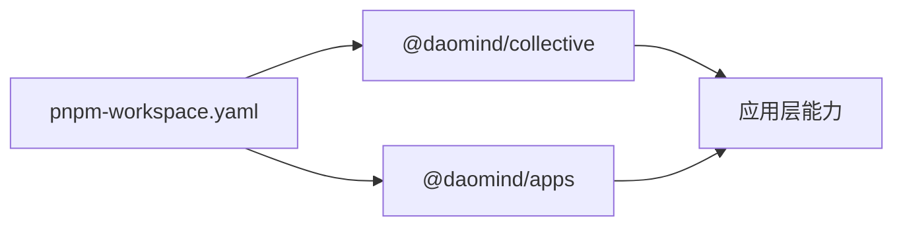
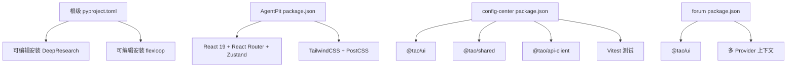

# 项目结构

<cite>
**本文引用的文件**
- [pyproject.toml](file://pyproject.toml)
- [apps/AgentPit/package.json](file://apps/AgentPit/package.json)
- [apps/AgentPit/src/App.tsx](file://apps/AgentPit/src/App.tsx)
- [apps/config-center/package.json](file://apps/config-center/package.json)
- [apps/config-center/src/App.tsx](file://apps/config-center/src/App.tsx)
- [apps/daoNexus/src/App.tsx](file://apps/daoNexus/src/App.tsx)
- [apps/forum/src/App.tsx](file://apps/forum/src/App.tsx)
- [apps/DaoMind/pnpm-workspace.yaml](file://apps/DaoMind/pnpm-workspace.yaml)
- [apps/DaoMind/packages/daoCollective/package.json](file://apps/DaoMind/packages/daoCollective/package.json)
- [apps/DaoMind/packages/daoApps/package.json](file://apps/DaoMind/packages/daoApps/package.json)
- [tools/DeepResearch/README.md](file://tools/DeepResearch/README.md)
- [tools/flexloop/README.md](file://tools/flexloop/README.md)
- [skills/daoSkilLs/.gitignore](file://skills/daoSkilLs/.gitignore)
- [src/daoapps/__init__.py](file://src/daoapps/__init__.py)
</cite>

## 目录
1. [简介](#简介)
2. [项目结构](#项目结构)
3. [核心组件](#核心组件)
4. [架构总览](#架构总览)
5. [详细组件分析](#详细组件分析)
6. [依赖分析](#依赖分析)
7. [性能考虑](#性能考虑)
8. [故障排查指南](#故障排查指南)
9. [结论](#结论)
10. [附录](#附录)

## 简介
本文件面向DAO Collective项目，系统性梳理其 monorepo 架构设计理念与组织方式，重点说明以下方面：
- apps 目录下前端应用（AgentPit、config-center、daoNexus、forum 等）的功能定位与作用边界
- skills 目录下的技能系统模块与工具定位
- tools 目录下的后端工具（DeepResearch、flexloop）的架构设计与职责划分
- src 目录下的核心源码结构（应用容器系统、生命周期管理等）
- 各目录之间的依赖关系与协作机制，帮助开发者快速导航与理解整体架构

## 项目结构
DAO Collective 采用多工作区的 monorepo 组织方式，结合前端 Vite 工程与 Python 工具链，形成“前端应用 + 技能系统 + 后端工具 + 核心库”的分层布局。

- apps：前端应用集合，包含多个独立的 React/Vite 工程，各自负责特定业务域
- skills：技能系统相关资料与参考文档
- tools：后端工具与服务化能力，包含 Python 工程与测试体系
- src：核心源码（当前仓库中存在空的包入口），作为未来统一的 Python 包根目录预留
- 根级 pyproject.toml：定义了 Python 生态的构建、测试、格式化与类型检查策略，并将 tools 子工程以可编辑模式引入

图表来源
- [pyproject.toml](file://pyproject.toml)
- [apps/AgentPit/package.json](file://apps/AgentPit/package.json)
- [apps/config-center/package.json](file://apps/config-center/package.json)
- [apps/daoNexus/src/App.tsx](file://apps/daoNexus/src/App.tsx)
- [apps/forum/src/App.tsx](file://apps/forum/src/App.tsx)
- [apps/DaoMind/pnpm-workspace.yaml](file://apps/DaoMind/pnpm-workspace.yaml)
- [tools/DeepResearch/README.md](file://tools/DeepResearch/README.md)
- [tools/flexloop/README.md](file://tools/flexloop/README.md)

章节来源
- [pyproject.toml](file://pyproject.toml)
- [apps/AgentPit/package.json](file://apps/AgentPit/package.json)
- [apps/config-center/package.json](file://apps/config-center/package.json)
- [apps/daoNexus/src/App.tsx](file://apps/daoNexus/src/App.tsx)
- [apps/forum/src/App.tsx](file://apps/forum/src/App.tsx)
- [apps/DaoMind/pnpm-workspace.yaml](file://apps/DaoMind/pnpm-workspace.yaml)

## 核心组件
本节聚焦于各目录的关键角色与职责：

- apps 前端应用
  - AgentPit：围绕“智能体工作台”主题，提供多页面路由与状态管理，覆盖商业化、聊天、社交、市场、协作、记忆、个性化、生活方式与设置等场景
  - config-center：配置中心管理应用，提供登录、仪表盘、配置列表/详情、版本管理、审计日志、用户与角色管理等
  - daoNexus：应用聚合门户，按分类展示应用卡片，作为统一入口
  - forum：社区论坛应用，提供主题浏览、发帖、用户资料、搜索、管理后台与设置等
  - DaoMind：以 pnpm workspace 管理的多包工作区，包含多个领域包（如 collective、apps 等）

- skills 技能系统模块
  - 当前为技能参考与术语说明的资料目录，便于统一术语与评估标准

- tools 后端工具
  - DeepResearch：基于渐进式检索与交叉评估的轻量级深度研究框架，支持多 LLM 协作与可视化报告生成
  - flexloop：多智能体/任务编排与基础设施能力，提供测试体系与文档体系支撑

- src 核心源码
  - 当前为空包入口，作为未来统一的 Python 包根目录预留

章节来源
- [apps/AgentPit/src/App.tsx](file://apps/AgentPit/src/App.tsx)
- [apps/config-center/src/App.tsx](file://apps/config-center/src/App.tsx)
- [apps/daoNexus/src/App.tsx](file://apps/daoNexus/src/App.tsx)
- [apps/forum/src/App.tsx](file://apps/forum/src/App.tsx)
- [apps/DaoMind/packages/daoCollective/package.json](file://apps/DaoMind/packages/daoCollective/package.json)
- [apps/DaoMind/packages/daoApps/package.json](file://apps/DaoMind/packages/daoApps/package.json)
- [skills/daoSkilLs/.gitignore](file://skills/daoSkilLs/.gitignore)
- [tools/DeepResearch/README.md](file://tools/DeepResearch/README.md)
- [tools/flexloop/README.md](file://tools/flexloop/README.md)
- [src/daoapps/__init__.py](file://src/daoapps/__init__.py)

## 架构总览
从架构视角看，DAO Collective 采用“前端应用 + 工具链 + 技能规范”的分层设计：
- 前端层：apps 下的各应用通过 Vite + React Router 提供业务功能；部分应用共享 UI/SDK 包（如 @tao/ui、@tao/shared、@tao/api-client）
- 工具层：tools 下的 Python 工程提供研究与编排能力，通过可编辑安装集成到根级开发环境
- 规范层：skills 提供术语与评估参考，辅助统一认知
- 核心层：src 作为 Python 包根目录预留，承载未来统一的后端能力

图表来源
- [apps/AgentPit/src/App.tsx](file://apps/AgentPit/src/App.tsx)
- [apps/config-center/src/App.tsx](file://apps/config-center/src/App.tsx)
- [apps/daoNexus/src/App.tsx](file://apps/daoNexus/src/App.tsx)
- [apps/forum/src/App.tsx](file://apps/forum/src/App.tsx)
- [apps/DaoMind/pnpm-workspace.yaml](file://apps/DaoMind/pnpm-workspace.yaml)
- [tools/DeepResearch/README.md](file://tools/DeepResearch/README.md)
- [tools/flexloop/README.md](file://tools/flexloop/README.md)
- [skills/daoSkilLs/.gitignore](file://skills/daoSkilLs/.gitignore)
- [src/daoapps/__init__.py](file://src/daoapps/__init__.py)

## 详细组件分析

### AgentPit 组件分析
- 功能定位：智能体工作台的前端入口，提供多页面路由与主布局
- 关键特性：基于 React Router 的嵌套路由设计，配合 Zustand 进行状态管理
- 典型页面：首页、商业化、Sphinx、聊天、社交、市场、协作、记忆、个性化、生活方式、设置等

图表来源
- [apps/AgentPit/src/App.tsx](file://apps/AgentPit/src/App.tsx)

章节来源
- [apps/AgentPit/src/App.tsx](file://apps/AgentPit/src/App.tsx)
- [apps/AgentPit/package.json](file://apps/AgentPit/package.json)

### config-center 组件分析
- 功能定位：配置中心管理应用，提供登录、仪表盘、配置管理、版本审计、用户与角色管理等
- 关键特性：受保护路由（ProtectedRoute）封装，全局通知（Toaster）提示，基于工作区包的依赖复用（@tao/shared、@tao/ui、@tao/api-client）

图表来源
- [apps/config-center/src/App.tsx](file://apps/config-center/src/App.tsx)

章节来源
- [apps/config-center/src/App.tsx](file://apps/config-center/src/App.tsx)
- [apps/config-center/package.json](file://apps/config-center/package.json)

### daoNexus 组件分析
- 功能定位：应用聚合门户，按分类展示应用卡片，作为统一入口
- 关键特性：从数据模块读取应用分类与应用列表，动态渲染分类区块

图表来源
- [apps/daoNexus/src/App.tsx](file://apps/daoNexus/src/App.tsx)

章节来源
- [apps/daoNexus/src/App.tsx](file://apps/daoNexus/src/App.tsx)

### forum 组件分析
- 功能定位：社区论坛应用，提供主题浏览、发帖、用户资料、搜索、管理后台与设置等
- 关键特性：多 Provider 组合（认证、论坛上下文、Toast），初始化种子数据，多路由映射

图表来源
- [apps/forum/src/App.tsx](file://apps/forum/src/App.tsx)

章节来源
- [apps/forum/src/App.tsx](file://apps/forum/src/App.tsx)

### DaoMind 工作区分析
- 功能定位：以 pnpm workspace 管理的多包工作区，包含 collective、apps 等领域包
- 关键特性：通过 pnpm-workspace.yaml 将 packages/* 纳入工作区，便于包间依赖与版本统一

图表来源
- [apps/DaoMind/pnpm-workspace.yaml](file://apps/DaoMind/pnpm-workspace.yaml)
- [apps/DaoMind/packages/daoCollective/package.json](file://apps/DaoMind/packages/daoCollective/package.json)
- [apps/DaoMind/packages/daoApps/package.json](file://apps/DaoMind/packages/daoApps/package.json)

章节来源
- [apps/DaoMind/pnpm-workspace.yaml](file://apps/DaoMind/pnpm-workspace.yaml)
- [apps/DaoMind/packages/daoCollective/package.json](file://apps/DaoMind/packages/daoCollective/package.json)
- [apps/DaoMind/packages/daoApps/package.json](file://apps/DaoMind/packages/daoApps/package.json)

### skills 技能系统模块分析
- 功能定位：技能参考与术语说明资料，辅助统一术语与评估标准
- 关键特性：当前为静态资料目录，便于团队对齐认知

章节来源
- [skills/daoSkilLs/.gitignore](file://skills/daoSkilLs/.gitignore)

### tools 工具集分析
- DeepResearch：深度研究框架，支持多 LLM 协作与可视化报告生成
- flexloop：多智能体/任务编排工具，提供测试体系与文档体系支撑

章节来源
- [tools/DeepResearch/README.md](file://tools/DeepResearch/README.md)
- [tools/flexloop/README.md](file://tools/flexloop/README.md)

## 依赖分析
- 根级 pyproject.toml
  - 通过可编辑安装将 tools 子工程引入开发环境，便于联调与测试
  - 定义了统一的 lint/format/type-check 脚本，确保代码质量一致性

- apps 工程
  - AgentPit：React 19、React Router、Zustand、TailwindCSS 等
  - config-center：@tao/ui、@tao/shared、@tao/api-client 等工作区包，Vitest 测试
  - forum：@tao/ui、@tao/shared 等工作区包，多 Provider 组合

- tools 工程
  - DeepResearch：研究框架，提供 CLI 与配置
  - flexloop：多智能体/任务编排，提供测试与文档脚本

图表来源
- [pyproject.toml](file://pyproject.toml)
- [apps/AgentPit/package.json](file://apps/AgentPit/package.json)
- [apps/config-center/package.json](file://apps/config-center/package.json)
- [apps/forum/src/App.tsx](file://apps/forum/src/App.tsx)

章节来源
- [pyproject.toml](file://pyproject.toml)
- [apps/AgentPit/package.json](file://apps/AgentPit/package.json)
- [apps/config-center/package.json](file://apps/config-center/package.json)
- [apps/forum/src/App.tsx](file://apps/forum/src/App.tsx)

## 性能考虑
- 前端应用
  - 使用 Vite 构建，具备快速冷启动与热更新能力
  - React 19 的并发特性有助于提升交互流畅度
  - TailwindCSS 与按需样式减少打包体积
- 工具链
  - 可编辑安装避免重复构建，提升迭代效率
  - 测试与覆盖率配置有助于稳定质量

## 故障排查指南
- 常见问题
  - 依赖解析失败：检查 pnpm/workspace 与 package.json 的依赖声明是否一致
  - 开发服务器无法启动：确认 Node 版本与包管理器版本兼容
  - 测试失败：根据根级 pyproject.toml 中的测试脚本运行测试并查看输出
- 建议流程
  - 先执行根级脚本进行统一 lint/format/type-check
  - 再运行对应应用的测试命令，定位问题范围
  - 对工具链问题，优先检查可编辑安装路径与 Python 版本

章节来源
- [pyproject.toml](file://pyproject.toml)

## 结论
DAO Collective 通过 monorepo 将前端应用、工具链与技能规范有机整合，形成“前端业务 + 工具能力 + 规范支撑 + 核心预留”的完整生态。开发者可依据本文档快速定位各模块职责与协作关系，在保证一致性的同时高效推进功能演进。

## 附录
- 术语与评估参考：skills 目录提供统一术语与评估标准，便于跨团队协同
- 核心源码预留：src 目录作为 Python 包根目录预留，后续可在此沉淀统一的后端能力